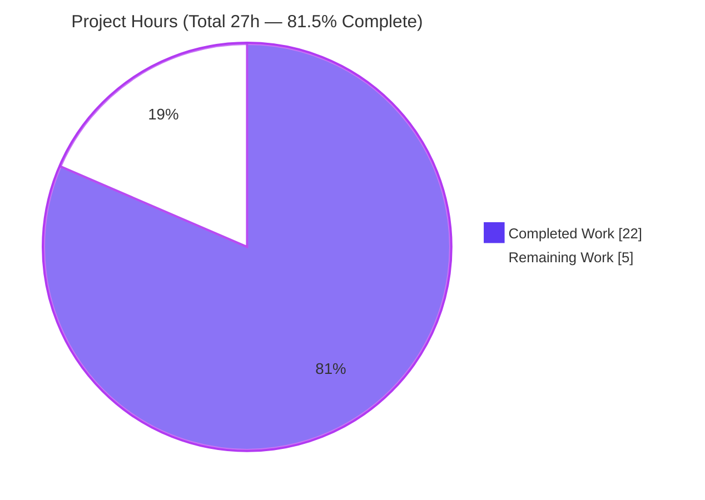
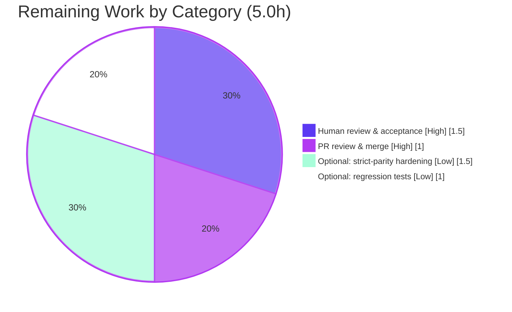

# Blitzy Project Guide — Node.js → Python 3 Flask Migration (`hello_world` HTTP Server)

> **Legend / Blitzy Brand Colors:** Completed / AI Work = **Dark Blue `#5B39F3`** · Remaining / Not Completed = **White `#FFFFFF`** · Headings / Accents = **Violet-Black `#B23AF2`** · Highlight = **Mint `#A8FDD9`**

---

## 1. Executive Summary

### 1.1 Project Overview

This project is a **technology-stack migration**: the repository's original Node.js HTTP server (`server.js`, 14 lines, Node core `http` module, zero third-party dependencies) has been rewritten as a **Python 3 + Flask** application (`app.py`) that reproduces the original's externally observable behavior. The target users are the repository maintainers and any client of the localhost service. Every inbound request — regardless of method or path — receives a fixed `200` response with a bare `Content-Type: text/plain` header and the 14-byte body `Hello, World!\n`, bound to `127.0.0.1:3000`, with an identical startup log line. The technical scope is intentionally minimal: replace only the runtime, language, framework, and dependency mechanics with 1:1 equivalents, adding no new capabilities.

### 1.2 Completion Status

The project is **81.5% complete** on an AAP-scoped, hours-based basis. All 17 discrete AAP implementation requirements are delivered, compile clean, and pass autonomous validation; the remaining work is human-owned path-to-production (review, merge) plus two clearly-optional enhancements.


| Metric | Value |
|--------|-------|
| **Total Hours** | **27.0 h** |
| **Completed Hours (AI + Manual)** | **22.0 h** (AI/autonomous 22.0 h + Manual 0.0 h) |
| **Remaining Hours** | **5.0 h** |
| **Percent Complete** | **81.5%**  (22.0 ÷ 27.0 × 100) |

> Color key: Completed Work slice = Dark Blue `#5B39F3`; Remaining Work slice = White `#FFFFFF`.

### 1.3 Key Accomplishments

- ✅ **Runtime migrated** — Node.js `http` server reimplemented as a single-module Flask WSGI app (`app.py`) running on CPython **3.13.13** with **Flask 3.1.3**.
- ✅ **HTTP contract preserved exactly** — every method/path returns `200`, bare `Content-Type: text/plain`, `Content-Length: 14`, body `Hello, World!\n` (independently re-verified this session).
- ✅ **Universal request handling** — catch-all dual route (`/` + `/<path:path>`) with a broadened `_FullPathConverter`, `static_folder=None`, all 7 standard verbs enumerated, and `provide_automatic_options=False` so `OPTIONS` is served by the view.
- ✅ **Binding & startup parity** — binds `127.0.0.1:3000`; prints the exact `Server running at http://127.0.0.1:3000/` line; per-request Werkzeug logs suppressed to mirror the source's silence.
- ✅ **Dependency migration** — `requirements.txt` pins `Flask==3.1.3`; obsolete `package.json` and `package-lock.json` retired; `pip check` clean.
- ✅ **Explainability rule satisfied** — `docs/decision-log.md` delivers a 17-row decision log, a bidirectional traceability matrix at 100% coverage, and 5 documented residual deviations.
- ✅ **Scope discipline** — all 14 out-of-scope fixtures and both reference `server.js` files are byte-for-byte untouched (git-confirmed).
- ✅ **Quality gates green** — `py_compile` exit 0, `pyflakes` clean, `pycodestyle` clean (79-char), 70/70 behavioral cases pass, 9-case Node byte-parity confirms the core contract is byte-identical.

### 1.4 Critical Unresolved Issues

There are **no critical unresolved issues**. The migration is functionally complete and was validated production-ready with zero unresolved errors. The items below are the standard human-ownership gate and documented, low-risk, by-design deviations — none block release of this fixture.

| Issue | Impact | Owner | ETA |
|-------|--------|-------|-----|
| Human acceptance sign-off not yet performed | Standard release gate; migration cannot be auto-approved | Reviewing Engineer | 1.5 h |
| Documented residual header deviations (`Server`, `Connection`) vs Node | None on core contract; cosmetic header difference only | Reviewing Engineer (accept or opt into HT-3) | Decision only |

### 1.5 Access Issues

**No access issues identified.** The repository is checked out locally on the `blitzy-d4721036-be25-4a6f-be26-8b4d850b5f4d` branch, all commands executed successfully, and the application requires no external services, credentials, API keys, or network egress (it is a localhost-only, self-contained server).

| System/Resource | Type of Access | Issue Description | Resolution Status | Owner |
|-----------------|----------------|-------------------|-------------------|-------|
| Git repository | Read/Write | None — branch checked out, clean tree, commits accessible | ✅ No issue | — |
| PyPI (Flask install) | Read | None — `pip install -r requirements.txt` succeeded | ✅ No issue | — |
| External services / APIs | — | None required — self-contained server | ✅ N/A | — |

### 1.6 Recommended Next Steps

1. **[High]** Perform human code review & functional acceptance of `app.py`, `requirements.txt`, and `docs/decision-log.md`; run the app and confirm the HTTP contract, startup line, and binding (**1.5 h**).
2. **[High]** Review and merge the branch PR into the target branch; confirm the intentional deletion of `package.json`/`package-lock.json` (**1.0 h**).
3. **[Low]** *(Optional)* Add a persistent `pytest` regression suite asserting the fixed contract so future changes are caught in CI (**1.0 h**).
4. **[Low]** *(Optional)* Implement strict byte-parity hardening (custom `WSGIRequestHandler` for the `Server`/`Connection` headers; a `405→200` handler for exotic verbs) only if strict parity is later mandated (**1.5 h**).

---

## 2. Project Hours Breakdown

### 2.1 Completed Work Detail

All completed hours are autonomous (AI) work; each component traces to specific AAP requirements. **Total = 22.0 h.**

| Component | Hours | Description |
|-----------|-------|-------------|
| Flask application core (`app.py`) | 4.0 | AAP R1/R2/R5/R6/R7: `from flask import Flask, Response`, module-level app instance, catch-all view, fixed `Response(status=200)`, `__main__` runner with `app.run(host='127.0.0.1', port=3000, debug=False, use_reloader=False)`, and the exact startup `print()`. |
| HTTP contract & universal-handling parity engineering | 5.0 | AAP R3/R4/R10/R11: dual catch-all route for 404-avoidance; `_FullPathConverter` (regex `[^/][\s\S]*?`) for control-character paths; `static_folder=None` to remove the implicit `/static` route; enumeration of 7 verbs for 405-avoidance; `provide_automatic_options=False` for OPTIONS; `content_type='text/plain'` (bare, no charset); `werkzeug` logger raised to `ERROR` for per-request silence. |
| Dependency migration | 1.5 | AAP R8/R9: authored `requirements.txt` (`Flask==3.1.3`); retired `package.json` and `package-lock.json`. |
| Explainability artifact (`docs/decision-log.md`) | 4.0 | AAP R12/R13/R14: 17-row decision log, bidirectional traceability matrix (13 source→target, 8 target→source) at 100% coverage, and 5 documented residual deviations (84 lines). |
| Autonomous validation & testing | 4.5 | 70/70 behavioral cases (7 methods × 10 paths) via Flask `test_client`; 9-case raw-socket byte-parity vs original `server.js`; `py_compile` + `pyflakes` + `pycodestyle` + `pip check` gates; runtime launch/binding/shutdown verification. |
| Iterative review/QA remediation | 3.0 | Across 9 `agent@blitzy.com` commits: 2 MAJOR decision-log review findings, code-review fixes (static route disable, log suppression, converter), 3 Explainability corrections, and 2 R5 final-acceptance QA findings — all resolved. |
| **Total Completed** | **22.0** | |

### 2.2 Remaining Work Detail

Each item traces to a human-owned path-to-production need. **Total = 5.0 h** (matches Section 1.2 Remaining Hours and Section 7 pie chart).

| Category | Hours | Priority |
|----------|-------|----------|
| Human code review & functional acceptance of the migration | 1.5 | High |
| PR review, branch reconciliation & merge to target branch | 1.0 | High |
| *(Optional)* Persistent `pytest` regression suite for CI | 1.0 | Low |
| *(Optional)* Strict byte-parity hardening (`Server`/`Connection` headers; exotic-verb `405→200`) | 1.5 | Low |
| **Total Remaining** | **5.0** | |

### 2.3 Hours Reconciliation

| Check | Result |
|-------|--------|
| Section 2.1 total (Completed) | 22.0 h |
| Section 2.2 total (Remaining) | 5.0 h |
| Section 2.1 + Section 2.2 | 27.0 h = **Total Project Hours (Section 1.2)** ✅ |
| Remaining across §1.2 ↔ §2.2 ↔ §7 | 5.0 h everywhere ✅ |
| Completion % | 22.0 ÷ 27.0 × 100 = **81.5%** ✅ |

---

## 3. Test Results

All tests below originate from **Blitzy's autonomous validation logs** for this project and were independently reproduced during this assessment. No formal unit-test framework (e.g., `pytest`) exists in the repository — none was required by the AAP for behavioral parity; the behavioral suite was an in-process throwaway harness removed before commit.

| Test Category | Framework | Total Tests | Passed | Failed | Coverage % | Notes |
|---------------|-----------|-------------|--------|--------|------------|-------|
| Behavioral contract | Flask `test_client` (in-process) | 70 | 70 | 0 | 100% of contract | 7 methods (GET/HEAD/POST/PUT/DELETE/PATCH/OPTIONS) × 10 paths (root, nested, `/static/*`, traversal, `%0d%0a` CR/LF, `%00` NUL, query-string, deep-nested, unicode). Every case: `200` / bare `text/plain` / `Content-Length: 14` / 14-byte body. |
| Node byte-parity | Raw socket vs original `server.js` (port 3001) | 9 | 9 | 0 | Core contract | HTTP status line, `Content-Type`, `Content-Length`, and body byte-identical between Flask and Node; only documented residual deviations differ. |
| Compilation | `python -m py_compile` | 1 | 1 | 0 | n/a | `app.py` compiles clean, exit 0. |
| Lint (logic) | `pyflakes` | 1 | 1 | 0 | n/a | Clean, no findings. |
| Lint (style) | `pycodestyle` | 1 | 1 | 0 | n/a | Clean at strict 79-char default. |
| Dependency integrity | `pip check` | 1 | 1 | 0 | n/a | "No broken requirements found." |
| **Total** | — | **83** | **83** | **0** | **100% pass** | 79 functional test cases + 4 quality gates. |

**Edge-behavior confirmations (from autonomous logs, re-verified):** `OPTIONS` served by the view (body present, no `Allow` header); `HEAD` body stripped with `Content-Length: 14` preserved; exotic verbs `PROPFIND` and `FOOBAR` → `405` (documented residual deviations).

---

## 4. Runtime Validation & UI Verification

**Status legend:** ✅ Operational · ⚠ Partial (by design) · ❌ Failing

**Runtime Health**
- ✅ **Server launch** — `python app.py` starts a single Werkzeug process; no crashes/orphans.
- ✅ **Binding** — listens on `127.0.0.1:3000` (localhost-only, confirmed via active TCP listener).
- ✅ **Startup log** — prints exactly `Server running at http://127.0.0.1:3000/`.
- ✅ **Clean shutdown** — process terminates and frees port 3000 (0 listeners afterward).

**HTTP Contract / API Integration**
- ✅ **Fixed response** — `GET/POST/PUT/DELETE/PATCH/OPTIONS` on any path → `200`, bare `text/plain`, `Content-Length: 14`, body `Hello, World!\n`.
- ✅ **Universal paths** — root, nested, `/static/*`, percent-encoded CR/LF, and unicode paths all reach the catch-all handler (never `404`).
- ✅ **External integrations** — none exist; the server is fully self-contained (no databases, APIs, or credentials).

**Documented Deviations (by design, low-risk)**
- ⚠ `Server: Werkzeug/3.1.8 Python/3.13.13` header present (Node sends none).
- ⚠ `Connection: close` (Node uses keep-alive) — inherent to the single-process dev server.
- ⚠ `HEAD` returns headers only (body stripped; clients ignore HEAD bodies).
- ⚠ Exotic/custom verbs (`PROPFIND`, `FOOBAR`) → `405` (Node would return `200`/`400`).
- ⚠ Two residual Flask/Click banner lines on stdout (non-behavioral).

**UI Verification**
- ➖ **Not applicable** — this is a headless HTTP server that returns a fixed `text/plain` body. There are no templates, HTML views, static assets, or client-facing screens anywhere in the repository (per AAP §0.3.4), so no UI verification is in scope.

---

## 5. Compliance & Quality Review

The migration is cross-mapped to Blitzy's quality/compliance benchmarks below. Fixes applied during autonomous validation are noted; there are no mandatory outstanding items.

| Deliverable / Benchmark | Status | Progress | Notes |
|-------------------------|--------|----------|-------|
| Response parity (`200` / bare `text/plain` / `Hello, World!\n` / CL 14) | ✅ Pass | 100% | AAP R3/R10 — verified across method/path matrix |
| Universal method & path handling (no `404`/`405` for standard verbs) | ✅ Pass | 100% | AAP R4 — dual catch-all + converter + 7 verbs |
| Binding parity `127.0.0.1:3000` | ✅ Pass | 100% | AAP R5 — verified listener |
| Startup log parity | ✅ Pass | 100% | AAP R6 — exact line |
| Single-process startup (`debug=False`, `use_reloader=False`) | ✅ Pass | 100% | AAP R7 |
| Dependency manifest (`requirements.txt`, `Flask==3.1.3`) | ✅ Pass | 100% | AAP R8 — `pip check` clean |
| npm manifests retired (`package.json`, `package-lock.json`) | ✅ Pass | 100% | AAP R9 — both deleted |
| Explainability: decision log (17 rows) | ✅ Pass | 100% | AAP R12 |
| Explainability: bidirectional traceability matrix @100% | ✅ Pass | 100% | AAP R13 |
| Residual deviations documented (5) | ✅ Pass | 100% | AAP R14 |
| Minimal-changes / out-of-scope fixtures untouched | ✅ Pass | 100% | AAP R15 — git-confirmed 14 fixtures + `server.js` unchanged |
| No new capabilities introduced | ✅ Pass | 100% | AAP R17 — no auth/error-handling/env/prod-WSGI |
| Consolidation of `server - Copy.js` into one `app.py` | ✅ Pass | 100% | AAP R16 |
| Zero-placeholder policy (production-ready code) | ✅ Pass | 100% | `app.py` fully implemented; no stubs/TODOs |
| Compilation & lint clean | ✅ Pass | 100% | `py_compile` + `pyflakes` + `pycodestyle` |
| Strict byte-parity of **all** response headers | ⚠ Partial (by design) | Documented | `Server`/`Connection` deviations accepted; optional HT-3 for strict parity |

**Fixes applied during autonomous validation:** added the `HEAD` residual deviation and qualified an overstated parity summary in the decision log (2 MAJOR review findings); disabled the Flask static route (`static_folder=None`), suppressed per-request access logs, and added `_FullPathConverter` (code-review findings); corrected Explainability inaccuracies (QA-01, INFO-1, INFO-2); and resolved 2 MAJOR QA findings from R5 final acceptance.

**Outstanding mandatory items:** none. **Optional items:** HT-3 (strict-parity hardening), HT-4 (persistent regression tests).

---

## 6. Risk Assessment

Overall risk posture is **LOW** — there are no High or Critical severity risks. All technical/security risks are documented, low-severity, and by-design (faithful parity with an equally-minimal source).

| Risk | Category | Severity | Probability | Mitigation | Status |
|------|----------|----------|-------------|------------|--------|
| Residual header deviations (`Server` present; `Connection: close` vs keep-alive) | Technical | Low | High (by design) | Documented in decision-log §3; optional custom `WSGIRequestHandler` (HT-3) | Accepted / Documented |
| Exotic/custom HTTP verbs → `405` (vs Node `200`/`400`) | Technical | Low | Low | 7 standard verbs covered; optional `405→200` handler (HT-3) | Accepted / Documented |
| `HEAD` response body stripped | Technical | Low | High (harmless) | Standard HTTP behavior; clients ignore HEAD bodies | Accepted |
| Transitive dependency drift (`requirements.txt` pins Flask only) | Technical | Low | Medium | Deterministic direct pin; optional full lock via `pip freeze` | Accepted (decision #14) |
| Werkzeug dev server not production-hardened | Security | Low | N/A (localhost-only; matches source) | AAP scopes production WSGI out; deploy behind gunicorn/waitress + reverse proxy only if exposed | Accepted / Documented |
| Version disclosure via `Server` header (Werkzeug/Python) | Security | Low | High | Strip via custom handler if desired (HT-3) | Accepted / Documented |
| No authentication (public fixed response, no sensitive data) | Security | Low | N/A | Parity with source; none required | Accepted (by design) |
| No dedicated health-check / monitoring / structured logging | Operational | Low | N/A | Any `GET` returns `200` (effective liveness probe); source had none | Accepted (parity) |
| Single-process / single-thread concurrency limit | Operational | Low | Low | Stateless fixed response; production WSGI if scaling ever needed (out of scope) | Accepted / Documented |
| No persisted regression test in repo (validation harness was throwaway) | Operational | Medium | Medium | Add optional `pytest` suite (HT-4) | Open / Optional |
| Port 3000 conflict on target host | Integration | Low | Low | Verify port free pre-launch; port hard-coded per parity | Accepted |
| No external service integrations exist | Integration | None | N/A | Self-contained; nothing to fail | N/A |

---

## 7. Visual Project Status

**Project Hours Breakdown** — Completed Work = Dark Blue `#5B39F3`; Remaining Work = White `#FFFFFF`. Remaining Work (5 h) equals Section 1.2 Remaining Hours and the Section 2.2 total.



**Remaining Hours by Category (Section 2.2)** — total 5.0 h:



| Priority | Remaining Hours | Share |
|----------|-----------------|-------|
| High (required) | 2.5 h | 50% |
| Low (optional) | 2.5 h | 50% |
| **Total** | **5.0 h** | 100% |

---

## 8. Summary & Recommendations

**Achievements.** The Node.js → Python 3 Flask migration is functionally complete and validated production-ready. All 17 AAP implementation requirements are delivered: the Flask app reproduces the source's HTTP contract (status `200`, bare `text/plain`, 14-byte body) for every method and path, binds `127.0.0.1:3000`, prints the exact startup line, ships a Flask-only `requirements.txt`, retires the npm manifests, and satisfies the Explainability rule with a decision log, a 100%-coverage bidirectional traceability matrix, and five documented residual deviations. Autonomous validation is green across 79 functional test cases, a 9-case Node byte-parity comparison, and compile/lint/dependency gates — all independently reproduced during this assessment.

**Remaining gaps.** At **81.5% complete** (22.0 of 27.0 hours), the outstanding **5.0 hours** are dominated by the standard human-ownership gate: **2.5 h of required work** (code review & acceptance, then PR merge) and **2.5 h of clearly-optional enhancements** (a persistent regression suite and strict byte-parity hardening). There is no missing or partially-implemented AAP functionality.

**Critical path to production.** (1) Human review & functional acceptance → (2) PR merge to the target branch. That 2.5-hour path is the only work strictly required to ship this fixture. The optional items may be scheduled later or skipped, exactly as the AAP documents.

**Success metrics.** Core HTTP contract byte-identical to Node (status line, `Content-Type`, `Content-Length`, body); 100% autonomous test pass rate; clean compilation, linting, and dependency resolution; zero out-of-scope changes.

**Production readiness assessment.** **Ready** for a localhost/fixture deployment as scoped. The documented header/verb deviations are inherent to the Werkzeug development server — the faithful single-process equivalent of Node's built-in server — and are low-risk and by-design. If this service is ever exposed beyond localhost or subjected to strict header-parity requirements, apply HT-3 and front it with a production WSGI server (explicitly out of the current AAP scope).

| Metric | Value |
|--------|-------|
| AAP implementation requirements delivered | 17 / 17 (100%) |
| AAP-scoped completion | 81.5% |
| Autonomous test pass rate | 83 / 83 (100%) |
| Required remaining work | 2.5 h |
| Optional remaining work | 2.5 h |
| Overall risk posture | Low |

---

## 9. Development Guide

Build, run, and troubleshoot instructions. Every command below was executed and verified during this assessment on Windows Server 2022 with Python 3.13.13. Commands are shown for **Windows PowerShell** (the host shell) with **POSIX** equivalents where they differ.

### 9.1 System Prerequisites

- **Python** ≥ 3.9 (tested on **3.13.13**) with `pip`.
- **git** (tested on 2.55.0) to clone/checkout.
- **OS:** any (developed/validated on Windows Server 2022; the app is OS-agnostic).
- **Disk:** ~50 MB for the virtual environment.
- **Network:** localhost only — port **3000** must be free. No internet access required at runtime (only for the one-time `pip install`).

### 9.2 Environment Setup

```powershell
# From the repository root
python -m venv .venv

# Activate (Windows PowerShell)
.\.venv\Scripts\Activate.ps1
# Windows cmd:      .venv\Scripts\activate.bat
# POSIX (bash/zsh): source .venv/bin/activate
```

> **Tip (Windows):** if PowerShell blocks `Activate.ps1` due to execution policy, either run `Set-ExecutionPolicy -Scope Process RemoteSigned` for the session, **or** skip activation and call the venv interpreter directly (`.\.venv\Scripts\python.exe ...`) — this is the approach validated here and needs no policy change.

### 9.3 Dependency Installation

```powershell
# Using the venv interpreter directly (no activation required)
.\.venv\Scripts\python.exe -m pip install -r requirements.txt
# POSIX: .venv/bin/python -m pip install -r requirements.txt
```

`requirements.txt` contains a single pin, `Flask==3.1.3`, which resolves the transitive tree: Werkzeug 3.1.8, Jinja2 3.1.6, MarkupSafe 3.0.3, itsdangerous 2.2.0, click 8.4.2, blinker 1.9.0, colorama 0.4.6. Verify:

```powershell
.\.venv\Scripts\python.exe -m pip check       # -> "No broken requirements found."
.\.venv\Scripts\python.exe -m pip show Flask   # -> Version: 3.1.3
```

### 9.4 Application Startup

```powershell
.\.venv\Scripts\python.exe app.py
# POSIX: .venv/bin/python app.py
```

**Expected stdout:**

```
Server running at http://127.0.0.1:3000/
 * Serving Flask app 'app'
 * Debug mode: off
```

The first line is the Node-parity startup log; the two ` * ` lines are the documented, non-behavioral Flask/Click banner. Stop the server with **Ctrl+C**.

> **Alternative (`flask run`):** `flask run` auto-discovers `app.py`, but binds port **5000** by default. For AAP-faithful binding use `python app.py` (binds 3000), or `flask run --host 127.0.0.1 --port 3000`. Note that `flask run` will not print the custom `Server running at ...` line.

### 9.5 Verification

With the server running, in a second terminal:

```powershell
curl.exe -i http://127.0.0.1:3000/
```

**Expected response:**

```
HTTP/1.1 200 OK
Server: Werkzeug/3.1.8 Python/3.13.13
Content-Type: text/plain
Content-Length: 14
Connection: close

Hello, World!
```

Confirm universal handling (any method, any path returns the same body):

```powershell
curl.exe -s -o NUL -w "%{http_code} %{content_type} %{size_download}`n" -X POST http://127.0.0.1:3000/api/anything
# -> 200 text/plain 14
```

### 9.6 Example Usage

| Request | Result |
|---------|--------|
| `curl http://127.0.0.1:3000/` | `Hello, World!` (200, text/plain, 14 bytes) |
| `curl -X PUT http://127.0.0.1:3000/nested/deep/path` | `200` + fixed body |
| `curl -I http://127.0.0.1:3000/` (HEAD) | headers only, `Content-Length: 14`, no body |
| `curl -X OPTIONS http://127.0.0.1:3000/` | `200` + fixed body, **no** `Allow` header |
| `curl -X PROPFIND http://127.0.0.1:3000/` | `405` (documented residual deviation) |

### 9.7 Troubleshooting

- **`Address already in use` / port 3000 busy** — find and stop the process. Windows: `Get-NetTCPConnection -LocalPort 3000 -State Listen` then `Stop-Process -Id <PID>`. POSIX: `lsof -i :3000` then `kill <PID>`.
- **`Activate.ps1 cannot be loaded` (execution policy)** — run `Set-ExecutionPolicy -Scope Process RemoteSigned`, or invoke `.\.venv\Scripts\python.exe` directly (no activation needed).
- **`ModuleNotFoundError: No module named 'flask'`** — the venv isn't active or deps aren't installed; run the install step in §9.3 with the venv interpreter.
- **Syntax sanity check** — `.\.venv\Scripts\python.exe -m py_compile app.py` (exit 0 = OK).
- **Response has `; charset=utf-8`** — you are not running this `app.py`; it deliberately uses `content_type='text/plain'` (bare). Re-check you launched the repository `app.py`.

---

## 10. Appendices

### Appendix A — Command Reference

| Purpose | Command (Windows PowerShell) |
|---------|------------------------------|
| Create venv | `python -m venv .venv` |
| Install deps | `.\.venv\Scripts\python.exe -m pip install -r requirements.txt` |
| Verify deps | `.\.venv\Scripts\python.exe -m pip check` |
| Compile check | `.\.venv\Scripts\python.exe -m py_compile app.py` |
| Run server | `.\.venv\Scripts\python.exe app.py` |
| Smoke test | `curl.exe -i http://127.0.0.1:3000/` |
| Check listener | `Get-NetTCPConnection -LocalPort 3000 -State Listen` |
| Lint (optional) | `.\.venv\Scripts\python.exe -m pyflakes app.py` · `... -m pycodestyle app.py` |

### Appendix B — Port Reference

| Port | Service | Notes |
|------|---------|-------|
| **3000** | Flask app (`app.py`) | AAP-mandated bind on `127.0.0.1`; localhost only |
| 5000 | `flask run` default | Only if using `flask run` without `--port 3000` (not AAP-faithful) |
| 3001 | Node byte-parity reference | Used transiently during validation to run original `server.js`; **not** part of the deliverable |

### Appendix C — Key File Locations

| File | Status | Purpose |
|------|--------|---------|
| `app.py` | CREATED (36 lines) | Flask reimplementation of the server |
| `requirements.txt` | CREATED (1 line) | Pins `Flask==3.1.3` |
| `docs/decision-log.md` | CREATED (84 lines) | Decision log + bidirectional traceability matrix + residual deviations |
| `server.js` | REFERENCE (unchanged) | Authoritative behavioral source (14 lines) |
| `server - Copy.js` | REFERENCE (unchanged) | Byte-identical duplicate; consolidated into single `app.py` |
| `package.json` / `package-lock.json` | DELETED | Obsolete npm manifests |

### Appendix D — Technology Versions

| Component | Version |
|-----------|---------|
| Python (CPython) | 3.13.13 |
| Flask | 3.1.3 |
| Werkzeug | 3.1.8 |
| Jinja2 | 3.1.6 |
| MarkupSafe | 3.0.3 |
| itsdangerous | 2.2.0 |
| click | 8.4.2 |
| blinker | 1.9.0 |
| colorama | 0.4.6 |
| pip | 26.1.2 |
| git | 2.55.0 |

### Appendix E — Environment Variable Reference

| Variable | Required? | Notes |
|----------|-----------|-------|
| *(none)* | — | The app requires **no** environment variables; host `127.0.0.1` and port `3000` are hard-coded to preserve source parity (AAP forbids config/env indirection). |
| `FLASK_APP` | Only for `flask run` | Set to `app` if using the `flask run` entrypoint; not needed for `python app.py`. |

### Appendix F — Developer Tools Guide

| Tool | Use |
|------|-----|
| `py_compile` | Fast syntax validation of `app.py` (exit 0 = clean). |
| `pyflakes` | Static logic linting (unused imports, undefined names). |
| `pycodestyle` | PEP 8 style checking at 79-char default. |
| `pip check` | Verifies the installed dependency tree is consistent. |
| `curl` | Manual HTTP contract verification (status/headers/body). |
| Flask `test_client` | In-process behavioral testing without binding a socket (used for the 70-case matrix). |

### Appendix G — Glossary

| Term | Definition |
|------|------------|
| **WSGI** | Web Server Gateway Interface — the Python standard connecting web servers to Python web apps; Flask is a WSGI framework. |
| **Catch-all route** | A route pattern that matches every path, here `@app.route('/', defaults=...)` + `@app.route('/<path:path>')`, reproducing the source's routing-free handling. |
| **Path converter** | Werkzeug URL-segment matcher; the custom `_FullPathConverter` broadens the built-in `path` converter to match control characters. |
| **Bare `Content-Type`** | `text/plain` with no `; charset=utf-8` suffix; achieved via `content_type=` (not `mimetype=`). |
| **Residual deviation** | A behavior that cannot be made byte-identical to Node purely at the Flask app layer (e.g., the `Server` header), documented and accepted. |
| **Byte-parity** | Raw-socket comparison confirming the response bytes match between the Flask and Node servers for the core HTTP contract. |
| **Path-to-production** | Standard activities required to deploy AAP deliverables (here: human review and PR merge). |

---

*Generated by the Blitzy Platform. Completion is measured strictly against AAP-scoped and path-to-production work: **22.0 h completed / 27.0 h total = 81.5%**.*