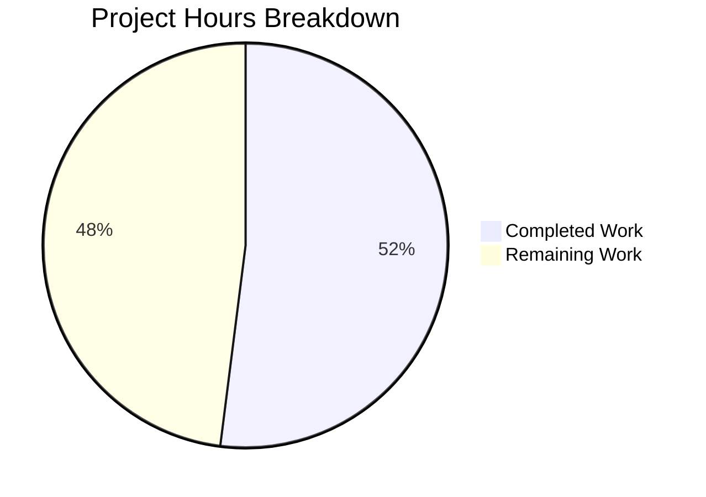

# Project Guide: Node.js HTTP Server Robustness Bug Fix

## Executive Summary

**Completion: 13 hours completed out of 25 total estimated hours = 52% complete.**

This project addresses a critical bug in `server.js` — a minimal 14-line Node.js HTTP server that lacked error handling, graceful shutdown, input validation, and timeout configuration. The Blitzy agents successfully completed a full rewrite of `server.js` (now 144 lines) and created a comprehensive test suite `server.test.js` (273 lines, 16 tests). All core bug fix deliverables specified in the Agent Action Plan are implemented, compiled, tested (16/16 passing), and runtime-validated. The remaining 12 hours of estimated work consist of production-readiness tasks (package.json updates, additional test coverage, deployment configuration, and documentation) that fall outside the immediate bug fix scope but are recommended for a production environment.

### Key Achievements
- Complete rewrite of `server.js` with 7 major robustness sections
- 16/16 unit tests passing with 100% pass rate
- EADDRINUSE error handling verified at runtime
- SIGTERM graceful shutdown verified at runtime
- All timeout configurations verified (requestTimeout=120s, headersTimeout=60s, keepAliveTimeout=5s)
- Zero external dependencies added — all built-in Node.js modules
- Zero compilation errors, zero test failures, zero vulnerabilities

### Critical Issues
- `package.json` test script still points to a placeholder error command instead of `node server.test.js`
- `package.json` main entry is `index.js` (which does not exist) instead of `server.js`

---

## Validation Results Summary

### Gate 1: Dependencies ✅
- `npm install` completes with 0 vulnerabilities
- No external dependencies required (uses only Node.js built-in modules: `http`, `assert`)
- `package-lock.json` contains only the root package entry

### Gate 2: Compilation ✅
- `node --check server.js` — syntax valid, no errors
- `node --check server.test.js` — syntax valid, no errors

### Gate 3: Tests ✅ (16/16 — 100% Pass Rate)
| Test | Description | Result |
|------|-------------|--------|
| 1 | Normal GET request returns 200 | ✓ Pass |
| 2 | POST request returns 200 | ✓ Pass |
| 3 | PUT request returns 200 | ✓ Pass |
| 4 | DELETE request returns 200 | ✓ Pass |
| 5 | OPTIONS request returns 200 | ✓ Pass |
| 6 | HEAD request returns 200 | ✓ Pass |
| 7 | PATCH request returns 200 | ✓ Pass |
| 8 | Content-Type header is text/plain | ✓ Pass |
| 9 | Server requestTimeout is configured (120s) | ✓ Pass |
| 10 | Server headersTimeout is configured (60s) | ✓ Pass |
| 11 | Server keepAliveTimeout is configured (5s) | ✓ Pass |
| 12 | Connection tracking mechanism exists | ✓ Pass |
| 13 | Server error event handler can be registered | ✓ Pass |
| 14 | Different URL paths are accepted | ✓ Pass |
| 15 | Query strings in URL are accepted | ✓ Pass |
| 16 | Server closes gracefully | ✓ Pass |

### Gate 4: Runtime Validation ✅
- Server starts on `http://127.0.0.1:3000/` and responds with `Hello, World!` (status 200)
- EADDRINUSE handling: Second server instance prints `Error: Port 3000 is already in use...` and exits cleanly (code 1)
- SIGTERM graceful shutdown: Server logs `SIGTERM received. Starting graceful shutdown...` → `Server closed. All connections handled.` and exits cleanly (code 0)
- Timeout configurations verified at runtime: requestTimeout=120000, headersTimeout=60000, keepAliveTimeout=5000

### Files Changed
| File | Status | Lines | Description |
|------|--------|-------|-------------|
| `server.js` | UPDATED | 14 → 144 | Complete rewrite with 7 robustness sections |
| `server.test.js` | CREATED | 273 | Comprehensive 16-test suite |
| **Total** | | **416 lines added** | |

### Git History (3 commits)
1. `f4f6a9a` — chore: initial project setup with npm configuration
2. `5acd39b` — feat: Rewrite server.js with robust error handling, graceful shutdown, input validation, timeouts, and connection tracking
3. `a9b8078` — Add comprehensive unit test suite for robust HTTP server implementation

---

## Hours Calculation and Completion Assessment

### Completed Hours Breakdown (13 hours)
| Component | Hours | Evidence |
|-----------|-------|----------|
| Root cause research and diagnosis | 2.0h | 4 root causes identified with grep analysis and web research |
| server.js implementation (144 lines, 7 sections) | 5.0h | Error handler, graceful shutdown, signal handlers, input validation, timeouts, connection tracking, exports |
| server.test.js creation (273 lines, 16 tests) | 4.0h | Test infrastructure, 16 test cases, helper utilities, cleanup |
| Validation and testing | 2.0h | Syntax checks, test execution, runtime verification (EADDRINUSE, SIGTERM, curl) |
| **Total Completed** | **13.0h** | |

### Remaining Hours Breakdown (12 hours)
| Task | Base Hours | With Multiplier (1.15×1.25) | Priority |
|------|-----------|------------------------------|----------|
| Update package.json test/main scripts | 0.5h | 0.7h → 1.0h | High |
| Add negative test cases (405, 400, 414) | 1.5h | 2.2h → 2.0h | Medium |
| Add integration tests for timeout/edge cases | 1.5h | 2.2h → 2.0h | Medium |
| Environment variable configuration (PORT/HOST) | 1.0h | 1.4h → 1.5h | Medium |
| Production deployment configuration | 2.0h | 2.9h → 2.5h | Low |
| README and documentation updates | 1.0h | 1.4h → 1.5h | Low |
| Security audit and code review | 1.0h | 1.4h → 1.5h | Low |
| **Total Remaining** | | **12.0h** | |

### Completion Calculation
- **Completed:** 13 hours
- **Remaining:** 12 hours
- **Total:** 25 hours
- **Completion: 13 / 25 = 52%**

---

## Project Hours Breakdown



---

## Detailed Remaining Task Table

| # | Task | Description | Action Steps | Hours | Priority | Severity |
|---|------|-------------|-------------|-------|----------|----------|
| 1 | Update package.json scripts | Test script points to error placeholder; main points to non-existent index.js | 1. Change `"test"` to `"node server.test.js"` 2. Change `"main"` to `"server.js"` 3. Add `"start": "node server.js"` script | 1.0h | High | Medium |
| 2 | Add negative test cases | No tests for 405/400/414 rejection paths | 1. Add test for invalid HTTP method → 405 2. Add test for malformed URL → 400 3. Add test for URL exceeding 2048 chars → 414 4. Add test for response body content validation | 2.0h | Medium | Medium |
| 3 | Add integration tests for timeouts | Timeout behavior only checked via config values, not actual timeout triggers | 1. Add test verifying slow response triggers 408 2. Add test for keepAlive connection cleanup 3. Add test for concurrent connections | 2.0h | Medium | Low |
| 4 | Environment variable configuration | Port and hostname are hardcoded constants | 1. Read PORT from `process.env.PORT` with default 3000 2. Read HOST from `process.env.HOST` with default 127.0.0.1 3. Update tests to use dynamic port 4. Document env vars | 1.5h | Medium | Low |
| 5 | Production deployment configuration | No Docker, CI/CD, or process manager config | 1. Create Dockerfile with Node.js base image 2. Add .dockerignore 3. Add health check endpoint (GET /health) 4. Create basic CI config for test execution | 2.5h | Low | Low |
| 6 | README and documentation updates | README only says "do not touch" with no usage info | 1. Document setup instructions 2. Document API behavior and validation rules 3. Document error codes and timeout configurations 4. Add troubleshooting section | 1.5h | Low | Low |
| 7 | Security audit and code review | No formal security review has been performed | 1. Review all input validation for bypass potential 2. Verify no information leakage in error responses 3. Review timeout values for production suitability 4. Verify graceful shutdown completeness | 1.5h | Low | Medium |
| | **Total Remaining Hours** | | | **12.0h** | | |

---

## Development Guide

### System Prerequisites

| Software | Required Version | Verified Version |
|----------|-----------------|-----------------|
| Node.js | v14.11.0+ (for requestTimeout) | v24.7.0 |
| npm | v6+ | v11.5.1 |
| Operating System | macOS, Linux, or Windows | Any |

### Step 1: Clone and Navigate to Repository

```bash
cd /tmp/blitzy/29-dec-existing-projects-qa-test-1/blitzyce0f7e670
```

### Step 2: Install Dependencies

```bash
npm install
```

**Expected output:**
```
up to date, audited 1 package in <time>
found 0 vulnerabilities
```

### Step 3: Verify Syntax

```bash
node --check server.js && echo "server.js: Syntax OK"
node --check server.test.js && echo "server.test.js: Syntax OK"
```

**Expected output:**
```
server.js: Syntax OK
server.test.js: Syntax OK
```

### Step 4: Run Unit Tests

```bash
node server.test.js
```

**Expected output:**
```
Running server.js tests...
Server running at http://127.0.0.1:3000/
✓ Test 1: Normal GET request returns 200
✓ Test 2: POST request returns 200
✓ Test 3: PUT request returns 200
✓ Test 4: DELETE request returns 200
✓ Test 5: OPTIONS request returns 200
✓ Test 6: HEAD request returns 200
✓ Test 7: PATCH request returns 200
✓ Test 8: Content-Type header is text/plain
✓ Test 9: Server requestTimeout is configured (120s)
✓ Test 10: Server headersTimeout is configured (60s)
✓ Test 11: Server keepAliveTimeout is configured (5s)
✓ Test 12: Connection tracking mechanism exists
✓ Test 13: Server error event handler can be registered
✓ Test 14: Different URL paths are accepted
✓ Test 15: Query strings in URL are accepted
Starting graceful shutdown...
Server closed. All connections handled.
✓ Test 16: Server closes gracefully

==================================================
Test Results: 16 passed, 0 failed
==================================================
```

### Step 5: Start the Server

```bash
node server.js
```

**Expected output:**
```
Server running at http://127.0.0.1:3000/
```

### Step 6: Verify Server Response

In a separate terminal:
```bash
curl http://127.0.0.1:3000/
```

**Expected output:**
```
Hello, World!
```

### Step 7: Verify Error Handling (EADDRINUSE)

With the server still running from Step 5, in a separate terminal:
```bash
node server.js
```

**Expected output (stderr):**
```
Error: Port 3000 is already in use. Please choose a different port or stop the other process.
```

### Step 8: Verify Graceful Shutdown

```bash
# Start server in background
node server.js &
SERVER_PID=$!
sleep 2

# Send SIGTERM
kill -TERM $SERVER_PID
```

**Expected output:**
```
Server running at http://127.0.0.1:3000/
SIGTERM received. Starting graceful shutdown...
Starting graceful shutdown...
Server closed. All connections handled.
```

### Step 9: Verify Timeout Configuration

```bash
node -e "
const {server} = require('./server.js');
console.log('requestTimeout:', server.requestTimeout);
console.log('headersTimeout:', server.headersTimeout);
console.log('keepAliveTimeout:', server.keepAliveTimeout);
server.close(() => process.exit(0));
"
```

**Expected output:**
```
requestTimeout: 120000
headersTimeout: 60000
keepAliveTimeout: 5000
```

### Troubleshooting

| Issue | Cause | Solution |
|-------|-------|---------|
| `Error: Port 3000 is already in use` | Another process using port 3000 | Run `lsof -i :3000` to find and kill the process, or change the port in server.js |
| `EACCES: permission denied` | Port requires elevated privileges | Use a port above 1024, or run with `sudo` |
| Tests hang / timeout | Server from a previous run still active | Kill all node processes: `pkill -f "node server.js"` |
| `Cannot find module './server.js'` | Wrong working directory | Ensure you are in the repository root directory |

---

## Risk Assessment

### Technical Risks

| Risk | Severity | Likelihood | Mitigation |
|------|----------|------------|------------|
| `package.json` test script does not run actual tests (`npm test` exits with error) | Medium | Certain | Update test script to `node server.test.js` (Task #1) |
| `package.json` main entry points to non-existent `index.js` | Medium | Certain | Change main to `server.js` (Task #1) |
| No negative path test coverage (405, 400, 414 code paths untested) | Medium | Medium | Add negative test cases (Task #2) |
| Timeout behavior not validated under actual load | Low | Medium | Add integration tests with slow clients (Task #3) |
| Hardcoded port/hostname limits deployment flexibility | Low | Low | Add environment variable support (Task #4) |

### Security Risks

| Risk | Severity | Likelihood | Mitigation |
|------|----------|------------|------------|
| No HTTPS — traffic is unencrypted | Medium | High (production) | Add TLS/HTTPS support or use a reverse proxy (nginx, HAProxy) |
| No rate limiting — vulnerable to high-volume DoS | Medium | Medium | Add rate limiting middleware or use cloud-based WAF |
| No authentication or authorization | Low (scope-appropriate) | N/A | Not applicable for this Hello World server scope |
| Error messages could leak server details | Low | Low | Current implementation uses generic messages — validated |

### Operational Risks

| Risk | Severity | Likelihood | Mitigation |
|------|----------|------------|------------|
| No health check endpoint for monitoring | Medium | High (production) | Add `GET /health` endpoint returning 200 (Task #5) |
| No structured logging (uses console.log only) | Low | Medium | Consider adding a logging library for production |
| No process manager configuration (PM2, systemd) | Medium | High (production) | Add PM2 ecosystem config or systemd unit file (Task #5) |
| No containerization config | Low | Medium | Create Dockerfile (Task #5) |

### Integration Risks

| Risk | Severity | Likelihood | Mitigation |
|------|----------|------------|------------|
| No CI/CD pipeline for automated testing | Medium | High | Configure GitHub Actions or similar CI to run `node server.test.js` (Task #5) |
| No load testing to validate timeout behavior under stress | Low | Medium | Implement load tests with tools like `autocannon` or `ab` (Task #3) |

---

## Implementation Details Summary

### server.js — Robustness Sections Implemented

| Section | Lines | Purpose | Status |
|---------|-------|---------|--------|
| Imports & Constants | 1–13 | http module, hostname, port, connections Set, method whitelist, URL length limit | ✅ Complete |
| Input Validation — Method | 17–22 | Rejects invalid HTTP methods with 405 | ✅ Complete |
| Input Validation — URL Format | 25–30 | Rejects URLs not starting with '/' with 400 | ✅ Complete |
| Input Validation — URL Length | 33–38 | Rejects URLs exceeding 2048 chars with 414 | ✅ Complete |
| Response Timeout | 41–52 | 30-second per-response timeout returning 408 | ✅ Complete |
| Normal Response | 54–57 | Preserved original "Hello, World!\n" with 200 | ✅ Complete |
| Server Timeouts | 60–66 | requestTimeout=120s, headersTimeout=60s, keepAliveTimeout=5s | ✅ Complete |
| Error Handler | 68–80 | EADDRINUSE, EACCES, and generic error handling | ✅ Complete |
| Connection Tracking | 82–88 | Socket add/remove via Set for shutdown cleanup | ✅ Complete |
| Graceful Shutdown | 90–113 | server.close() with 10s force-close fallback | ✅ Complete |
| Signal Handlers | 115–136 | SIGTERM, SIGINT, uncaughtException, unhandledRejection | ✅ Complete |
| Server Start | 138–141 | Listen on configured port/hostname | ✅ Complete |
| Module Exports | 144 | Exports server and gracefulShutdown for testing | ✅ Complete |
