# Technical Specification

# 1. Introduction

This Technical Specification documents the **hao-backprop-test** repository, a minimal Node.js HTTP server designed explicitly as a testing scaffold for Backprop integration. This document serves as the authoritative reference for understanding the system's purpose, technical composition, and intentional constraints.

---

## 1.1 Executive Summary

### 1.1.1 Project Overview

The hao-backprop-test project is a deliberately minimal "Hello World" implementation in Node.js, created to serve as a controlled testing target for Backprop—a tool or service utilized for code analysis, refactoring, or AI-assisted development workflows. The repository is explicitly marked with the constraint "Do not touch!" indicating it should remain in its current state to preserve its utility as a consistent test fixture.

| Attribute | Value |
|-----------|-------|
| Project Name | hello_world |
| Repository Name | hao-backprop-test |
| Version | 1.0.0 |
| License | MIT |
| Author | hxu |

### 1.1.2 Core Business Problem

The project addresses the need for a **stable, predictable repository structure** that can be used to validate Backprop integration functionality. Key characteristics that make this an effective test target include:

- **Minimal Complexity**: A single-purpose HTTP server with deterministic behavior
- **Multi-File-Type Composition**: Includes source code, configuration files, binary documents, images, and data files to exercise diverse file handling scenarios
- **Duplicate Detection Scenarios**: Contains intentional file duplicates (e.g., `server.js` / `server - Copy.js`) for testing comparison and deduplication features
- **Zero External Dependencies**: Eliminates variable behavior from third-party packages

### 1.1.3 Key Stakeholders and Users

| Stakeholder | Role | Interest |
|-------------|------|----------|
| Backprop Development Team | Primary Users | Integration testing and validation |
| hxu (Author) | Maintainer | Repository stability and integrity |
| Quality Assurance Engineers | Secondary Users | Tool verification against known baseline |
| Developer Tools Engineers | Consumers | Code analysis tool development |

### 1.1.4 Expected Business Impact and Value Proposition

The value of this project lies not in production functionality but in its role as a **testing artifact**:

| Value Dimension | Description |
|-----------------|-------------|
| Test Reproducibility | Provides consistent baseline for regression testing |
| Integration Validation | Enables verification of Backprop tool capabilities |
| Multi-Format Coverage | Tests tool behavior across code, data, and binary files |
| Minimal Maintenance | Zero dependencies eliminate update/security concerns |

---

## 1.2 System Overview

### 1.2.1 Project Context

#### Business Context and Market Positioning

This repository occupies a specialized niche as **developer tooling infrastructure** rather than end-user software. It serves the internal needs of teams developing or integrating with Backprop, providing a known-good repository state against which tool behavior can be validated.

#### Current System Limitations

As an intentionally minimal implementation, the system has deliberate limitations that are features rather than deficiencies:

| Limitation | Rationale |
|------------|-----------|
| Localhost-only binding (127.0.0.1) | Prevents external access; appropriate for local testing |
| No request routing | Simplifies behavior verification |
| No error handling | Reduces code paths for deterministic testing |
| No logging beyond startup | Minimizes output noise during automated testing |

#### Integration with Existing Enterprise Landscape

The repository is designed as a **standalone testing fixture** with no integration requirements:

- No database connectivity
- No external API consumption
- No authentication services
- No message queue integration
- No cloud service dependencies

### 1.2.2 High-Level Description

#### Primary System Capabilities

The system provides a single capability: responding to HTTP requests with a fixed "Hello, World!" message.

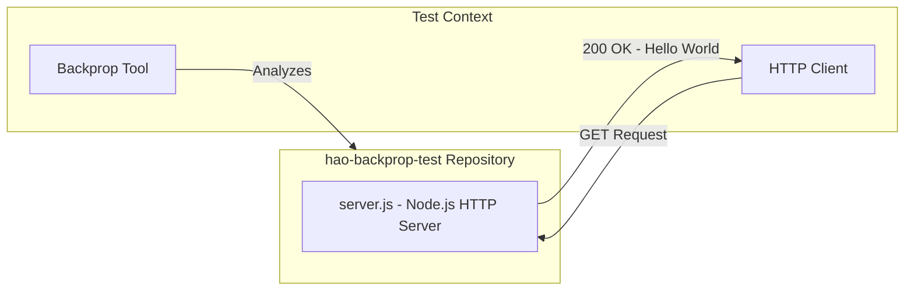

#### Major System Components

| Component | File | Purpose |
|-----------|------|---------|
| HTTP Server | `server.js` | Core functionality—serves HTTP responses |
| Package Manifest | `package.json` | npm metadata and project configuration |
| Dependency Lock | `package-lock.json` | Ensures reproducible (empty) dependency tree |
| Documentation | `README.md` | Project identification and usage constraints |

**Supplementary Test Assets:**

| Category | Files | Purpose |
|----------|-------|---------|
| Binary Documents | `100Pages.pdf`, `sample.doc` | Document parsing test targets |
| Images | `demo.jpg` | Image file handling verification |
| Data Files | `industry.csv` | Structured data processing tests |
| Placeholder Stubs | `LoginTest.java`, `test.py.txt` | Multi-language detection testing |

#### Core Technical Approach

The HTTP server implementation follows a minimalist design philosophy:

| Aspect | Implementation |
|--------|----------------|
| Runtime | Node.js |
| Module System | CommonJS (`require()`) |
| HTTP Module | Built-in `http` module |
| Binding | `127.0.0.1:3000` |
| Response | Fixed: HTTP 200, `text/plain`, "Hello, World!\n" |

### 1.2.3 Success Criteria

#### Measurable Objectives

| Objective | Metric | Target |
|-----------|--------|--------|
| Server Availability | HTTP response on localhost:3000 | 100% when running |
| Response Consistency | Identical response to all requests | "Hello, World!\n" always |
| Startup Reliability | Successful binding to port | No port conflicts |
| Repository Stability | Unchanged file structure | Zero modifications |

#### Critical Success Factors

1. **Deterministic Behavior**: Server must respond identically to every request regardless of method, path, or headers
2. **Zero Dependencies**: No external packages that could introduce variability
3. **File Structure Integrity**: Repository structure must remain unchanged to preserve test validity
4. **Cross-Platform Compatibility**: Must run on any system with Node.js installed

#### Key Performance Indicators (KPIs)

| KPI | Description | Measurement |
|-----|-------------|-------------|
| Startup Time | Time from execution to listening state | Console log timestamp |
| Response Latency | Time to serve "Hello, World!" response | < 10ms (localhost) |
| Memory Footprint | Node.js process memory consumption | Minimal (single-digit MB) |
| Test Pass Rate | Backprop integration tests passing | 100% expected |

---

## 1.3 Scope

### 1.3.1 In-Scope

#### Core Features and Functionalities

**Must-Have Capabilities:**

| Capability | Description | Evidence |
|------------|-------------|----------|
| HTTP Response | Return "Hello, World!" to any HTTP request | `server.js` implementation |
| Localhost Binding | Listen on 127.0.0.1:3000 | Server configuration constants |
| Startup Notification | Log listening status to console | `console.log()` in server callback |

**Primary User Workflows:**

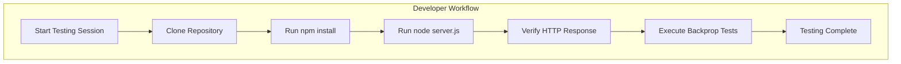

**Essential Integrations:**

| Integration Point | Type | Status |
|-------------------|------|--------|
| npm | Package management | Configured |
| Node.js runtime | Execution environment | Required |
| Backprop | Analysis tool target | Primary purpose |

**Key Technical Requirements:**

| Requirement | Specification |
|-------------|---------------|
| Node.js Version | Any version supporting CommonJS and `http` module |
| Network | Localhost access only |
| Port Availability | Port 3000 must be available |
| File System | Read access to server.js |

#### Implementation Boundaries

**System Boundaries:**

| Boundary | Definition |
|----------|------------|
| Network Scope | Localhost (127.0.0.1) only |
| Protocol | HTTP (no HTTPS) |
| Port | 3000 (fixed) |
| Process | Single Node.js process |

**User Groups Covered:**

| User Group | Access Level |
|------------|--------------|
| Backprop Tool Developers | Full repository access |
| Integration Testers | Read and execute access |
| Repository Maintainer (hxu) | Administrative access |

**Geographic/Market Coverage:**

- **Geographic**: Not applicable (development tool, not production service)
- **Market**: Internal developer tooling ecosystem

**Data Domains Included:**

| Domain | Files | Content Type |
|--------|-------|--------------|
| Source Code | `server.js`, `LoginTest.java` | Application logic |
| Configuration | `package.json`, `package-lock.json` | npm metadata |
| Reference Data | `industry.csv` | 44 industry category labels |
| Binary Test Assets | PDF, DOC, JPG files | Document and image formats |
| Documentation | `README.md` | Project description |

### 1.3.2 Out-of-Scope

#### Explicitly Excluded Features/Capabilities

| Excluded Feature | Rationale |
|------------------|-----------|
| Production Deployment | Explicitly marked "Do not touch!" and for testing only |
| Request Routing | Intentionally returns same response for all paths |
| Request Method Handling | No differentiation between GET, POST, etc. |
| Error Handling | Minimal implementation by design |
| Logging Framework | Console.log only; no structured logging |
| Configuration Management | Hardcoded values; no environment variables |
| Authentication/Authorization | Not required for testing purposes |
| Database Connectivity | No data persistence required |
| API Design | No RESTful or GraphQL endpoints |
| Input Validation | No request body or parameter processing |
| HTTPS/TLS | Security not required for localhost testing |

#### Future Phase Considerations

| Potential Enhancement | Phase | Notes |
|-----------------------|-------|-------|
| Additional language stubs | Future | Currently only Node.js and Java placeholders |
| Larger binary test files | Future | May expand PDF/image corpus |
| Multi-port testing | Future | Currently single port only |
| Container support | Future | No Docker configuration present |

#### Integration Points Not Covered

| Integration | Status | Reason |
|-------------|--------|--------|
| CI/CD Pipelines | Not configured | No `.github/workflows`, Jenkinsfile, etc. |
| Container Orchestration | Not supported | No Dockerfile or Kubernetes manifests |
| Cloud Deployment | Not supported | Localhost-only design |
| Monitoring/Observability | Not implemented | No metrics, tracing, or health endpoints |
| Secret Management | Not required | No secrets in scope |

#### Unsupported Use Cases

| Use Case | Support Status | Alternative |
|----------|----------------|-------------|
| Production web serving | ❌ Not Supported | Use production-grade frameworks |
| Multi-user access | ❌ Not Supported | N/A for testing scaffold |
| Persistent data storage | ❌ Not Supported | No database integration |
| Real authentication flows | ❌ Not Supported | `LoginTest.java` is non-functional stub |
| High-availability deployment | ❌ Not Supported | Single-process design |
| External network access | ❌ Not Supported | Bound to 127.0.0.1 only |

---

## 1.4 Document Conventions

### 1.4.1 Terminology

| Term | Definition |
|------|------------|
| Backprop | The code analysis/AI-assisted development tool this repository targets |
| Test Fixture | A controlled, stable repository state used for consistent testing |
| Stub | Non-functional placeholder code (e.g., `LoginTest.java`) |

### 1.4.2 Notation Standards

- File paths are presented in monospace: `server.js`
- Configuration values appear in monospace: `127.0.0.1:3000`
- Emphasis indicates intentional design decisions: **deliberately minimal**

---

## 1.5 References

### 1.5.1 Repository Files Examined

| File Path | Relevance to Introduction |
|-----------|---------------------------|
| `README.md` | Project name, purpose statement, usage constraint ("Do not touch!") |
| `package.json` | npm metadata: name, version, author, license, description, scripts |
| `package-lock.json` | Dependency verification (confirmed zero external dependencies) |
| `server.js` | Core HTTP server implementation details and configuration |
| `LoginTest.java` | Evidence of multi-language placeholder strategy |
| `industry.csv` | Reference data file demonstrating multi-file-type composition |
| `server - Copy.js` | Duplicate file for testing file comparison scenarios |
| `LoginTest - Copy.java` | Duplicate placeholder for consistency verification |

### 1.5.2 Repository Structure Examined

| Path | Description |
|------|-------------|
| `/` (root) | Flat repository structure containing all 12+ project files |

### 1.5.3 Binary Assets Catalogued

| Asset | Size | Purpose |
|-------|------|---------|
| `100Pages.pdf` | ~9.4 MB | Large document parsing test target |
| `demo.jpg` | ~2.1 MB | Image file handling verification |
| `sample.doc` | ~98 KB | Legacy document format testing |

# 2. Product Requirements

## 2.1 FEATURE CATALOG

### 2.1.1 Feature Overview

This section catalogs all discrete, testable features of the hao-backprop-test repository. Given the project's intentional minimalism as a Backprop testing fixture, the feature set is deliberately constrained to a single functional capability supported by a curated set of test assets.

| Feature ID | Feature Name | Category | Priority | Status |
|------------|--------------|----------|----------|--------|
| F-001 | Hello World HTTP Server | Core Functionality | Critical | Completed |
| F-002 | Test Asset Repository | Testing Infrastructure | High | Completed |

---

### 2.1.2 Feature F-001: Hello World HTTP Server

#### Feature Metadata

| Attribute | Value |
|-----------|-------|
| Feature ID | F-001 |
| Feature Name | Hello World HTTP Server |
| Category | Core Functionality |
| Priority Level | Critical |
| Status | Completed |
| Version | 1.0.0 |
| Owner | hxu |

#### Description

**Overview:**
The Hello World HTTP Server is the primary functional component of the repository, implementing a minimalist Node.js HTTP server that responds to all incoming requests with a fixed "Hello, World!" message. This feature serves as the executable target for Backprop integration testing.

**Business Value:**
- Provides a **deterministic, predictable endpoint** for automated testing
- Establishes a **known-good baseline** against which tool behavior can be validated
- Enables **regression testing** by maintaining consistent output across test runs
- Eliminates **external variables** through zero third-party dependencies

**User Benefits:**
| User Group | Benefit |
|------------|---------|
| Backprop Developers | Consistent test target with predictable behavior |
| QA Engineers | Reproducible test conditions for tool validation |
| Integration Testers | Simple verification of HTTP response handling |

**Technical Context:**
The server utilizes Node.js built-in `http` module with CommonJS module syntax, requiring no external package installation. The implementation is contained entirely within `server.js` (14 lines of code).

#### Dependencies

| Dependency Type | Dependency | Description |
|-----------------|------------|-------------|
| Runtime | Node.js | Any version supporting CommonJS and `http` module |
| Network | Port 3000 | Must be available for binding |
| File System | `server.js` | Read access required |

| External Dependencies | Status |
|-----------------------|--------|
| npm packages | None (zero dependencies) |
| External APIs | None |
| Database connections | None |
| Authentication services | None |

#### Integration Requirements

| Integration Point | Type | Status |
|-------------------|------|--------|
| npm | Package management | Configured in `package.json` |
| Node.js runtime | Execution environment | Required |
| Backprop tool | Analysis target | Primary purpose |

---

### 2.1.3 Feature F-002: Test Asset Repository

#### Feature Metadata

| Attribute | Value |
|-----------|-------|
| Feature ID | F-002 |
| Feature Name | Test Asset Repository |
| Category | Testing Infrastructure |
| Priority Level | High |
| Status | Completed |
| Version | 1.0.0 |
| Owner | hxu |

#### Description

**Overview:**
The Test Asset Repository is a curated collection of files designed to exercise diverse Backprop analysis capabilities. The repository structure includes intentional duplicate files, multi-language stubs, reference data files, binary documents, and placeholder files organized in a flat directory structure.

**Business Value:**
- Enables **multi-format testing** of code analysis tools
- Supports **duplicate detection validation** through intentional file copies
- Provides **language detection testing** via multi-language stub files
- Tests **binary file handling** with documents and images

**User Benefits:**
| User Group | Benefit |
|------------|---------|
| Tool Developers | Comprehensive file-type coverage for testing |
| QA Engineers | Pre-configured test scenarios |
| Integration Testers | Multi-format validation targets |

**Technical Context:**
The repository maintains a flat structure with 12+ files spanning source code (JavaScript, Java), configuration (JSON), data (CSV), binary documents (PDF, DOC), images (JPG), and text placeholders.

#### Asset Inventory

| Asset Category | Files | Purpose |
|----------------|-------|---------|
| Source Code | `server.js`, `LoginTest.java` | Code analysis targets |
| Duplicates | `server - Copy.js`, `LoginTest - Copy.java`, `industry - Copy.csv` | Deduplication testing |
| Configuration | `package.json`, `package-lock.json` | Metadata analysis |
| Reference Data | `industry.csv` (44 industry labels) | Structured data testing |
| Binary Documents | `100Pages.pdf` (~9.4 MB), `sample.doc` (~98 KB) | Document handling |
| Images | `demo.jpg` (~2.1 MB) | Image file processing |
| Placeholders | `test.py.txt`, `test.py - Copy.txt`, `test.txt.txt` | Path existence testing |

#### Dependencies

| Dependency Type | Dependency | Description |
|-----------------|------------|-------------|
| File System | Repository root | Read access to all files |
| Storage | ~12 MB total | Space for binary assets |

---

## 2.2 FUNCTIONAL REQUIREMENTS

### 2.2.1 Feature F-001 Requirements Table

#### HTTP Server Core Requirements

| Requirement ID | Description | Priority |
|----------------|-------------|----------|
| F-001-RQ-001 | Server Initialization | Must-Have |
| F-001-RQ-002 | HTTP Request Handling | Must-Have |
| F-001-RQ-003 | Response Generation | Must-Have |
| F-001-RQ-004 | Startup Notification | Must-Have |

---

#### F-001-RQ-001: Server Initialization

| Attribute | Specification |
|-----------|---------------|
| Requirement ID | F-001-RQ-001 |
| Description | Initialize HTTP server and bind to localhost port 3000 |
| Priority | Must-Have |
| Complexity | Low |

**Acceptance Criteria:**
| Criterion ID | Criterion | Verification Method |
|--------------|-----------|---------------------|
| AC-001-01 | Server binds to IP address 127.0.0.1 | Port binding verification |
| AC-001-02 | Server listens on port 3000 | Network socket inspection |
| AC-001-03 | Server starts without errors when port is available | Process exit code = 0 |

**Technical Specifications:**

| Parameter | Specification |
|-----------|---------------|
| Binding Address | `127.0.0.1` (localhost only) |
| Port Number | `3000` (fixed, not configurable) |
| Protocol | HTTP (not HTTPS) |
| Server Type | Single-threaded Node.js process |

| Output/Response | Specification |
|-----------------|---------------|
| Success State | Server listening on bound address |
| Failure State | Process terminates if port unavailable |

**Validation Rules:**

| Rule Type | Rule |
|-----------|------|
| Business Rule | Server must start without requiring any configuration |
| Data Validation | Port must be numeric 3000 |
| Security | Localhost-only binding prevents external access |

---

#### F-001-RQ-002: HTTP Request Handling

| Attribute | Specification |
|-----------|---------------|
| Requirement ID | F-001-RQ-002 |
| Description | Accept and process any incoming HTTP request |
| Priority | Must-Have |
| Complexity | Low |

**Acceptance Criteria:**
| Criterion ID | Criterion | Verification Method |
|--------------|-----------|---------------------|
| AC-002-01 | Server accepts GET requests | HTTP client test |
| AC-002-02 | Server accepts POST requests | HTTP client test |
| AC-002-03 | Server accepts requests on any path | Multi-path testing |
| AC-002-04 | Server accepts requests with any headers | Header variation testing |

**Technical Specifications:**

| Parameter | Specification |
|-----------|---------------|
| Supported Methods | ALL (GET, POST, PUT, DELETE, etc.) |
| Supported Paths | ALL (/, /any/path, /test, etc.) |
| Request Body | Ignored (not processed) |
| Query Parameters | Ignored (not processed) |

| Output/Response | Specification |
|-----------------|---------------|
| Behavior | Identical response regardless of request characteristics |
| Request Inspection | None performed |

**Validation Rules:**

| Rule Type | Rule |
|-----------|------|
| Business Rule | No routing logic; all requests receive identical treatment |
| Data Validation | None required; request content ignored |
| Security | No input validation (by design for testing) |

---

#### F-001-RQ-003: Response Generation

| Attribute | Specification |
|-----------|---------------|
| Requirement ID | F-001-RQ-003 |
| Description | Return fixed "Hello, World!" response to all requests |
| Priority | Must-Have |
| Complexity | Low |

**Acceptance Criteria:**
| Criterion ID | Criterion | Verification Method |
|--------------|-----------|---------------------|
| AC-003-01 | Response status code is 200 | HTTP response inspection |
| AC-003-02 | Content-Type header is `text/plain` | Header verification |
| AC-003-03 | Response body is exactly `Hello, World!\n` | Body content comparison |
| AC-003-04 | Response is identical for all requests | Multi-request testing |

**Technical Specifications:**

| Parameter | Specification |
|-----------|---------------|
| Status Code | `200` (always) |
| Content-Type | `text/plain` |
| Response Body | `Hello, World!\n` (15 characters including newline) |

| Output/Response | Specification |
|-----------------|---------------|
| Consistency | 100% identical across all requests |
| Determinism | No randomization or variation |

**Performance Criteria:**

| Metric | Target | Rationale |
|--------|--------|-----------|
| Response Latency | < 10ms | Localhost networking |
| Throughput | Not specified | Test fixture, not production |

**Validation Rules:**

| Rule Type | Rule |
|-----------|------|
| Business Rule | Response must never vary |
| Data Validation | Body must be exact string match |
| Compliance | MIT License compliance |

---

#### F-001-RQ-004: Startup Notification

| Attribute | Specification |
|-----------|---------------|
| Requirement ID | F-001-RQ-004 |
| Description | Log server status to console upon successful binding |
| Priority | Must-Have |
| Complexity | Low |

**Acceptance Criteria:**
| Criterion ID | Criterion | Verification Method |
|--------------|-----------|---------------------|
| AC-004-01 | Console log appears after successful startup | STDOUT inspection |
| AC-004-02 | Log message includes server URL | Text content verification |
| AC-004-03 | Log message format matches expected pattern | Regex validation |

**Technical Specifications:**

| Parameter | Specification |
|-----------|---------------|
| Output Channel | Standard output (console.log) |
| Message Format | `Server running at http://127.0.0.1:3000/` |
| Timing | After successful port binding |

| Output/Response | Specification |
|-----------------|---------------|
| Log Content | Exact URL where server is accessible |
| Log Format | Human-readable string |

---

### 2.2.2 Feature F-002 Requirements Table

#### Test Asset Requirements

| Requirement ID | Description | Priority |
|----------------|-------------|----------|
| F-002-RQ-001 | Duplicate File Pairs | Must-Have |
| F-002-RQ-002 | Multi-Language Stubs | Should-Have |
| F-002-RQ-003 | Reference Data Files | Should-Have |
| F-002-RQ-004 | Binary Asset Availability | Should-Have |

---

#### F-002-RQ-001: Duplicate File Pairs

| Attribute | Specification |
|-----------|---------------|
| Requirement ID | F-002-RQ-001 |
| Description | Maintain intentional file duplicates for deduplication testing |
| Priority | Must-Have |
| Complexity | Low |

**Acceptance Criteria:**
| Criterion ID | Criterion | Verification Method |
|--------------|-----------|---------------------|
| AC-101-01 | `server.js` and `server - Copy.js` have identical content | File hash comparison |
| AC-101-02 | `LoginTest.java` and `LoginTest - Copy.java` have identical content | File hash comparison |
| AC-101-03 | `industry.csv` and `industry - Copy.csv` have identical content | File hash comparison |

**Technical Specifications:**

| Duplicate Pair | File Type | Purpose |
|----------------|-----------|---------|
| `server.js` / `server - Copy.js` | JavaScript | Source code deduplication |
| `LoginTest.java` / `LoginTest - Copy.java` | Java | Multi-language deduplication |
| `industry.csv` / `industry - Copy.csv` | CSV | Data file deduplication |

---

#### F-002-RQ-002: Multi-Language Stubs

| Attribute | Specification |
|-----------|---------------|
| Requirement ID | F-002-RQ-002 |
| Description | Include non-functional language stubs for language detection testing |
| Priority | Should-Have |
| Complexity | Low |

**Acceptance Criteria:**
| Criterion ID | Criterion | Verification Method |
|--------------|-----------|---------------------|
| AC-102-01 | `LoginTest.java` contains valid Java syntax | Syntax parsing |
| AC-102-02 | `LoginTest.java` is non-functional (stub only) | Code inspection |
| AC-102-03 | File extensions correctly identify language | Extension verification |

**Technical Specifications:**

| Stub File | Language | Content Type |
|-----------|----------|--------------|
| `LoginTest.java` | Java | Class definition with empty method |
| `test.py.txt` | Python (placeholder) | Empty/minimal content |

---

#### F-002-RQ-003: Reference Data Files

| Attribute | Specification |
|-----------|---------------|
| Requirement ID | F-002-RQ-003 |
| Description | Include structured data files for data processing tests |
| Priority | Should-Have |
| Complexity | Low |

**Acceptance Criteria:**
| Criterion ID | Criterion | Verification Method |
|--------------|-----------|---------------------|
| AC-103-01 | `industry.csv` contains valid CSV format | CSV parsing |
| AC-103-02 | File contains 44 industry category labels | Row count verification |
| AC-103-03 | Data is consistent and parseable | Data validation |

**Technical Specifications:**

| Data File | Format | Content |
|-----------|--------|---------|
| `industry.csv` | CSV | 44 industry category labels (e.g., "Accounting", "Airlines/Aviation") |

---

#### F-002-RQ-004: Binary Asset Availability

| Attribute | Specification |
|-----------|---------------|
| Requirement ID | F-002-RQ-004 |
| Description | Include binary files for document/image handling verification |
| Priority | Should-Have |
| Complexity | Low |

**Acceptance Criteria:**
| Criterion ID | Criterion | Verification Method |
|--------------|-----------|---------------------|
| AC-104-01 | `100Pages.pdf` is a valid PDF file | MIME type verification |
| AC-104-02 | `demo.jpg` is a valid JPEG image | MIME type verification |
| AC-104-03 | `sample.doc` is a valid DOC file | MIME type verification |
| AC-104-04 | Binary files are readable without corruption | Checksum validation |

**Technical Specifications:**

| Binary Asset | Format | Size | Purpose |
|--------------|--------|------|---------|
| `100Pages.pdf` | PDF | ~9.4 MB | Large document parsing |
| `demo.jpg` | JPEG | ~2.1 MB | Image file handling |
| `sample.doc` | DOC | ~98 KB | Legacy document format |

---

## 2.3 FEATURE RELATIONSHIPS

### 2.3.1 Feature Dependencies Map

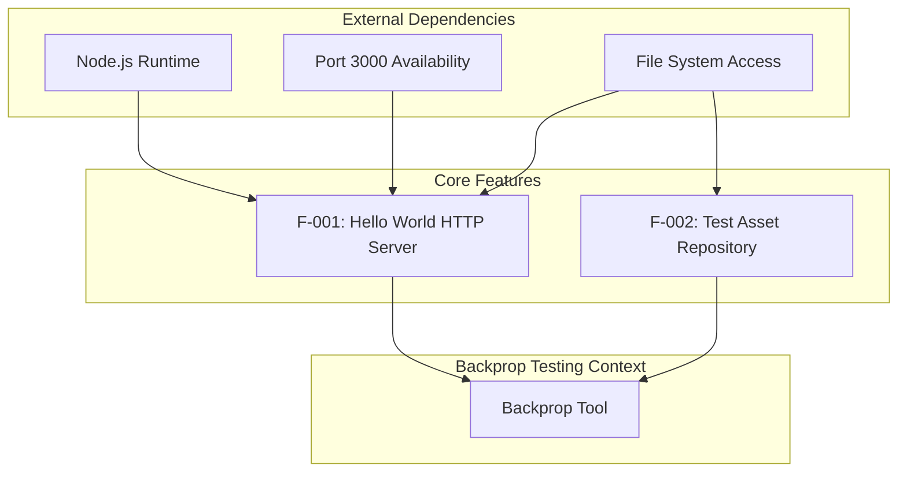

### 2.3.2 Feature Dependency Matrix

| Feature | Depends On | Depended By |
|---------|------------|-------------|
| F-001 | Node.js Runtime, Port 3000, File System | Backprop Tool |
| F-002 | File System | Backprop Tool |

### 2.3.3 Integration Points

| Integration Point | Features Involved | Description |
|-------------------|-------------------|-------------|
| npm Package Management | F-001 | `package.json` defines project metadata and entry points |
| HTTP Protocol | F-001 | Server communicates via HTTP on port 3000 |
| File System | F-001, F-002 | All features require read access to repository files |
| Backprop Analysis | F-001, F-002 | Both features serve as analysis targets |

### 2.3.4 Shared Components

| Component | Used By | Purpose |
|-----------|---------|---------|
| `package.json` | F-001, F-002 | Project configuration and metadata |
| Repository root directory | F-001, F-002 | Flat structure containing all files |
| Node.js runtime | F-001 | Server execution environment |

### 2.3.5 Common Services

This project intentionally uses **no shared services** to maintain zero external dependencies. All functionality is self-contained within:

| Service Type | Status | Rationale |
|--------------|--------|-----------|
| Database | Not Used | No persistence required |
| Cache | Not Used | No caching needed for fixed response |
| Logging Service | Not Used | Console.log only |
| Authentication | Not Used | Not required for test fixture |
| External APIs | Not Used | Self-contained design |

---

## 2.4 IMPLEMENTATION CONSIDERATIONS

### 2.4.1 Feature F-001 Implementation Considerations

#### Technical Constraints

| Constraint | Description | Impact |
|------------|-------------|--------|
| Localhost-Only Binding | Server binds to `127.0.0.1` only | Cannot serve external traffic |
| Fixed Port | Hardcoded to port 3000 | Port conflicts require manual resolution |
| No Configuration | No environment variables or config files | Cannot customize behavior |
| CommonJS Only | Uses `require()` syntax | Not ES Module compatible without changes |

#### Performance Requirements

| Metric | Requirement | Rationale |
|--------|-------------|-----------|
| Startup Time | < 1 second | Simple initialization |
| Response Latency | < 10ms | Localhost networking, no processing |
| Memory Footprint | < 50 MB | Single-digit MB typical for Node.js |
| Concurrent Connections | Not specified | Test fixture, not load tested |

#### Scalability Considerations

| Aspect | Current State | Notes |
|--------|---------------|-------|
| Horizontal Scaling | Not Supported | Single-process design |
| Vertical Scaling | Not Required | Minimal resource usage |
| Load Balancing | Not Applicable | Localhost binding |
| Clustering | Not Implemented | Single Node.js instance |

#### Security Implications

| Security Aspect | Status | Description |
|-----------------|--------|-------------|
| Network Exposure | Mitigated | Localhost-only binding prevents external access |
| Input Validation | Not Required | No user input processed |
| Authentication | Not Required | Test fixture, not production |
| HTTPS/TLS | Not Implemented | HTTP only, acceptable for localhost |
| Dependencies | Zero Risk | No third-party packages to audit |

#### Maintenance Requirements

| Requirement | Description | Frequency |
|-------------|-------------|-----------|
| Dependency Updates | None required | N/A (zero dependencies) |
| Security Patches | None required | No external packages |
| Node.js Compatibility | Verify with new Node.js releases | Quarterly |
| Repository Integrity | Verify files unchanged | Per test cycle |

---

### 2.4.2 Feature F-002 Implementation Considerations

#### Technical Constraints

| Constraint | Description | Impact |
|------------|-------------|--------|
| Flat Structure | All files in root directory | No folder organization |
| Fixed File Set | Specific files required for testing | Changes may invalidate tests |
| Binary Size | ~12 MB total for binary assets | Storage requirements |
| File Naming | Includes spaces in some filenames | May require quoting in scripts |

#### Storage Requirements

| Asset Type | Size | Files |
|------------|------|-------|
| Binary Documents | ~9.5 MB | `100Pages.pdf`, `sample.doc` |
| Images | ~2.1 MB | `demo.jpg` |
| Source/Config | < 50 KB | All text files |
| **Total** | **~12 MB** | 12+ files |

#### Security Implications

| Security Aspect | Status | Description |
|-----------------|--------|-------------|
| Sensitive Data | None | No credentials or PII in repository |
| Binary Verification | Recommended | Verify binary files haven't been tampered |
| File Permissions | Standard | Read access sufficient |

#### Maintenance Requirements

| Requirement | Description | Frequency |
|-------------|-------------|-----------|
| File Integrity | Verify duplicate pairs remain identical | Per test cycle |
| Binary Validation | Confirm binary files are uncorrupted | Monthly |
| Structure Verification | Confirm flat structure maintained | Per modification |

---

## 2.5 TRACEABILITY MATRIX

### 2.5.1 Requirements to Features Matrix

| Requirement ID | Feature ID | Description |
|----------------|------------|-------------|
| F-001-RQ-001 | F-001 | Server Initialization |
| F-001-RQ-002 | F-001 | HTTP Request Handling |
| F-001-RQ-003 | F-001 | Response Generation |
| F-001-RQ-004 | F-001 | Startup Notification |
| F-002-RQ-001 | F-002 | Duplicate File Pairs |
| F-002-RQ-002 | F-002 | Multi-Language Stubs |
| F-002-RQ-003 | F-002 | Reference Data Files |
| F-002-RQ-004 | F-002 | Binary Asset Availability |

### 2.5.2 Requirements to Source Files Matrix

| Requirement ID | Source File(s) | Evidence |
|----------------|----------------|----------|
| F-001-RQ-001 | `server.js` (lines 3-4) | `hostname` and `port` constants |
| F-001-RQ-002 | `server.js` (lines 6-9) | `createServer` callback function |
| F-001-RQ-003 | `server.js` (lines 7-8) | Response headers and body |
| F-001-RQ-004 | `server.js` (lines 12-14) | `server.listen` callback |
| F-002-RQ-001 | `server - Copy.js`, `LoginTest - Copy.java`, `industry - Copy.csv` | File existence |
| F-002-RQ-002 | `LoginTest.java` | Java class structure |
| F-002-RQ-003 | `industry.csv` | CSV content (44 rows) |
| F-002-RQ-004 | `100Pages.pdf`, `demo.jpg`, `sample.doc` | Binary file presence |

### 2.5.3 Requirements to Acceptance Criteria Matrix

| Requirement ID | Acceptance Criteria IDs | Total Criteria |
|----------------|-------------------------|----------------|
| F-001-RQ-001 | AC-001-01, AC-001-02, AC-001-03 | 3 |
| F-001-RQ-002 | AC-002-01, AC-002-02, AC-002-03, AC-002-04 | 4 |
| F-001-RQ-003 | AC-003-01, AC-003-02, AC-003-03, AC-003-04 | 4 |
| F-001-RQ-004 | AC-004-01, AC-004-02, AC-004-03 | 3 |
| F-002-RQ-001 | AC-101-01, AC-101-02, AC-101-03 | 3 |
| F-002-RQ-002 | AC-102-01, AC-102-02, AC-102-03 | 3 |
| F-002-RQ-003 | AC-103-01, AC-103-02, AC-103-03 | 3 |
| F-002-RQ-004 | AC-104-01, AC-104-02, AC-104-03, AC-104-04 | 4 |

---

## 2.6 ASSUMPTIONS AND CONSTRAINTS

### 2.6.1 Assumptions

| ID | Assumption | Impact if False |
|----|------------|-----------------|
| A-001 | Node.js is installed on the target system | Server cannot start |
| A-002 | Port 3000 is available | Binding failure |
| A-003 | Repository files remain unmodified | Test validity compromised |
| A-004 | File system provides read access | Files inaccessible |
| A-005 | Backprop tool is the primary consumer | Documentation scope may differ |

### 2.6.2 Constraints

| ID | Constraint | Rationale |
|----|------------|-----------|
| C-001 | "Do not touch!" - No modifications allowed | Preserve test fixture integrity |
| C-002 | Zero external dependencies | Eliminate third-party variability |
| C-003 | Localhost-only operation | Security and simplicity |
| C-004 | Fixed response content | Deterministic testing |
| C-005 | MIT License compliance | Open source requirements |

---

## 2.7 REFERENCES

### 2.7.1 Repository Files Examined

| File Path | Relevance to Product Requirements |
|-----------|-----------------------------------|
| `server.js` | Core HTTP server implementation; basis for F-001 requirements |
| `server - Copy.js` | Duplicate file pair for F-002-RQ-001 |
| `package.json` | Project metadata, npm configuration, dependency verification |
| `package-lock.json` | Confirms zero external dependencies |
| `README.md` | Project purpose and "Do not touch!" constraint |
| `LoginTest.java` | Multi-language stub for F-002-RQ-002 |
| `LoginTest - Copy.java` | Duplicate file pair for F-002-RQ-001 |
| `industry.csv` | Reference data file for F-002-RQ-003 |
| `industry - Copy.csv` | Duplicate file pair for F-002-RQ-001 |
| `100Pages.pdf` | Binary document asset for F-002-RQ-004 |
| `demo.jpg` | Image asset for F-002-RQ-004 |
| `sample.doc` | Legacy document asset for F-002-RQ-004 |
| `test.py.txt` | Placeholder file for multi-language testing |

### 2.7.2 Technical Specification Sections Referenced

| Section | Relevance |
|---------|-----------|
| 1.1 Executive Summary | Project identity and stakeholder context |
| 1.2 System Overview | Success criteria and KPIs |
| 1.3 Scope | In-scope/out-of-scope boundaries |
| 1.4 Document Conventions | Terminology and notation standards |
| 1.5 References | Repository file inventory |

---

# 3. Technology Stack

## 3.1 Overview

The hao-backprop-test repository employs a deliberately minimal technology stack, carefully designed to serve as a stable, predictable testing fixture for Backprop integration validation. Unlike production applications that leverage comprehensive technology ecosystems, this project's architecture prioritizes simplicity, determinism, and zero external dependencies as core design principles.

### 3.1.1 Design Philosophy

The technology selections in this repository are guided by the following architectural imperatives:

| Principle | Implementation | Rationale |
|-----------|----------------|-----------|
| **Zero Dependencies** | No `dependencies` or `devDependencies` in `package.json` | Eliminates variable behavior from third-party packages |
| **Built-in Modules Only** | Uses Node.js native `http` module exclusively | Ensures predictable behavior across Node.js installations |
| **Minimal Footprint** | 14 lines of server code | Reduces code paths for deterministic testing |
| **Cross-Platform Compatibility** | Pure JavaScript with CommonJS syntax | Runs on any system with Node.js installed |

### 3.1.2 Technology Stack Summary

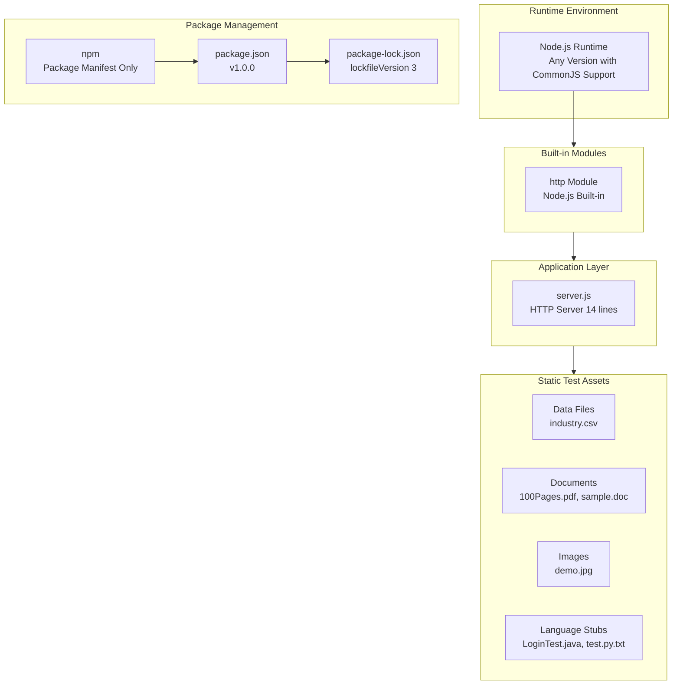

---

## 3.2 Programming Languages

### 3.2.1 Primary Language: JavaScript (Node.js)

JavaScript serves as the sole functional programming language in this repository, executing within the Node.js runtime environment.

| Attribute | Value | Evidence |
|-----------|-------|----------|
| **Language** | JavaScript (ECMAScript) | `server.js` source file |
| **Runtime** | Node.js | `package.json` npm project configuration |
| **Module System** | CommonJS (`require()`) | Line 1: `const http = require('http');` |
| **Syntax Style** | ES6+ with CommonJS exports | Arrow functions not used; traditional function syntax |

#### Version Requirements

| Aspect | Requirement | Notes |
|--------|-------------|-------|
| **Minimum Version** | Any Node.js version supporting CommonJS and `http` module | No `engines` field specified in `package.json` |
| **Recommended Version** | Node.js 24.12.0 LTS is the latest supported version (December 2025) | Node.js 24.x (codename 'Krypton') entered Long Term Support and will continue to receive updates through to the end of April 2028 |
| **Alternative LTS** | Node.js 22.x is in Active LTS until October 2025, then moves to Maintenance until end of life in April 2027 | Suitable for production use |
| **ES Module Support** | Not compatible | Uses CommonJS syntax exclusively |

#### Selection Justification

| Criterion | Justification |
|-----------|---------------|
| **Simplicity** | Node.js provides zero-setup requirements for HTTP server creation |
| **Built-in HTTP** | Native `http` module eliminates external dependency requirements |
| **Broad Compatibility** | CommonJS syntax ensures compatibility with all actively maintained Node.js versions |
| **Deterministic Behavior** | Single-threaded event loop provides predictable execution |
| **Low Overhead** | Minimal memory footprint (single-digit MB typical) |

### 3.2.2 Secondary Language: Java (Non-Functional Stub)

A Java file exists in the repository exclusively for multi-language detection testing purposes.

| Attribute | Value | Evidence |
|-----------|-------|----------|
| **File** | `LoginTest.java` | Repository root directory |
| **Package Declaration** | `com.blitzyTest` | Line 1: `package com.blitzyTest;` |
| **Functional Status** | **Non-functional placeholder** | Contains invalid Java syntax |
| **Purpose** | Language detection testing for Backprop | Tests multi-language repository analysis |

> **Important:** The Java file is explicitly a stub for testing language detection capabilities and is **not intended to be compiled or executed**. It contains only a `Web` identifier in `main()`, which is invalid Java syntax.

### 3.2.3 Other Language Files

| File | Language | Status | Purpose |
|------|----------|--------|---------|
| `test.py.txt` | Python (disguised) | Non-functional | File extension testing |

---

## 3.3 Frameworks & Libraries

### 3.3.1 Core Framework: None (Intentional Design)

This repository intentionally omits all external frameworks in favor of using Node.js built-in capabilities directly.

| Component | Status | Alternative Used | Rationale |
|-----------|--------|------------------|-----------|
| **Web Framework** | Not used | Built-in `http` module | Zero dependency policy |
| **Testing Framework** | Not configured | None | Test fixture, not application |
| **Logging Framework** | Not used | `console.log()` only | Minimal output requirements |
| **Utility Libraries** | Not used | Native JavaScript | Eliminates variability |
| **Express/Koa/Fastify** | Not used | Raw `http.createServer()` | Reduces attack surface |

### 3.3.2 Built-in Module Usage

The sole library dependency is the Node.js built-in `http` module:

| Module | Type | Usage | Location |
|--------|------|-------|----------|
| `http` | Node.js Core | HTTP server creation | `server.js`, Line 1 |

#### HTTP Module Implementation Details

```
Import Statement: const http = require('http');
Server Creation: http.createServer(callback)
Server Method: server.listen(port, hostname, callback)
```

| HTTP Module Feature | Usage in Repository |
|---------------------|---------------------|
| `createServer()` | Creates HTTP server instance |
| `server.listen()` | Binds to `127.0.0.1:3000` |
| `res.statusCode` | Sets HTTP 200 response |
| `res.setHeader()` | Sets `Content-Type: text/plain` |
| `res.end()` | Sends "Hello, World!\n" response |

### 3.3.3 Framework Selection Justification

| Evaluation Criterion | Framework Approach | This Repository's Approach |
|----------------------|-------------------|----------------------------|
| **Dependency Count** | Multiple transitive dependencies | Zero dependencies |
| **Security Surface** | Requires auditing | No audit required |
| **Update Frequency** | Regular updates needed | No updates needed |
| **Behavior Consistency** | May vary between versions | Always consistent |
| **Learning Curve** | Framework-specific patterns | Standard Node.js only |

---

## 3.4 Open Source Dependencies

### 3.4.1 Dependency Policy: Zero External Dependencies

The repository implements a strict zero-dependency policy as a core architectural decision.

| File | Evidence |
|------|----------|
| `package.json` | No `dependencies` field present |
| `package.json` | No `devDependencies` field present |
| `package-lock.json` | Contains only root package entry with no third-party dependencies |

### 3.4.2 Package Manifest Analysis

**package.json Configuration:**

| Field | Value | Notes |
|-------|-------|-------|
| `name` | `hello_world` | Package identifier |
| `version` | `1.0.0` | Semantic version |
| `description` | (empty) | Not specified |
| `main` | `index.js` | Declared but file doesn't exist |
| `license` | `MIT` | Open source compliant |
| `author` | `hxu` | Repository maintainer |
| `dependencies` | **ABSENT** | Intentionally omitted |
| `devDependencies` | **ABSENT** | Intentionally omitted |

**package-lock.json Configuration:**

| Field | Value | Significance |
|-------|-------|--------------|
| `name` | `hello_world` | Matches package.json |
| `version` | `1.0.0` | Matches package.json |
| `lockfileVersion` | `3` | npm v7+ format |
| `packages` | `{ "": {...} }` | Only root package entry |

### 3.4.3 Dependency Security Implications

| Security Aspect | Status | Benefit |
|-----------------|--------|---------|
| **Supply Chain Risk** | Eliminated | No third-party code executed |
| **CVE Exposure** | None | No vulnerable packages possible |
| **Audit Requirements** | None | No `npm audit` needed |
| **License Compliance** | Simplified | MIT license only |
| **Transitive Dependencies** | None | No dependency tree |

---

## 3.5 Third-Party Services

### 3.5.1 External Service Status: None Configured

The repository is designed as a standalone testing fixture with no external service integrations.

| Service Category | Status | Evidence |
|------------------|--------|----------|
| **External APIs** | Not used | No API integrations in code |
| **Authentication Services** | Not implemented | No authentication logic |
| **Monitoring Tools** | Not implemented | No metrics, tracing, or health endpoints |
| **Cloud Services** | Not supported | Localhost-only binding (`127.0.0.1`) |
| **Message Queues** | Not used | No queue integration |
| **CDN Services** | Not used | No static asset distribution |
| **Analytics** | Not implemented | No tracking or telemetry |

### 3.5.2 Integration Architecture

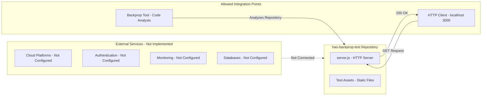

### 3.5.3 Service Exclusion Rationale

| Default Service | Exclusion Reason |
|-----------------|------------------|
| **AWS/Azure/GCP** | Localhost-only design; no cloud deployment |
| **Auth0/Okta** | Test fixture requires no authentication |
| **Datadog/NewRelic** | No production monitoring needs |
| **SendGrid/Twilio** | No notification requirements |
| **Stripe/PayPal** | No payment processing |

---

## 3.6 Databases & Storage

### 3.6.1 Database Status: None Required

The repository architecture explicitly excludes database connectivity as part of its minimal design philosophy.

| Category | Status | Evidence |
|----------|--------|----------|
| **Primary Database** | None | No database connection code |
| **Secondary Database** | None | No replication or failover |
| **Caching Layer** | None | No Redis/Memcached integration |
| **Search Engine** | None | No Elasticsearch/Solr integration |
| **Data Persistence** | Not required | Stateless test fixture |

### 3.6.2 Static Data Assets

The repository includes static files serving as test assets for Backprop's file handling verification:

| File | Format | Approximate Size | Purpose |
|------|--------|------------------|---------|
| `industry.csv` | CSV | < 1 KB | Data processing tests (44 industry categories) |
| `100Pages.pdf` | PDF | ~9.4 MB | Large document parsing tests |
| `demo.jpg` | JPEG | ~2.1 MB | Image file handling verification |
| `sample.doc` | DOC | ~98 KB | Legacy document format testing |

#### Storage Requirements Summary

| Asset Category | Size | File Count |
|----------------|------|------------|
| Binary Documents | ~9.5 MB | 2 (`100Pages.pdf`, `sample.doc`) |
| Images | ~2.1 MB | 1 (`demo.jpg`) |
| Data Files | < 1 KB | 1 (`industry.csv`) |
| Source/Config | < 50 KB | All text files |
| **Total Repository** | **~12 MB** | 12+ files |

### 3.6.3 Data Persistence Strategy

| Aspect | Implementation | Rationale |
|--------|----------------|-----------|
| **State Management** | Stateless | No session or application state |
| **File System Access** | Read-only | Test assets are static |
| **Data Transformation** | None | No ETL processes |
| **Backup Requirements** | Git repository | Version control provides history |

---

## 3.7 Development & Deployment

### 3.7.1 Package Management

| Tool | Status | Configuration |
|------|--------|---------------|
| **npm** | ✓ Configured | `package.json`, `package-lock.json` |
| **Yarn** | Not configured | No `yarn.lock` file |
| **pnpm** | Not configured | No `pnpm-lock.yaml` file |

#### npm Scripts Configuration

| Script | Command | Status |
|--------|---------|--------|
| `test` | `echo "Error: no test specified" && exit 1` | Intentionally fails |

> **Note:** The test script intentionally returns a failure exit code to signal that no test suite is configured—this is by design for a test fixture repository.

### 3.7.2 Build System

| Tool Category | Status | Rationale |
|---------------|--------|-----------|
| **Build Tools** | Not required | No compilation needed |
| **Transpilers** | Not used | No TypeScript or Babel |
| **Bundlers** | Not used | No Webpack, Rollup, or esbuild |
| **Task Runners** | Not used | No Gulp or Grunt |
| **Asset Pipeline** | Not implemented | Static files only |

### 3.7.3 Containerization

| Platform | Status | Evidence |
|----------|--------|----------|
| **Docker** | Not configured | No `Dockerfile` present |
| **Docker Compose** | Not configured | No `docker-compose.yml` present |
| **Kubernetes** | Not configured | No manifests present |
| **Container Registry** | Not used | No container images |

### 3.7.4 CI/CD Pipeline

| Platform | Status | Evidence |
|----------|--------|----------|
| **GitHub Actions** | Not configured | No `.github/workflows/` directory |
| **Jenkins** | Not configured | No `Jenkinsfile` |
| **CircleCI** | Not configured | No `.circleci/` directory |
| **GitLab CI** | Not configured | No `.gitlab-ci.yml` |
| **Travis CI** | Not configured | No `.travis.yml` |

### 3.7.5 Development Tools

| Category | Tool/Status |
|----------|-------------|
| **Version Control** | Git (implied by repository structure) |
| **IDE Configuration** | None (no `.editorconfig`, `.vscode/`) |
| **Code Linting** | None (no ESLint, Prettier configuration) |
| **Type Checking** | None (pure JavaScript, no TypeScript) |
| **Code Formatting** | None (no automated formatting) |
| **Pre-commit Hooks** | None (no `.husky/` or `.pre-commit-config.yaml`) |

### 3.7.6 Server Execution

| Command | Description |
|---------|-------------|
| `node server.js` | Starts HTTP server on `127.0.0.1:3000` |

#### Runtime Behavior

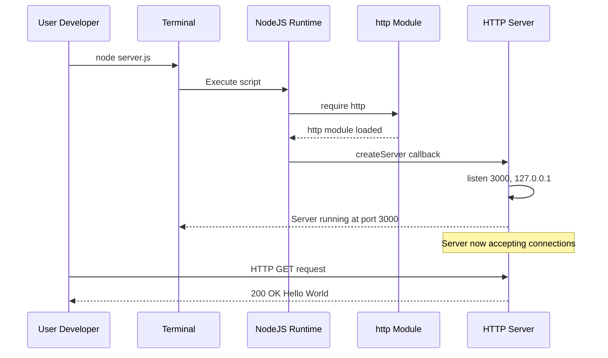

---

## 3.8 Technical Constraints

### 3.8.1 Network Configuration

| Constraint | Value | Impact |
|------------|-------|--------|
| **Binding Address** | `127.0.0.1` (localhost only) | Cannot serve external traffic |
| **Port** | `3000` (hardcoded) | Port conflicts require manual resolution |
| **Protocol** | HTTP only | No HTTPS/TLS support |
| **Configuration** | None | No environment variables or config files |

### 3.8.2 Module System Constraints

| Constraint | Description | Impact |
|------------|-------------|--------|
| **CommonJS Only** | Uses `require()` syntax | Not ES Module compatible without changes |
| **No Dynamic Imports** | Static require statements | No runtime module loading |
| **No Package Exports** | Module not designed for import | Internal use only |

### 3.8.3 Performance Specifications

| Metric | Target | Rationale |
|--------|--------|-----------|
| **Startup Time** | < 1 second | Simple initialization |
| **Response Latency** | < 10ms | Localhost networking, no processing |
| **Memory Footprint** | < 50 MB (typically single-digit MB) | Minimal Node.js process |
| **Response Size** | 15 bytes | `Hello, World!\n` |
| **Concurrent Connections** | Not specified | Test fixture, not load tested |

---

## 3.9 Security Considerations

### 3.9.1 Security Posture Summary

| Security Aspect | Status | Description |
|-----------------|--------|-------------|
| **Network Exposure** | ✓ Mitigated | Localhost-only binding prevents external access |
| **Input Validation** | N/A | No user input processed |
| **Authentication** | N/A | Test fixture, not production |
| **HTTPS/TLS** | Not Implemented | HTTP only, acceptable for localhost |
| **Dependencies** | ✓ Zero Risk | No third-party packages to audit |
| **Sensitive Data** | ✓ None | No credentials or PII in repository |

### 3.9.2 Attack Surface Analysis

| Vector | Risk Level | Mitigation |
|--------|------------|------------|
| **Network Attack** | Low | Localhost binding restricts access |
| **Supply Chain** | None | Zero external dependencies |
| **Code Injection** | None | No user input processing |
| **Data Breach** | None | No sensitive data stored |

### 3.9.3 Compliance Considerations

| Aspect | Status |
|--------|--------|
| **License** | MIT (open source compliant) |
| **GDPR** | N/A (no personal data) |
| **SOC 2** | N/A (test fixture) |
| **PCI DSS** | N/A (no payment data) |

---

## 3.10 Technology Stack Comparison

### 3.10.1 Default Stack vs. Implemented Stack

The following table compares the default technology stack template against what is actually implemented in this repository:

| Category | Default Stack | Implemented | Rationale for Deviation |
|----------|---------------|-------------|-------------------------|
| **Cloud Platform** | AWS | ❌ None | Localhost-only design |
| **Containerization** | Docker | ❌ None | No deployment infrastructure |
| **Infrastructure as Code** | Terraform | ❌ None | No cloud resources |
| **CI/CD** | GitHub Actions | ❌ None | Test fixture, no pipeline needed |
| **Backend Language** | Python | JavaScript (Node.js) | Simpler HTTP server setup |
| **Backend Framework** | Flask | ❌ None (raw http module) | Zero dependency requirement |
| **Authentication** | Auth0 | ❌ None | Test fixture, no auth needed |
| **Database** | MongoDB | ❌ None | Stateless design |
| **AI Framework** | Langchain | ❌ None | Not applicable |
| **Frontend Web** | React + TypeScript | ❌ None | No UI required |
| **CSS Framework** | TailwindCSS | ❌ None | No UI required |
| **Mobile** | React-Native | ❌ None | No mobile application |
| **iOS Native** | Swift | ❌ None | No native apps |
| **Android Native** | Kotlin | ❌ None | No native apps |
| **macOS Native** | Objective-C | ❌ None | No native apps |
| **Desktop** | ElectronJS | ❌ None | No desktop application |

### 3.10.2 Justification for Minimal Stack

The technology stack deviations are intentional design decisions, not oversights:

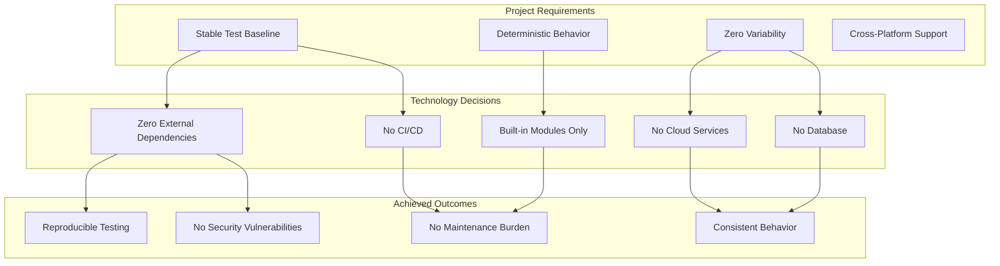

---

## 3.11 Maintenance Requirements

### 3.11.1 Update Schedule

| Requirement | Description | Frequency |
|-------------|-------------|-----------|
| **Dependency Updates** | None required | N/A (zero dependencies) |
| **Security Patches** | None required | N/A (no external packages) |
| **Node.js Compatibility** | Verify with new Node.js releases | Quarterly |
| **Repository Integrity** | Verify files unchanged | Per test cycle |

### 3.11.2 Node.js Version Monitoring

LTS release status provides long-term support, which typically guarantees that critical bugs will be fixed for a total of 30 months. Production applications should only use Active LTS or Maintenance LTS releases.

| Node.js Version | Status | Recommendation |
|-----------------|--------|----------------|
| **24.x (Krypton)** | LTS - receives updates through end of April 2028 | Recommended for testing |
| **22.x** | Active LTS until October 2025, then Maintenance until April 2027 | Supported |
| **20.x** | Support ending 2026-04-30 | Use with caution |

---

## 3.12 References

### 3.12.1 Repository Files Examined

| File Path | Relevance |
|-----------|-----------|
| `package.json` | npm project configuration, zero dependencies verification, version 1.0.0, MIT license |
| `package-lock.json` | Confirms zero external dependencies, lockfileVersion 3 format |
| `server.js` | Core HTTP server implementation, Node.js http module usage, CommonJS syntax |
| `README.md` | Project purpose documentation: "test project for backprop integration" |
| `LoginTest.java` | Java stub file demonstrating multi-language detection testing |
| `industry.csv` | Reference data file containing 44 industry categories |
| `100Pages.pdf` | Large binary test asset for document parsing |
| `demo.jpg` | Image test asset for file handling verification |
| `sample.doc` | Legacy document format test asset |

### 3.12.2 Technical Specification Sections Referenced

| Section | Information Used |
|---------|------------------|
| 1.1 Executive Summary | Project identity, stakeholders, zero dependencies rationale |
| 1.2 System Overview | Technical approach (Node.js, CommonJS, http module), KPIs |
| 2.4 Implementation Considerations | Technical constraints, security implications, maintenance |
| 2.6 Assumptions and Constraints | System assumptions, design constraints |

### 3.12.3 External Sources

| Source | Information Retrieved |
|--------|----------------------|
| nodejs.org | Current Node.js LTS versions and release schedule |
| endoflife.date/nodejs | Node.js version support timelines |
| GitHub nodejs/Release | Node.js release policy and maintenance phases |

# 4. Process Flowchart

## 4.1 SYSTEM WORKFLOWS OVERVIEW

### 4.1.1 Introduction and Scope

This section documents the process flows within the hao-backprop-test repository, a deliberately minimal "Hello World" Node.js HTTP server designed as a test fixture for Backprop integration testing. The simplicity of this system is a deliberate architectural choice that enables deterministic, predictable behavior for validation purposes.

#### Design Philosophy Impact on Process Flows

| Characteristic | Impact on Workflows |
|----------------|---------------------|
| Deterministic Behavior | All requests follow identical processing path |
| Zero Dependencies | No external integration flows required |
| Single Response Type | No branching logic in response handling |
| Localhost-Only Binding | No external access security flows |
| Test Fixture Purpose | Developer workflow is primary use case |

#### Workflow Categories Applicable to This System

| Workflow Category | Applicability | Rationale |
|-------------------|---------------|-----------|
| Server Initialization | ✓ Applicable | Core startup sequence |
| HTTP Request Processing | ✓ Applicable | Single-path response flow |
| Developer Testing Workflow | ✓ Applicable | Primary user journey |
| Backprop Analysis Workflow | ✓ Applicable | Core system purpose |
| Error Handling Flows | Minimal | Only port binding failure |
| State Management | ✗ Not Applicable | No state persistence |
| Integration Workflows | ✗ Not Applicable | No external integrations |
| Batch Processing | ✗ Not Applicable | Real-time responses only |

### 4.1.2 High-Level System Workflow

The following diagram illustrates the complete system workflow encompassing all actors and interaction paths.

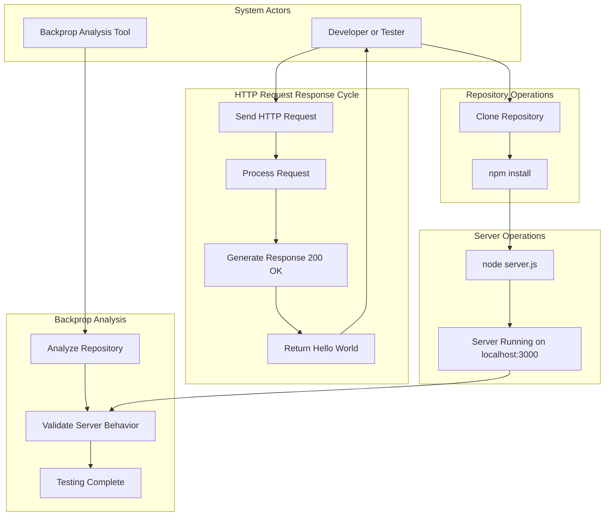

---

## 4.2 CORE BUSINESS PROCESSES

### 4.2.1 Server Initialization Flow

The server initialization process is the foundational workflow that must complete successfully before any HTTP request handling can occur.

#### Process Steps Detail

| Step | Component | Action | Output |
|------|-----------|--------|--------|
| 1 | Node.js Runtime | Execute `server.js` file | Script parsed and executed |
| 2 | Node.js Loader | Load `http` module via `require()` | Module object available |
| 3 | Variable Initialization | Define hostname (`127.0.0.1`) and port (`3000`) | Constants set |
| 4 | Server Creation | Call `http.createServer()` with callback | Server object instantiated |
| 5 | Port Binding | Call `server.listen()` on specified port/host | Socket bound |
| 6 | Startup Notification | Execute `console.log()` callback | Message displayed |

#### Server Initialization Flowchart

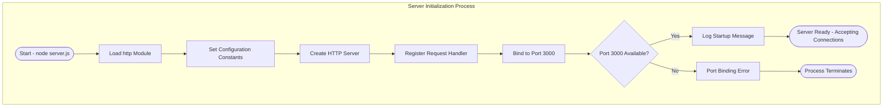

#### Validation Rules for Server Initialization

| Rule ID | Rule Type | Validation Rule | Enforcement Point |
|---------|-----------|-----------------|-------------------|
| INIT-001 | Business Rule | Server must start without external configuration | Variable initialization |
| INIT-002 | Data Validation | Port value must equal `3000` | Constant definition |
| INIT-003 | Data Validation | Hostname must equal `127.0.0.1` | Constant definition |
| INIT-004 | Security | Binding must be localhost-only | `server.listen()` call |
| INIT-005 | System | Port must be available for binding | OS socket allocation |

#### Timing Specifications

| Phase | Target Duration | Measurement Point |
|-------|-----------------|-------------------|
| Module Loading | < 100ms | Start of `require()` to return |
| Server Creation | < 10ms | `createServer()` execution |
| Port Binding | < 100ms | `listen()` to callback |
| **Total Startup** | **< 1 second** | Command execution to console log |

### 4.2.2 HTTP Request/Response Flow

The HTTP request/response flow demonstrates the deliberately uniform processing path where all incoming requests—regardless of method, path, headers, or body—receive the identical response.

#### Request Processing Characteristics

| Request Attribute | Processing Behavior | Rationale |
|-------------------|---------------------|-----------|
| HTTP Method (GET, POST, etc.) | Ignored | Uniform response design |
| URL Path (/, /test, /any) | Ignored | No routing logic |
| Query Parameters | Ignored | Not processed |
| Request Headers | Ignored | Not inspected |
| Request Body | Ignored | Not read |

#### Response Generation Specifications

| Response Attribute | Fixed Value | Evidence |
|--------------------|-------------|----------|
| HTTP Status Code | `200` | `res.statusCode = 200` in `server.js` |
| Content-Type Header | `text/plain` | `res.setHeader('Content-Type', 'text/plain')` |
| Response Body | `Hello, World!\n` | `res.end('Hello, World!\n')` |
| Response Size | 15 bytes | Including newline character |

#### HTTP Request/Response Flowchart

```mermaid
flowchart TD
    subgraph HTTPFlow["HTTP Request-Response Flow"]
        ClientRequest("Client Sends HTTP Request")
        ServerReceive["Server Receives Request - Any Method, Any Path"]
        TriggerCallback["Trigger Request Handler Callback Function"]
        SetStatus["Set Status Code res.statusCode = 200"]
        SetHeader["Set Content-Type Header text/plain"]
        WriteBody["Write Response Body - Hello World"]
        EndResponse["End Response res.end"]
        ClientReceive("Client Receives 200 OK Response")
        
        ClientRequest --> ServerReceive
        ServerReceive --> TriggerCallback
        TriggerCallback --> SetStatus
        SetStatus --> SetHeader
        SetHeader --> WriteBody
        WriteBody --> EndResponse
        EndResponse --> ClientReceive
    end
```

#### Detailed Request Processing Sequence

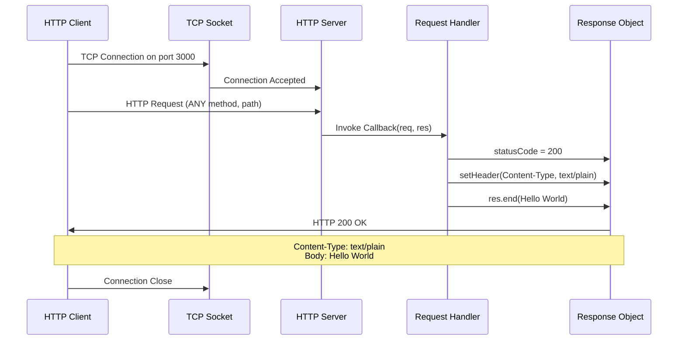

#### Validation Rules for Request Processing

| Rule ID | Rule Type | Validation Rule | Verification Method |
|---------|-----------|-----------------|---------------------|
| REQ-001 | Business Rule | Response must be identical for all requests | Multi-request comparison |
| REQ-002 | Data Validation | Status code must equal `200` | Response inspection |
| REQ-003 | Data Validation | Body must exactly match `Hello, World!\n` | String comparison |
| REQ-004 | Performance | Response latency must be < 10ms | Timing measurement |
| REQ-005 | Compliance | Response must not vary based on input | Input variation testing |

### 4.2.3 End-to-End Developer Workflow

The developer workflow represents the primary user journey for this test fixture, encompassing repository setup through Backprop integration testing.

#### Workflow Phases

| Phase | Activities | Deliverable |
|-------|------------|-------------|
| Setup | Clone repository, install dependencies | Local working copy |
| Execution | Start server, verify response | Running HTTP server |
| Validation | Test HTTP endpoints | Confirmed behavior |
| Integration | Execute Backprop analysis | Validated tool behavior |

#### Developer Workflow Flowchart

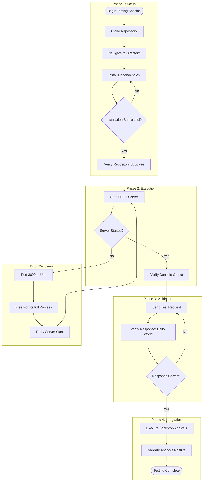

#### User Touchpoints Summary

| Touchpoint | User Action | System Response | Expected Outcome |
|------------|-------------|-----------------|------------------|
| Repository Clone | Execute `git clone` | Repository downloaded | 12 files present |
| Dependency Install | Execute `npm install` | Dependencies resolved | Empty node_modules (zero deps) |
| Server Launch | Execute `node server.js` | Server binds to port | Console confirmation |
| HTTP Test | Execute `curl localhost:3000` | Server processes request | "Hello, World!" response |
| Backprop Analysis | Run Backprop tool | Repository analyzed | Analysis complete |

---

## 4.3 INTEGRATION WORKFLOWS

### 4.3.1 Integration Workflow Overview

Due to the intentionally self-contained design of this test fixture, traditional integration workflows with external systems are not applicable. However, the following integration points exist.

#### Applicable Integration Points

| Integration Point | Type | Flow Direction | Description |
|-------------------|------|----------------|-------------|
| npm Registry | Package Management | Inbound (none used) | Dependency resolution (empty) |
| Node.js Runtime | Execution Platform | Bidirectional | Script execution and module loading |
| Backprop Tool | Analysis Target | Inbound | Repository analysis operations |
| HTTP Protocol | Communication | Bidirectional | Request/response exchange |

#### Intentionally Excluded Integrations

| Integration Type | Status | Rationale |
|------------------|--------|-----------|
| Database Connectivity | Not Implemented | No data persistence required |
| External APIs | Not Implemented | Self-contained design |
| Message Queues | Not Implemented | No asynchronous processing |
| Cloud Services | Not Implemented | Localhost-only operation |
| CI/CD Pipelines | Not Configured | Test fixture nature |
| Container Orchestration | Not Supported | No Docker configuration |

### 4.3.2 Backprop Analysis Integration Flow

The primary integration workflow involves Backprop analyzing this repository as a known-good test fixture.

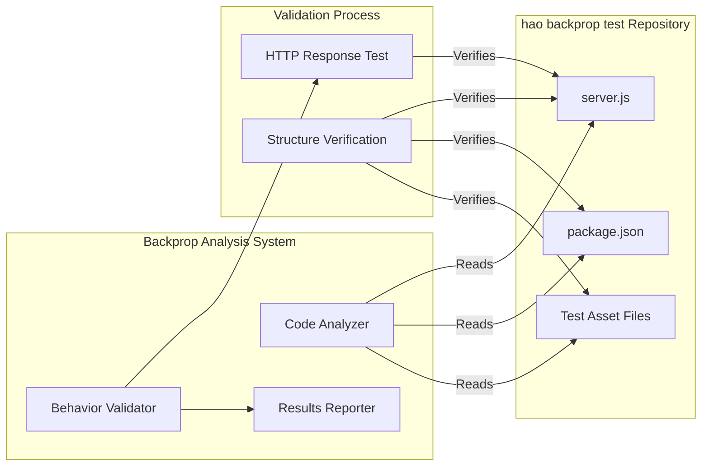

### 4.3.3 Data Flow Between Components

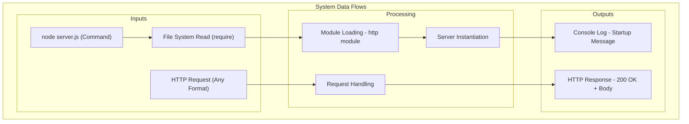

---

## 4.4 ERROR HANDLING FLOWCHARTS

### 4.4.1 Error Handling Philosophy

This system implements minimal error handling by design. The deliberate absence of error handling reduces code paths and ensures deterministic testing behavior.

#### Error Handling Scope

| Error Category | Handling Status | Rationale |
|----------------|-----------------|-----------|
| Port Binding Failure | Process Termination | Only runtime failure mode |
| Invalid HTTP Requests | Not Handled | All requests accepted equally |
| Malformed Headers | Not Handled | Headers not inspected |
| Connection Errors | Node.js Default | Managed by runtime |
| Request Timeouts | Not Configured | No timeout settings |
| Resource Exhaustion | Not Handled | Minimal resource usage |

### 4.4.2 Startup Error Flow

The only error condition with explicit handling impact is port binding failure.

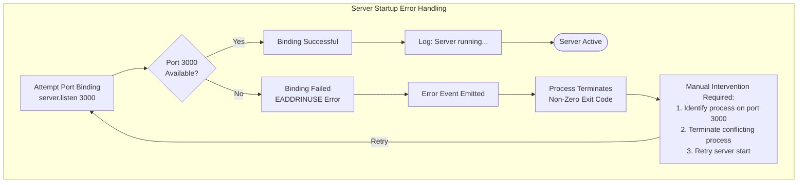

### 4.4.3 Error Recovery Procedures

| Error Condition | Detection Method | Recovery Procedure | Automated Recovery |
|-----------------|------------------|--------------------|--------------------|
| Port 3000 in use | EADDRINUSE error | Kill conflicting process, restart | No |
| HTTP module unavailable | require() failure | Reinstall Node.js | No |
| File read failure | File system error | Verify file permissions | No |
| Memory exhaustion | Process crash | Restart process | No |

### 4.4.4 Error Notification Flow

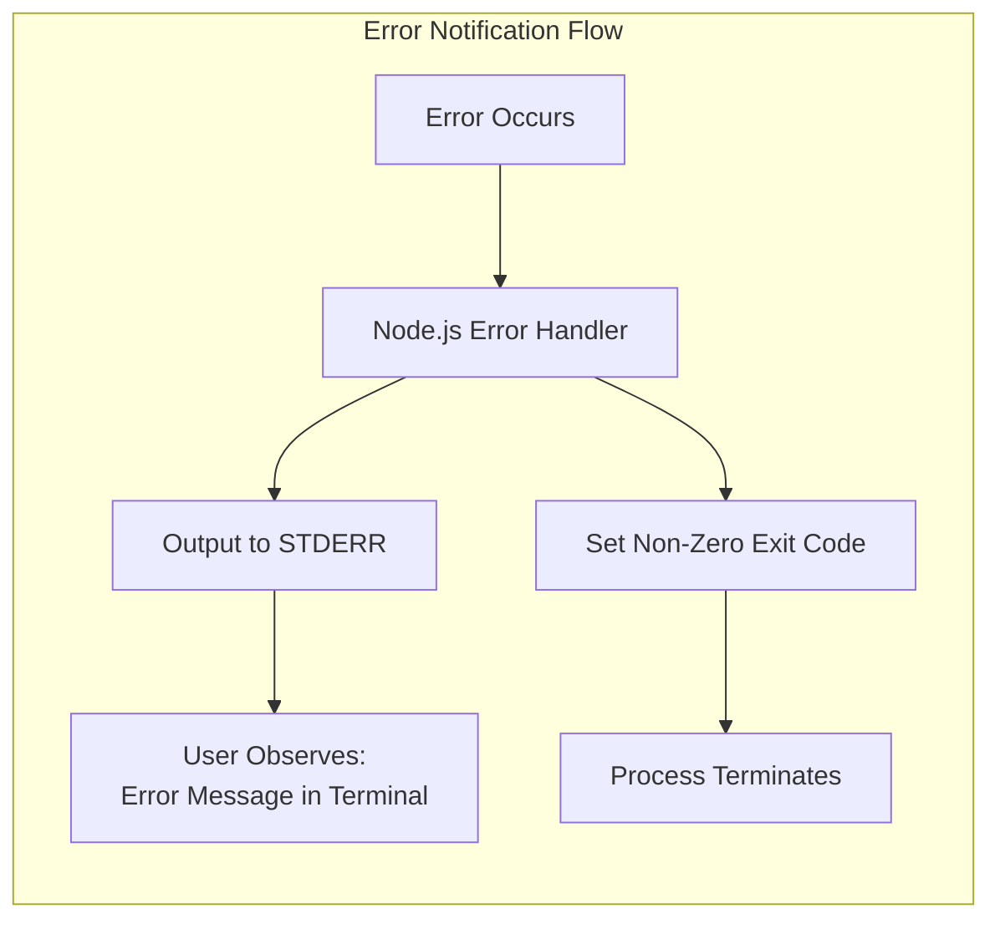

### 4.4.5 Intentionally Absent Error Handling

The following error handling mechanisms are deliberately not implemented:

| Mechanism | Status | Design Rationale |
|-----------|--------|------------------|
| Retry Logic | Not Implemented | Single-attempt design |
| Fallback Processes | Not Implemented | No fallback needed for fixed response |
| Circuit Breakers | Not Implemented | No external dependencies |
| Error Logging Framework | Not Implemented | Console output only |
| Health Check Endpoints | Not Implemented | Test fixture, not production |
| Graceful Shutdown | Not Implemented | Process termination acceptable |
| Connection Pooling | Not Implemented | Simple request handling |

---

## 4.5 STATE TRANSITION DIAGRAMS

### 4.5.1 Server State Machine

Despite the system's simplicity, the HTTP server transitions through defined operational states.

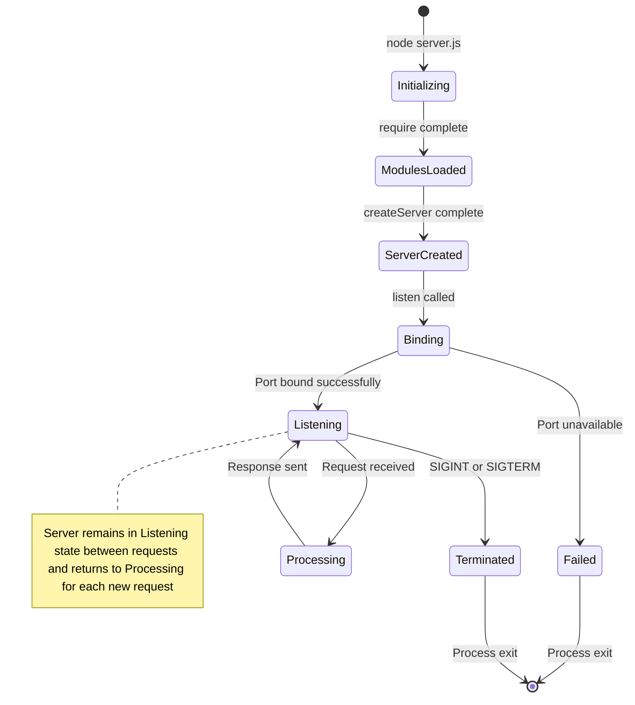

### 4.5.2 Server State Definitions

| State | Description | Duration | Transitions To |
|-------|-------------|----------|----------------|
| Initializing | Script execution starting | ~100ms | ModulesLoaded |
| ModulesLoaded | http module available | Instant | ServerCreated |
| ServerCreated | Server object instantiated | Instant | Binding |
| Binding | Port allocation in progress | ~50ms | Listening or Failed |
| Listening | Ready to accept connections | Indefinite | Processing or Terminated |
| Processing | Handling active request | < 10ms | Listening |
| Failed | Port binding unsuccessful | Instant | [End] |
| Terminated | Shutdown signal received | Instant | [End] |

### 4.5.3 HTTP Connection State Diagram

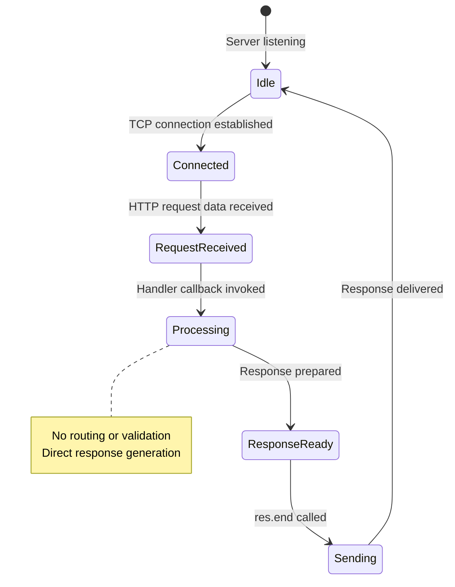

### 4.5.4 State Persistence Points

| State Transition | Persistence Action | Storage Location |
|------------------|--------------------| -----------------|
| Initializing → ModulesLoaded | Module cached | Node.js module cache |
| Binding → Listening | Socket allocated | OS kernel |
| Processing → Listening | None | No state persisted |

> **Note:** This system is stateless by design. No application state is persisted between requests, and no session information is maintained. Each request is handled independently with identical processing.

---

## 4.6 TECHNICAL IMPLEMENTATION DETAILS

### 4.6.1 Transaction Boundaries

Due to the stateless, single-response nature of this system, traditional transaction boundaries do not apply.

| Transaction Concept | Applicability | Implementation |
|---------------------|---------------|----------------|
| Database Transactions | Not Applicable | No database |
| Distributed Transactions | Not Applicable | Single process |
| HTTP Request Scope | Per-Request | Each request is atomic |
| State Rollback | Not Required | No state to roll back |

### 4.6.2 Caching Strategy

| Cache Type | Status | Rationale |
|------------|--------|-----------|
| Response Caching | Not Implemented | Response is trivially generated |
| Module Caching | Node.js Built-in | Automatic via require() |
| Connection Caching | Node.js Built-in | HTTP keep-alive (default) |
| CDN/Edge Caching | Not Applicable | Localhost-only binding |

### 4.6.3 Timing Constraints and SLA Considerations

#### Performance Targets

| Metric | Target | Measurement Method |
|--------|--------|--------------------|
| Server Startup | < 1 second | Time to console log |
| Request Latency | < 10ms | HTTP round-trip time |
| Response Size | 15 bytes | Constant |
| Memory Usage | < 50 MB | Process memory footprint |

#### Timing Flow Diagram

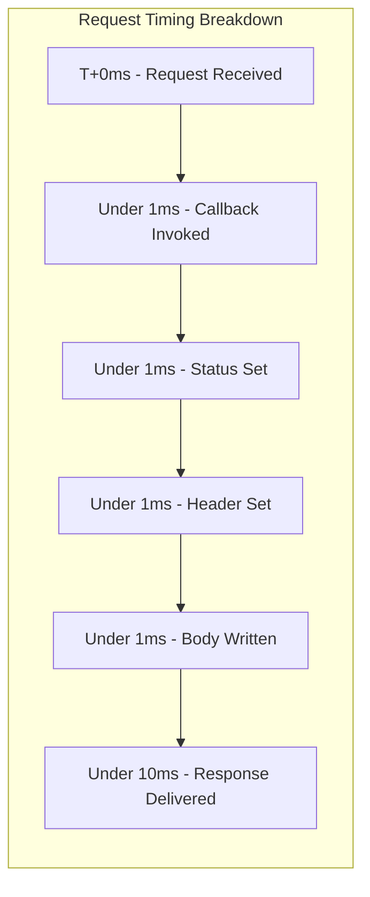

### 4.6.4 Authorization Checkpoints

| Checkpoint Type | Status | Rationale |
|-----------------|--------|-----------|
| Authentication | Not Implemented | Test fixture, not production |
| Authorization | Not Implemented | All requests allowed |
| Rate Limiting | Not Implemented | No abuse protection needed |
| IP Filtering | Inherent | Localhost-only binding |

### 4.6.5 Regulatory Compliance Checks

| Compliance Requirement | Applicability | Notes |
|------------------------|---------------|-------|
| Data Privacy (GDPR, etc.) | Not Applicable | No personal data collected |
| PCI DSS | Not Applicable | No payment processing |
| SOC 2 | Not Applicable | Test fixture only |
| HIPAA | Not Applicable | No health data |

---

## 4.7 PROCESS FLOW SUMMARY

### 4.7.1 Complete System Process Map

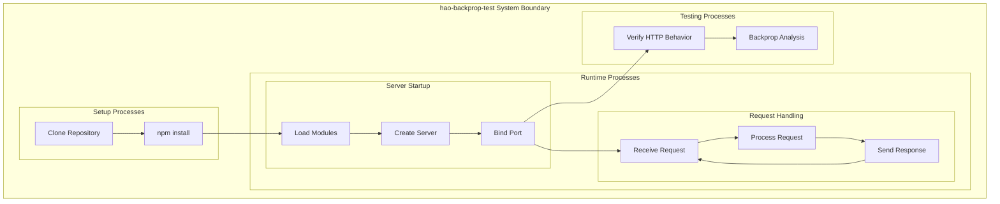

### 4.7.2 Process Complexity Analysis

| Process Category | Number of Steps | Decision Points | Error Paths |
|------------------|-----------------|-----------------|-------------|
| Server Initialization | 6 | 1 | 1 |
| HTTP Request Handling | 4 | 0 | 0 |
| Developer Workflow | 9 | 3 | 1 |
| Error Handling | 3 | 1 | 1 |

### 4.7.3 Key Process Characteristics

| Characteristic | Value | Implication |
|----------------|-------|-------------|
| Total Unique Process Flows | 3 | Minimal complexity |
| Maximum Decision Depth | 1 | Linear processing |
| Parallel Process Paths | 0 | Single-threaded |
| State Dependencies | 0 | Stateless operation |
| External Integration Points | 0 | Self-contained |
| Error Recovery Automation | None | Manual intervention only |

---

## 4.8 REFERENCES

### 4.8.1 Source Files Referenced

| File | Relevance to Process Flows |
|------|----------------------------|
| `server.js` | Core server logic—initialization, request handling, response generation (14 lines) |
| `package.json` | npm configuration defining project metadata and entry points |
| `package-lock.json` | Dependency lock file confirming zero external dependencies |
| `README.md` | Project constraints ("Do not touch!") confirming test fixture nature |
| `server - Copy.js` | Duplicate file confirming single implementation pattern |

### 4.8.2 Technical Specification Sections Referenced

| Section | Information Utilized |
|---------|---------------------|
| 1.2 System Overview | Architecture context, success criteria, system limitations |
| 1.3 Scope | Developer workflow, in-scope/out-of-scope features |
| 2.2 Functional Requirements | F-001-RQ-001 through F-001-RQ-004 requirement specifications |
| 2.3 Feature Relationships | Dependency map, integration points |
| 2.4 Implementation Considerations | Technical constraints, performance requirements |
| 3.7 Development & Deployment | Server execution, runtime behavior sequence |
| 3.8 Technical Constraints | Network configuration, module system constraints |

### 4.8.3 Flowchart Diagram Index

| Diagram ID | Diagram Name | Section |
|------------|--------------|---------|
| 4.1-01 | High-Level System Workflow | 4.1.2 |
| 4.2-01 | Server Initialization Flowchart | 4.2.1 |
| 4.2-02 | HTTP Request/Response Flowchart | 4.2.2 |
| 4.2-03 | Request Processing Sequence | 4.2.2 |
| 4.2-04 | Developer Workflow Flowchart | 4.2.3 |
| 4.3-01 | Backprop Analysis Integration Flow | 4.3.2 |
| 4.3-02 | Data Flow Between Components | 4.3.3 |
| 4.4-01 | Startup Error Flow | 4.4.2 |
| 4.4-02 | Error Notification Flow | 4.4.4 |
| 4.5-01 | Server State Machine | 4.5.1 |
| 4.5-02 | HTTP Connection State Diagram | 4.5.3 |
| 4.6-01 | Request Timing Breakdown | 4.6.3 |
| 4.7-01 | Complete System Process Map | 4.7.1 |

# 5. System Architecture

This section provides a comprehensive architectural overview of the hao-backprop-test repository, a deliberately minimal "Hello World" Node.js HTTP server designed as a test fixture for Backprop integration validation. The architectural simplicity documented herein is an intentional design choice that enables deterministic, predictable behavior for validation purposes.

---

## 5.1 HIGH-LEVEL ARCHITECTURE

### 5.1.1 System Overview

#### Architecture Style and Rationale

The hao-backprop-test system employs a **deliberately minimal monolithic architecture** characterized by a single-component design pattern. This architectural decision prioritizes determinism and predictability over scalability or feature richness.

| Architecture Attribute | Implementation | Strategic Rationale |
|------------------------|----------------|---------------------|
| Style | Single-Component Monolith | Eliminates inter-component variability |
| Pattern | Request-Response | Simplest HTTP interaction model |
| Processing Model | Synchronous, Stateless | Identical behavior for every request |
| Deployment Model | Single-Process | No distributed system complexity |

#### Key Architectural Principles

The system adheres to four foundational architectural principles that guide all design decisions:

| Principle | Implementation | Benefit |
|-----------|----------------|---------|
| **Zero Dependencies** | No `dependencies` or `devDependencies` in `package.json` | Eliminates variable behavior from third-party packages |
| **Built-in Modules Only** | Uses Node.js native `http` module exclusively | Ensures predictable behavior across Node.js installations |
| **Minimal Footprint** | 14 lines of server code | Reduces code paths for deterministic testing |
| **Cross-Platform Compatibility** | Pure JavaScript with CommonJS syntax | Runs on any system with Node.js installed |

#### System Boundaries and Major Interfaces

The system maintains strict boundaries that constrain its operational scope:

| Boundary Type | Constraint | Enforcement Mechanism |
|---------------|------------|----------------------|
| Network Scope | Localhost only (127.0.0.1) | Hardcoded binding address |
| Protocol | HTTP (no HTTPS) | Built-in `http` module usage |
| Port | Fixed at 3000 | Hardcoded port constant |
| Process | Single Node.js instance | No clustering or workers |
| State | Stateless design | No persistence layer |

```mermaid
flowchart TB
    subgraph ExternalBoundary["External Boundary - Localhost Only"]
        subgraph SystemCore["System Core"]
            ServerJS["server.js - HTTP Server - 14 Lines"]
        end
        
        subgraph NodeRuntime["Node.js Runtime Environment"]
            HTTPModule["http Module - Built-in"]
            CommonJS["CommonJS Module System"]
        end
        
        subgraph Configuration["Configuration Layer"]
            PackageJSON["package.json - Metadata"]
            PackageLock["package-lock.json - Empty Dependency Tree"]
        end
        
        subgraph TestAssets["Static Test Assets"]
            DataFiles["Data Files - industry.csv"]
            Documents["Documents - PDF, DOC"]
            Images["Images - demo.jpg"]
            LanguageStubs["Language Stubs - Java, Python"]
        end
    end
    
    subgraph Clients["Client Interfaces"]
        HTTPClient["HTTP Client - localhost 3000"]
        BackpropTool["Backprop Analysis Tool"]
    end
    
    HTTPClient -->|"HTTP Request"| ServerJS
    ServerJS -->|"HTTP 200 OK"| HTTPClient
    BackpropTool -->|"Repository Analysis"| SystemCore
    BackpropTool -->|"Static Analysis"| TestAssets
    NodeRuntime --> ServerJS
    CommonJS --> HTTPModule
```

### 5.1.2 Core Components Table

The system comprises a minimal set of components, each serving a specific purpose in the test fixture ecosystem:

| Component Name | Primary Responsibility | Key Dependencies |
|----------------|------------------------|------------------|
| `server.js` | HTTP server responding "Hello, World!" to all requests | Node.js `http` module (built-in) |
| `package.json` | npm project metadata and configuration | npm ecosystem |
| `package-lock.json` | Dependency tree lockfile (empty) | npm v7+ |
| `README.md` | Project documentation with usage constraints | None |

| Component Name | Integration Points | Critical Considerations |
|----------------|-------------------|------------------------|
| `server.js` | TCP port 3000, HTTP protocol | 14-line implementation; no routing or validation |
| `package.json` | npm install/init commands | Declares `main: index.js` which does not exist |
| `package-lock.json` | npm ci command | lockfileVersion 3; empty dependency tree |
| `README.md` | Human readers | Explicit "Do not touch!" modification constraint |

#### Supplementary Test Assets

| Asset Category | Files | Purpose |
|----------------|-------|---------|
| Data Files | `industry.csv` | CSV data processing tests (44 industry categories) |
| Binary Documents | `100Pages.pdf`, `sample.doc` | Document parsing test targets |
| Images | `demo.jpg` | Image file handling verification |
| Language Stubs | `LoginTest.java`, `test.py.txt` | Multi-language detection testing |
| Duplicate Files | `server - Copy.js`, `industry - Copy.csv` | Duplicate detection testing |

### 5.1.3 Data Flow Description

#### Primary Data Flow

The system implements a unidirectional, request-response data flow pattern where all requests traverse an identical processing path regardless of their composition.

**Flow Sequence:**

1. **Request Reception**: HTTP client initiates TCP connection to localhost:3000 and sends HTTP request
2. **Callback Invocation**: Node.js HTTP server receives request and invokes the registered callback function
3. **Response Generation**: Handler sets status code (200), header (Content-Type: text/plain), and body (Hello, World!\n)
4. **Response Delivery**: Complete HTTP response transmitted back to client over established connection

#### Request Processing Behavior

| Request Attribute | Processing Behavior | Design Rationale |
|-------------------|---------------------|------------------|
| HTTP Method (GET, POST, PUT, DELETE, etc.) | Ignored - uniform response | Deterministic testing |
| URL Path (/, /api, /any/path) | Ignored - no routing | Simplicity |
| Query Parameters (?key=value) | Ignored - not parsed | Minimal processing |
| Request Headers (Accept, Content-Type, etc.) | Ignored - not inspected | Zero input validation |
| Request Body (JSON, form data, etc.) | Ignored - not read | Stateless design |

#### Response Specifications

| Response Attribute | Fixed Value | Source Evidence |
|--------------------|-------------|-----------------|
| HTTP Status Code | `200` | `res.statusCode = 200` in `server.js` |
| Content-Type Header | `text/plain` | `res.setHeader('Content-Type', 'text/plain')` |
| Response Body | `Hello, World!\n` | `res.end('Hello, World!\n')` |
| Response Size | 15 bytes | Including newline character |

```mermaid
flowchart LR
    subgraph DataFlowPipeline["Request-Response Data Flow"]
        subgraph Ingress["Ingress"]
            ClientReq["HTTP Request"]
        end
        
        subgraph Processing["Uniform Processing"]
            Receive["Receive Request"]
            Callback["Invoke Handler"]
            Generate["Generate Response"]
        end
        
        subgraph Egress["Egress"]
            Response["HTTP 200 OK Response"]
        end
    end
    
    ClientReq --> Receive
    Receive --> Callback
    Callback --> Generate
    Generate --> Response
```

#### Data Transformation Points

| Transformation Point | Input | Output | Transformation Logic |
|---------------------|-------|--------|---------------------|
| Request Reception | TCP byte stream | HTTP Request object | Node.js HTTP parser |
| Response Generation | None (hardcoded) | Response attributes | Static value assignment |
| Response Serialization | Response object | TCP byte stream | Node.js HTTP serializer |

### 5.1.4 External Integration Points

The hao-backprop-test system is intentionally designed as a **standalone testing fixture** with no external integrations. This isolation is a deliberate architectural choice that ensures consistent, reproducible behavior.

#### Integration Status Matrix

| System/Service | Integration Type | Status | Design Rationale |
|----------------|------------------|--------|------------------|
| Database | Data Persistence | Not Implemented | Stateless design requires no storage |
| External APIs | Service Consumption | Not Implemented | Zero dependency policy |
| Message Queues | Async Communication | Not Implemented | No asynchronous processing needed |
| Cloud Services | Infrastructure | Not Implemented | Localhost-only binding |
| Authentication Services | Identity Management | Not Implemented | Test fixture, not production |
| CI/CD Pipelines | DevOps Integration | Not Configured | Test fixture nature |

#### Primary Consumer Integration

The sole external integration point is the Backprop Analysis Tool, which consumes this repository as a test fixture:

| Integration Aspect | Specification |
|--------------------|---------------|
| Consumer System | Backprop Analysis Tool |
| Integration Type | Static Analysis Target |
| Data Exchange Pattern | Read-Only Repository Access |
| Protocol/Format | File System Read Operations |
| SLA Requirements | N/A - Developer tooling |

---

## 5.2 COMPONENT DETAILS

### 5.2.1 HTTP Server Component (`server.js`)

#### Purpose and Responsibilities

The HTTP server component serves as the core functional element of the system, providing a deterministic HTTP endpoint for Backprop integration validation.

| Responsibility | Implementation Detail |
|----------------|----------------------|
| Listen for HTTP connections | Binds to `127.0.0.1:3000` |
| Accept incoming requests | Handles any HTTP method or path |
| Generate consistent responses | Returns identical response to all requests |
| Signal operational status | Logs startup message to console |

#### Technologies and Frameworks

| Technology | Role | Version Requirement |
|------------|------|---------------------|
| Node.js Runtime | Execution environment | Any version supporting CommonJS |
| `http` Module | HTTP server creation | Built-in (no version constraint) |
| CommonJS | Module system | Standard Node.js module resolution |

#### Key Interfaces and APIs

| Interface | Method/Property | Usage |
|-----------|-----------------|-------|
| `http.createServer()` | Server factory | Creates HTTP server instance with callback |
| `server.listen()` | Binding method | Binds server to specified host and port |
| `res.statusCode` | Response property | Sets HTTP status code to 200 |
| `res.setHeader()` | Response method | Sets Content-Type header |
| `res.end()` | Response method | Sends response body and completes request |

#### Data Persistence Requirements

| Persistence Type | Requirement | Rationale |
|------------------|-------------|-----------|
| Database Storage | None | Stateless design |
| File System Storage | None | No persistent data |
| Session Storage | None | No session tracking |
| Cache Storage | None | Response is trivially generated |

#### Scaling Considerations

| Scaling Dimension | Capability | Limitation |
|-------------------|------------|------------|
| Horizontal Scaling | Not supported | Single-process design |
| Vertical Scaling | Limited | Basic Node.js constraints |
| Load Balancing | Not applicable | Localhost binding only |
| Clustering | Not implemented | No worker processes |

### 5.2.2 Package Configuration Component (`package.json`)

#### Purpose and Responsibilities

The package configuration component provides npm ecosystem metadata and establishes the project identity.

| Responsibility | Implementation |
|----------------|----------------|
| Project Identification | Name: `hello_world`, Version: `1.0.0` |
| Entry Point Declaration | `main: index.js` (note: file does not exist) |
| Dependency Management | Zero dependencies declared |
| Script Configuration | Test script intentionally fails |
| License Declaration | MIT license |

#### Configuration Specifications

| Field | Value | Purpose |
|-------|-------|---------|
| `name` | `hello_world` | npm package identifier |
| `version` | `1.0.0` | Semantic version |
| `description` | `Hello world in Node.js` | Human-readable description |
| `main` | `index.js` | Entry point (not used) |
| `author` | `hxu` | Package author |
| `license` | `MIT` | Open source license |

### 5.2.3 Dependency Lock Component (`package-lock.json`)

#### Purpose and Responsibilities

The dependency lock file ensures reproducible builds by documenting the exact dependency tree—which is intentionally empty.

| Attribute | Value | Significance |
|-----------|-------|--------------|
| `lockfileVersion` | 3 | npm v7+ format |
| `packages` | Empty object | Confirms zero dependencies |
| Dependency Tree | Empty | No transitive dependencies |

### 5.2.4 Component Interaction Diagram

```mermaid
sequenceDiagram
    participant Dev as Developer
    participant CLI as "Command Line"
    participant NodeJS as "Node.js Runtime"
    participant HTTP as "http Module"
    participant Server as "server.js"
    participant Client as "HTTP Client"

    Dev->>CLI: node server.js
    CLI->>NodeJS: Execute script
    NodeJS->>Server: Load and parse
    Server->>HTTP: require http
    HTTP-->>Server: Module loaded
    Server->>HTTP: createServer with callback
    HTTP-->>Server: Server instance
    Server->>HTTP: listen on port 3000 localhost
    HTTP-->>Server: Port bound
    Server->>CLI: console.log Server running

    Note over Server,Client: Server now accepting connections

    Client->>Server: HTTP Request ANY
    Server->>Server: Execute callback
    Server->>Client: HTTP 200 OK Hello World
```

### 5.2.5 Server State Transition Diagram

```mermaid
stateDiagram-v2
    [*] --> Initializing: node server.js
    
    Initializing --> ModulesLoaded: require complete
    ModulesLoaded --> ServerCreated: createServer complete
    ServerCreated --> Binding: listen called
    
    Binding --> Listening: Port bound successfully
    Binding --> Failed: Port unavailable EADDRINUSE
    
    Listening --> Processing: Request received
    Processing --> Listening: Response sent
    
    Listening --> Terminated: SIGINT or SIGTERM
    Failed --> [*]: Process exit nonzero
    Terminated --> [*]: Process exit zero
    
    note right of Listening
        Server remains in Listening state between requests
    end note
    note right of Processing
        Each request under 10ms
    end note
```

### 5.2.6 Server Lifecycle Sequence

```mermaid
sequenceDiagram
    participant OS as Operating System
    participant NJS as Node.js
    participant Mod as Module Loader
    participant Srv as Server Instance
    participant Net as Network Stack
    
    NJS->>Mod: Load server.js
    Mod->>Mod: Parse JavaScript
    Mod->>Mod: Execute require http
    Mod->>NJS: http module loaded
    
    NJS->>Srv: http.createServer
    Srv->>Srv: Register callback
    Srv-->>NJS: Server object
    
    NJS->>Srv: server.listen 3000
    Srv->>Net: Request port binding
    Net->>OS: Allocate socket
    
    alt Port Available
        OS-->>Net: Socket allocated
        Net-->>Srv: Binding successful
        Srv->>NJS: Invoke callback
        NJS->>NJS: console.log
        Note over Srv: Server LISTENING
    else Port In Use
        OS-->>Net: EADDRINUSE error
        Net-->>Srv: Binding failed
        Srv->>NJS: Emit error event
        NJS->>OS: Process exit 1
    end
```

---

## 5.3 TECHNICAL DECISIONS

### 5.3.1 Architecture Style Decisions

#### Decision: Monolithic Single-Component Architecture

| Decision Aspect | Selection | Rationale |
|-----------------|-----------|-----------|
| **Architecture Style** | Monolithic Single-Component | Test fixture requires deterministic behavior |
| **Alternative Considered** | Microservices, Modular Monolith | Rejected due to added complexity |
| **Tradeoffs Accepted** | No scalability, no high-availability | Acceptable for test fixture purpose |

#### Decision Justification Matrix

| Evaluation Criterion | Selected Approach | Rejected Alternatives |
|---------------------|-------------------|----------------------|
| Complexity | Minimal (14 lines) | Higher with frameworks |
| Determinism | Guaranteed | Variable with dependencies |
| Testability | Maximum predictability | Reduced with external factors |
| Maintenance | Zero updates needed | Ongoing updates required |
| Security Surface | Minimal | Expanded with dependencies |

### 5.3.2 Communication Pattern Choices

#### Decision: Synchronous HTTP Request-Response

| Pattern Aspect | Selection | Rationale |
|----------------|-----------|-----------|
| **Communication Style** | Synchronous HTTP | Simplest interaction model |
| **Processing Model** | Single-threaded, blocking | No concurrency complexity |
| **Protocol** | HTTP 1.1 | Universal compatibility |

#### Rejected Communication Patterns

| Pattern | Rejection Reason |
|---------|------------------|
| WebSockets | Unnecessary bidirectional communication |
| Server-Sent Events | No real-time updates needed |
| HTTP/2 | Additional complexity without benefit |
| gRPC | Overkill for test fixture |
| Message Queues | No async processing required |

### 5.3.3 Data Storage Solution Rationale

#### Decision: No Persistence Layer

| Storage Aspect | Decision | Rationale |
|----------------|----------|-----------|
| **Database** | None | Stateless design eliminates need |
| **File Storage** | Read-only assets only | No runtime data generation |
| **Caching** | None (except Node.js built-in) | Response trivially generated |
| **Session Storage** | None | No user sessions tracked |

#### Storage Decision Justification

| Requirement | Persistence Need | Implementation |
|-------------|------------------|----------------|
| User Data | None | No users to track |
| Application State | None | Stateless design |
| Configuration | Hardcoded | No external config |
| Logging | Console only | No log persistence |

### 5.3.4 Security Mechanism Selection

#### Decision: Network Isolation via Localhost Binding

| Security Aspect | Mechanism | Effectiveness |
|-----------------|-----------|---------------|
| **Network Access Control** | Localhost-only binding (127.0.0.1) | Prevents all external access |
| **Authentication** | Not implemented | Not needed for localhost |
| **Authorization** | Not implemented | All requests allowed |
| **Input Validation** | Not implemented | No input processing |
| **TLS/HTTPS** | Not implemented | HTTP acceptable for localhost |

#### Security Tradeoff Analysis

| Security Feature | Status | Tradeoff Accepted |
|------------------|--------|-------------------|
| External Access Prevention | ✓ Implemented | None - full protection |
| Transport Encryption | Not Implemented | Localhost traffic only |
| Request Validation | Not Implemented | No user input processed |
| Rate Limiting | Not Implemented | No abuse risk on localhost |

### 5.3.5 Architecture Decision Record Summary

```mermaid
flowchart TB
    subgraph ADR["Architecture Decision Records"]
        subgraph ADR001["ADR-001: Zero Dependencies"]
            ZeroDepProblem["Problem: External packages<br/>introduce variability"]
            ZeroDepDecision["Decision: Use only<br/>Node.js built-in modules"]
            ZeroDepConseq["Consequence: Maximum<br/>predictability achieved"]
        end
        
        subgraph ADR002["ADR-002: Localhost Binding"]
            LocalProblem["Problem: External access<br/>unnecessary and risky"]
            LocalDecision["Decision: Bind exclusively<br/>to 127.0.0.1"]
            LocalConseq["Consequence: Inherent<br/>network isolation"]
        end
        
        subgraph ADR003["ADR-003: Stateless Design"]
            StateProblem["Problem: State management<br/>adds complexity"]
            StateDecision["Decision: No persistence,<br/>identical responses"]
            StateConseq["Consequence: Every request<br/>fully independent"]
        end
        
        subgraph ADR004["ADR-004: Minimal Error Handling"]
            ErrorProblem["Problem: Error handling<br/>introduces code paths"]
            ErrorDecision["Decision: Only handle<br/>port binding failure"]
            ErrorConseq["Consequence: Deterministic<br/>failure behavior"]
        end
    end
    
    ZeroDepProblem --> ZeroDepDecision
    ZeroDepDecision --> ZeroDepConseq
    LocalProblem --> LocalDecision
    LocalDecision --> LocalConseq
    StateProblem --> StateDecision
    StateDecision --> StateConseq
    ErrorProblem --> ErrorDecision
    ErrorDecision --> ErrorConseq
```

---

## 5.4 CROSS-CUTTING CONCERNS

### 5.4.1 Monitoring and Observability Approach

#### Implementation Status

| Observability Component | Status | Rationale |
|------------------------|--------|-----------|
| Metrics Collection | Not Implemented | Test fixture, not production |
| Health Check Endpoints | Not Implemented | No operational monitoring needed |
| Distributed Tracing | Not Implemented | Single-process design |
| Application Performance Monitoring | Not Implemented | Minimal performance requirements |
| Alerting | Not Implemented | No production deployment |

#### Observable System Signals

| Signal Type | Availability | Access Method |
|-------------|--------------|---------------|
| Startup Confirmation | Available | Console log output |
| Request Success | Implicit | HTTP 200 response |
| Port Binding Failure | Available | STDERR error message |
| Process Status | Available | OS process monitoring |

### 5.4.2 Logging and Tracing Strategy

#### Current Logging Implementation

| Log Event | Implementation | Output Destination |
|-----------|----------------|-------------------|
| Server Startup | `console.log()` | STDOUT |
| Request Processing | None | N/A |
| Error Events | Node.js default | STDERR |

#### Logging Characteristics

| Characteristic | Implementation | Rationale |
|----------------|----------------|-----------|
| Log Format | Plain text | Simplicity |
| Log Levels | Not implemented | Single log type |
| Structured Logging | Not implemented | Minimal output |
| Log Rotation | Not implemented | Console output only |
| Log Aggregation | Not implemented | Test fixture |

#### Startup Log Message

```
Server running at http://127.0.0.1:3000/
```

### 5.4.3 Error Handling Patterns

#### Error Handling Philosophy

The system implements **minimal error handling by design**. This deliberate absence reduces code paths and ensures deterministic testing behavior.

#### Error Handling Matrix

| Error Category | Handling Status | System Behavior |
|----------------|-----------------|-----------------|
| Port Binding Failure | Process Termination | EADDRINUSE error emitted |
| Invalid HTTP Requests | Not Handled | All requests accepted |
| Malformed Headers | Not Handled | Headers not inspected |
| Connection Errors | Node.js Default | Managed by runtime |
| Request Timeouts | Not Configured | No timeout settings |
| Resource Exhaustion | Not Handled | Minimal resource usage |

#### Error Flow Diagram

```mermaid
flowchart TD
    subgraph ErrorHandling["Error Handling Flow"]
        ErrorOccurs{"Error Occurs"}
    end
    
    subgraph PortError["Port Binding Error Path"]
        BindFail["EADDRINUSE Error"]
        NodeHandler["Node.js Error Handler"]
        StderrOut["Output to STDERR"]
        ExitNonZero["Exit Code: Non-Zero"]
        ProcessEnd["Process Terminates"]
    end
    
    subgraph OtherErrors["Other Error Path"]
        NoHandler["No Custom Handler"]
        RuntimeDefault["Node.js Runtime Default Behavior"]
    end
    
    subgraph Recovery["Manual Recovery"]
        UserAction["User Intervention Required"]
        KillProcess["Identify and kill process on port 3000"]
        Retry["Retry server start"]
    end
    
    ErrorOccurs -->|Port Binding| BindFail
    ErrorOccurs -->|Other| NoHandler
    
    BindFail --> NodeHandler
    NodeHandler --> StderrOut
    NodeHandler --> ExitNonZero
    ExitNonZero --> ProcessEnd
    ProcessEnd --> UserAction
    UserAction --> KillProcess
    KillProcess --> Retry
    
    NoHandler --> RuntimeDefault
```

#### Intentionally Absent Error Mechanisms

| Mechanism | Status | Design Rationale |
|-----------|--------|------------------|
| Retry Logic | Not Implemented | Single-attempt design |
| Fallback Processes | Not Implemented | No fallback needed for fixed response |
| Circuit Breakers | Not Implemented | No external dependencies |
| Error Logging Framework | Not Implemented | Console output only |
| Health Check Endpoints | Not Implemented | Test fixture, not production |
| Graceful Shutdown | Not Implemented | Process termination acceptable |

### 5.4.4 Authentication and Authorization Framework

#### Implementation Status

| Security Control | Status | Rationale |
|------------------|--------|-----------|
| Authentication | Not Implemented | Test fixture, not production |
| Authorization | Not Implemented | All requests allowed equally |
| Rate Limiting | Not Implemented | No abuse protection needed |
| IP Filtering | Inherent | Localhost-only binding |
| Session Management | Not Implemented | Stateless design |
| CORS | Not Implemented | Same-origin localhost only |

#### Security Posture Summary

| Security Aspect | Status | Description |
|-----------------|--------|-------------|
| **Network Exposure** | ✓ Mitigated | Localhost-only binding prevents external access |
| **Input Validation** | N/A | No user input processed |
| **Authentication** | N/A | Test fixture, not production |
| **HTTPS/TLS** | Not Implemented | HTTP only, acceptable for localhost |
| **Dependencies** | ✓ Zero Risk | No third-party packages to audit |
| **Sensitive Data** | ✓ None | No credentials or PII in repository |

#### Attack Surface Analysis

| Attack Vector | Risk Level | Mitigation |
|---------------|------------|------------|
| Network Attack | Low | Localhost binding restricts access |
| Supply Chain | None | Zero external dependencies |
| Code Injection | None | No user input processing |
| Data Breach | None | No sensitive data stored |

### 5.4.5 Performance Requirements and SLAs

#### Performance Targets

| Metric | Target Value | Measurement Method |
|--------|--------------|-------------------|
| Server Startup Time | < 1 second | Time to console log output |
| Request Latency | < 10ms | HTTP round-trip time |
| Response Size | 15 bytes | Constant (Hello, World!\n) |
| Memory Footprint | < 50 MB | Process memory (typically single-digit MB) |
| Concurrent Connections | Not specified | Test fixture, not load tested |

#### Performance Timing Breakdown

| Phase | Target Duration | Measurement Point |
|-------|-----------------|-------------------|
| Module Loading | < 100ms | Start of `require()` to return |
| Server Creation | < 10ms | `createServer()` execution |
| Port Binding | < 100ms | `listen()` to callback |
| Request Processing | < 1ms | Callback execution |
| Response Delivery | < 10ms | End-to-end HTTP round-trip |

```mermaid
flowchart LR
    subgraph TimingBreakdown["Request Timing Breakdown"]
        T0["T+0ms<br/>Request Received"]
        T1["< 1ms<br/>Callback Invoked"]
        T2["< 1ms<br/>Status Set"]
        T3["< 1ms<br/>Header Set"]
        T4["< 1ms<br/>Body Written"]
        T5["< 10ms<br/>Response Delivered"]
    end
    
    T0 --> T1 --> T2 --> T3 --> T4 --> T5
```

#### SLA Considerations

| SLA Dimension | Applicability | Notes |
|---------------|---------------|-------|
| Availability SLA | Not Applicable | Test fixture, not production |
| Response Time SLA | Not Applicable | Best-effort localhost |
| Throughput SLA | Not Applicable | No load requirements |
| Support SLA | Not Applicable | Developer tooling |

### 5.4.6 Disaster Recovery Procedures

#### Recovery Scope

Due to the stateless, ephemeral nature of this test fixture, traditional disaster recovery procedures are not applicable.

| DR Component | Status | Rationale |
|--------------|--------|-----------|
| Data Backup | Not Required | No persistent data |
| Failover Systems | Not Required | Single-use test fixture |
| Replication | Not Required | Stateless design |
| Geographic Redundancy | Not Required | Localhost-only operation |

#### Error Recovery Procedures

| Error Condition | Detection Method | Recovery Procedure | Automated |
|-----------------|------------------|-------------------|-----------|
| Port 3000 in use | EADDRINUSE error | Kill conflicting process, restart | No |
| HTTP module unavailable | require() failure | Reinstall Node.js | No |
| File read failure | File system error | Verify file permissions | No |
| Memory exhaustion | Process crash | Restart process | No |

#### Service Restoration Steps

1. **Identify Failure**: Check console output for error messages
2. **Resolve Root Cause**: Address port conflict or system issue
3. **Restart Service**: Execute `node server.js`
4. **Verify Operation**: Confirm console startup message
5. **Test Endpoint**: Send HTTP request to localhost:3000

---

## 5.5 ARCHITECTURAL CONSTRAINTS

### 5.5.1 Network Configuration Constraints

| Constraint | Value | Impact |
|------------|-------|--------|
| Binding Address | `127.0.0.1` (localhost only) | Cannot serve external traffic |
| Port | `3000` (hardcoded) | Port conflicts require manual resolution |
| Protocol | HTTP only | No HTTPS/TLS support |
| Configuration | None | No environment variables or config files |

### 5.5.2 Module System Constraints

| Constraint | Description | Impact |
|------------|-------------|--------|
| CommonJS Only | Uses `require()` syntax | Not ES Module compatible without changes |
| No Dynamic Imports | Static require statements | No runtime module loading |
| No Package Exports | Module not designed for import | Internal use only |

### 5.5.3 Operational Constraints

| Constraint | Description | Mitigation |
|------------|-------------|------------|
| Single Process | No clustering or worker threads | Acceptable for test fixture |
| No Hot Reload | Requires restart for changes | Expected behavior |
| No Configuration | Hardcoded values only | Simplifies behavior |
| Localhost Only | External access not possible | Intentional design |

---

## 5.6 REFERENCES

#### Files Examined

- `server.js` - Core HTTP server implementation (14 lines)
- `package.json` - npm project metadata, version, license configuration
- `package-lock.json` - Dependency lock confirmation (zero dependencies)
- `README.md` - Project purpose and "Do not touch!" modification constraint
- `industry.csv` - Reference data structure (44 industry categories)
- `LoginTest.java` - Non-functional Java stub for language detection testing

#### Folders Explored

- `/` (root) - Flat repository structure with 12 files, no subdirectories

#### Technical Specification Sections Referenced

- Section 1.2 System Overview - High-level system context and capabilities
- Section 3.1 Overview - Technology stack design philosophy
- Section 3.3 Frameworks & Libraries - Framework selection justification
- Section 3.8 Technical Constraints - Network and module system constraints
- Section 3.9 Security Considerations - Security posture and attack surface analysis
- Section 4.1 System Workflows Overview - Workflow applicability matrix
- Section 4.2 Core Business Processes - Detailed request/response flows
- Section 4.3 Integration Workflows - Integration points documentation
- Section 4.4 Error Handling Flowcharts - Error handling philosophy and flows
- Section 4.5 State Transition Diagrams - Server state machine definitions
- Section 4.6 Technical Implementation Details - Transaction boundaries and timing constraints

# 6. SYSTEM COMPONENTS DESIGN

## 6.1 Core Services Architecture

#### SERVICES ARCHITECTURE

## 6.1 Core Services Architecture

### 6.1.1 Applicability Assessment

#### Architecture Applicability Statement

**Core Services Architecture is not applicable for this system.**

The hao-backprop-test repository is a deliberately minimal single-component test fixture designed specifically for Backprop integration testing. By explicit design choice, this system does not implement microservices, distributed architecture, or distinct service components that would warrant a Core Services Architecture specification.

#### Rationale for Non-Applicability

| Core Services Concept | System Implementation | Non-Applicability Rationale |
|----------------------|----------------------|----------------------------|
| Service Boundaries | Single 14-line server | No service decomposition exists |
| Inter-service Communication | None | No services to communicate |
| Service Discovery | Not implemented | Localhost-only binding |
| Load Balancing | Not applicable | Single-process design |
| Circuit Breakers | Not implemented | No external dependencies |
| Auto-scaling | Not applicable | Test fixture purpose |
| Disaster Recovery | Not required | Stateless, ephemeral nature |

#### Design Philosophy

The system's architectural minimalism is intentional rather than accidental. As documented in the Architecture Decision Records (ADRs), the design prioritizes:

1. **Deterministic Behavior**: Test fixtures require predictable, reproducible behavior
2. **Zero Variability**: External packages and services introduce variability
3. **Maximum Simplicity**: Reduced code paths ensure predictable testing outcomes
4. **Isolation by Design**: Localhost-only operation eliminates network complexity

### 6.1.2 Architectural Classification

#### System Architecture Profile

The hao-backprop-test system employs a **deliberately minimal monolithic architecture** characterized by a single-component design pattern that fundamentally differs from systems requiring Core Services Architecture.

| Architecture Attribute | Implementation | Strategic Rationale |
|------------------------|----------------|---------------------|
| Architecture Style | Single-Component Monolith | Eliminates inter-component variability |
| Design Pattern | Request-Response | Simplest HTTP interaction model |
| Processing Model | Synchronous, Stateless | Identical behavior for every request |
| Deployment Model | Single-Process | No distributed system complexity |
| Network Scope | Localhost Only (127.0.0.1) | Prevents external access by design |

#### Comparison with Service-Oriented Systems

```mermaid
flowchart TB
    subgraph Comparison["Architecture Comparison"]
        subgraph TypicalSOA["Typical Service-Oriented Architecture"]
            direction TB
            APIGateway["API Gateway"]
            ServiceA["Service A"]
            ServiceB["Service B"]
            ServiceC["Service C"]
            MsgQueue["Message Queue"]
            ServiceDiscovery["Service Discovery"]
            LoadBalancer["Load Balancer"]
            
            APIGateway --> LoadBalancer
            LoadBalancer --> ServiceA
            LoadBalancer --> ServiceB
            ServiceA --> MsgQueue
            MsgQueue --> ServiceC
            ServiceDiscovery -.->|Registers| ServiceA
            ServiceDiscovery -.->|Registers| ServiceB
            ServiceDiscovery -.->|Registers| ServiceC
        end
        
        subgraph ThisSystem["hao-backprop-test System"]
            direction TB
            LocalClient["HTTP Client - localhost:3000"]
            SingleServer["server.js - 14 Lines"]
            FixedResponse["HTTP 200 - Hello World"]
            
            LocalClient --> SingleServer
            SingleServer --> FixedResponse
        end
    end
```

#### Architecture Decision Summary

The following Architecture Decision Records (ADRs) document the deliberate choices that make Core Services Architecture unnecessary:

| ADR ID | Decision | Problem Addressed | Consequence |
|--------|----------|-------------------|-------------|
| ADR-001 | Zero Dependencies | External packages introduce variability | Maximum predictability achieved |
| ADR-002 | Localhost Binding | External access unnecessary and risky | Inherent network isolation |
| ADR-003 | Stateless Design | State management adds complexity | Every request fully independent |
| ADR-004 | Minimal Error Handling | Error handling introduces code paths | Deterministic failure behavior |

### 6.1.3 Service Components Analysis

#### Feature Non-Applicability Matrix

The following table systematically documents why each Core Services component pattern is not applicable to this system:

| Service Component Feature | Status | Design Evidence | Alternative/Rationale |
|--------------------------|--------|-----------------|----------------------|
| Service Boundaries | **Not Applicable** | Single `server.js` file (14 lines) | Monolithic single-component design |
| Service Responsibilities | **Not Applicable** | One responsibility: return "Hello, World!" | No domain decomposition required |
| Inter-service Communication | **Not Applicable** | No services exist to communicate | Self-contained request handler |
| Service Discovery | **Not Applicable** | Hardcoded localhost:3000 binding | No dynamic service registration |
| Load Balancing | **Not Applicable** | Single-process, localhost-only | No traffic distribution needed |
| Circuit Breaker Patterns | **Not Applicable** | No external dependencies | Nothing to circuit-break |
| Retry Mechanisms | **Not Applicable** | Single-attempt design | No retryable operations |
| Fallback Mechanisms | **Not Applicable** | Fixed response always succeeds | No degraded mode needed |

#### System Component Inventory

Rather than distributed services, the system comprises a minimal set of files:

| Component | File | Purpose | Relevance to Services |
|-----------|------|---------|----------------------|
| HTTP Server | `server.js` | Core functionality | Single component, not a service |
| Package Manifest | `package.json` | npm metadata | Configuration, not a service |
| Dependency Lock | `package-lock.json` | Empty dependency tree | No service dependencies |
| Documentation | `README.md` | Usage constraints | Non-executable |

#### Communication Pattern Analysis

| Communication Aspect | Service-Oriented Expectation | Actual Implementation |
|---------------------|------------------------------|----------------------|
| Protocol | Multiple (REST, gRPC, AMQP) | HTTP only |
| Direction | Bidirectional, async | Unidirectional, sync |
| Discovery | Dynamic service registry | Static localhost binding |
| Routing | API gateway, load balancer | Direct connection |
| State | Distributed state management | Stateless |

### 6.1.4 Scalability Design Analysis

#### Scalability Non-Applicability Statement

Scalability features are explicitly not implemented due to the system's purpose as a local test fixture. The following analysis documents the intentional constraints:

```mermaid
flowchart TB
    subgraph ScalabilityAnalysis["Scalability Analysis"]
        subgraph HorizontalScaling["Horizontal Scaling"]
            HS_Status["Status: NOT SUPPORTED"]
            HS_Reason["Single process design"]
            HS_Constraint["Localhost binding prevents clustering"]
        end
        
        subgraph VerticalScaling["Vertical Scaling"]
            VS_Status["Status: NOT REQUIRED"]
            VS_Reason["Minimal resource usage"]
            VS_Footprint["Memory: under 50 MB typical"]
        end
        
        subgraph AutoScaling["Auto Scaling"]
            AS_Status["Status: NOT APPLICABLE"]
            AS_Reason["Test fixture not production"]
            AS_Binding["Localhost only operation"]
        end
        
        subgraph LoadBalancing["Load Balancing"]
            LB_Status["Status: NOT APPLICABLE"]
            LB_Reason["No clustering or workers"]
            LB_Instance["Single NodeJS instance"]
        end
    end
    
    HS_Status --> HS_Reason
    HS_Reason --> HS_Constraint
    VS_Status --> VS_Reason
    VS_Reason --> VS_Footprint
    AS_Status --> AS_Reason
    AS_Reason --> AS_Binding
    LB_Status --> LB_Reason
    LB_Reason --> LB_Instance
```

#### Scalability Feature Matrix

| Scalability Aspect | Status | Current State | Design Rationale |
|-------------------|--------|---------------|------------------|
| Horizontal Scaling | **Not Supported** | Single-process design | Test fixture requires determinism |
| Vertical Scaling | **Not Required** | Minimal resource usage | Sub-50 MB memory footprint |
| Auto-scaling Triggers | **Not Applicable** | No triggers defined | No production deployment |
| Auto-scaling Rules | **Not Applicable** | No rules defined | Localhost-only binding |
| Resource Allocation | **Fixed** | OS-managed | No orchestration |
| Load Balancing | **Not Applicable** | No clustering | Single Node.js instance |
| Capacity Planning | **Not Required** | Fixed minimal capacity | Test fixture scope |

#### Performance Characteristics (Non-Scaled)

| Performance Metric | Target Value | Measurement Context |
|-------------------|--------------|---------------------|
| Server Startup Time | < 1 second | Single process initialization |
| Request Latency | < 10ms | Localhost networking |
| Response Size | 15 bytes | Fixed "Hello, World!\n" |
| Memory Footprint | < 50 MB | Typical single-digit MB |
| Concurrent Connections | Not specified | Test fixture, not load tested |

#### Operational Constraints Preventing Scaling

| Constraint | Description | Scaling Impact |
|------------|-------------|----------------|
| Localhost-Only Binding | Server binds to 127.0.0.1 | Cannot serve external traffic |
| Fixed Port | Hardcoded to port 3000 | Port conflicts require manual resolution |
| No Configuration | No environment variables | Cannot customize for scaling |
| Single Process | No clustering or workers | Horizontal scaling impossible |
| CommonJS Only | Uses require() syntax | No dynamic module loading |

### 6.1.5 Resilience Patterns Analysis

#### Resilience Non-Applicability Statement

Traditional resilience patterns are intentionally not implemented due to the system's nature as an ephemeral, stateless test fixture with no external dependencies.

```mermaid
flowchart TB
    subgraph ResilienceAnalysis["Resilience Patterns Analysis"]
        subgraph FaultTolerance["Fault Tolerance"]
            FT_Status["Status: NOT IMPLEMENTED"]
            FT_Reason["Test fixture, not production"]
            FT_Accept["Tradeoff: Acceptable for purpose"]
            FT_Status --> FT_Reason --> FT_Accept
        end
        
        subgraph DisasterRecovery["Disaster Recovery"]
            DR_Status["Status: NOT REQUIRED"]
            DR_Reason["No persistent data"]
            DR_State["Stateless design"]
            DR_Status --> DR_Reason --> DR_State
        end
        
        subgraph DataRedundancy["Data Redundancy"]
            Redund_Status["Status: NOT APPLICABLE"]
            Redund_Reason["No persistence layer"]
            Redund_Design["Stateless by design"]
            Redund_Status --> Redund_Reason --> Redund_Design
        end
        
        subgraph Failover["Failover Configuration"]
            FO_Status["Status: NOT REQUIRED"]
            FO_Reason["Single-use test fixture"]
            FO_Recovery["Manual restart acceptable"]
            FO_Status --> FO_Reason --> FO_Recovery
        end
    end
```

#### Resilience Feature Matrix

| Resilience Pattern | Status | Implementation | Rationale |
|-------------------|--------|----------------|-----------|
| Fault Tolerance | **Not Implemented** | Node.js default behavior | Test fixture, not production |
| Disaster Recovery | **Not Required** | No procedures defined | No persistent data |
| Data Redundancy | **Not Applicable** | No data storage | Stateless design |
| Failover Configuration | **Not Required** | No failover systems | Single-use test fixture |
| Service Degradation | **Not Implemented** | No degradation modes | Fixed response always succeeds |
| Health Checks | **Not Implemented** | No health endpoints | Test fixture scope |
| Retry Logic | **Not Implemented** | Single-attempt design | No retryable operations |
| Circuit Breakers | **Not Implemented** | No external dependencies | Nothing to protect |
| Graceful Shutdown | **Not Implemented** | Process termination acceptable | Stateless nature |

#### Error Handling Philosophy

The system implements **minimal error handling by design**, reducing code paths to ensure deterministic testing behavior:

| Error Category | Handling Status | System Behavior |
|----------------|-----------------|-----------------|
| Port Binding Failure | Process Termination | EADDRINUSE error emitted |
| Invalid HTTP Requests | Not Handled | All requests accepted equally |
| Malformed Headers | Not Handled | Headers not inspected |
| Connection Errors | Node.js Default | Managed by runtime |
| Request Timeouts | Not Configured | No timeout settings |
| Resource Exhaustion | Not Handled | Minimal resource usage |

#### Recovery Procedures (Manual)

In the event of failure, recovery is straightforward due to the stateless design:

| Step | Action | Verification |
|------|--------|--------------|
| 1 | Identify failure via console output | Check for error messages |
| 2 | Resolve root cause (e.g., port conflict) | Kill conflicting process if needed |
| 3 | Restart service | Execute `node server.js` |
| 4 | Verify operation | Confirm startup log message |
| 5 | Test endpoint | Send HTTP request to localhost:3000 |

### 6.1.6 Intentional Architectural Constraints Summary

The following constraints are deliberate design decisions that preclude the need for Core Services Architecture:

| Constraint Category | Constraint | Value/Description |
|--------------------|------------|-------------------|
| Network | Binding Address | 127.0.0.1 (localhost only) |
| Network | Port | 3000 (hardcoded) |
| Network | Protocol | HTTP only (no HTTPS/TLS) |
| Operational | Process Model | Single process, no clustering |
| Operational | Configuration | Hardcoded values only |
| Operational | Hot Reload | Not supported, requires restart |
| Module | Module System | CommonJS only |
| Module | Dynamic Imports | Not supported |
| Integration | External Services | None (zero dependencies) |
| Integration | Database | None (stateless design) |
| Integration | Message Queues | None |

### 6.1.7 Alternative Architecture Reference

For systems that do require Core Services Architecture, the following components would typically be addressed:

| Component | Purpose | This System's Approach |
|-----------|---------|----------------------|
| API Gateway | Route and authenticate requests | Not needed—single endpoint |
| Service Registry | Dynamic service discovery | Not needed—static localhost |
| Load Balancer | Distribute traffic | Not needed—single process |
| Message Broker | Async communication | Not needed—synchronous design |
| Circuit Breaker | Fault isolation | Not needed—no dependencies |
| Config Server | Centralized configuration | Not needed—hardcoded values |
| Distributed Cache | Shared state | Not needed—stateless |
| Container Orchestration | Service deployment | Not needed—simple execution |

### 6.1.8 References

The following sources were examined to determine Core Services Architecture applicability:

#### Technical Specification Sections

- `Section 5.1 HIGH-LEVEL ARCHITECTURE` - Architecture style classification and system boundaries
- `Section 5.2 COMPONENT DETAILS` - Component inventory and specifications
- `Section 5.3 TECHNICAL DECISIONS` - Architecture Decision Records (ADRs)
- `Section 5.4 CROSS-CUTTING CONCERNS` - Monitoring, error handling, and disaster recovery status
- `Section 5.5 ARCHITECTURAL CONSTRAINTS` - Network and operational constraints
- `Section 2.4 IMPLEMENTATION CONSIDERATIONS` - Scalability and security implications
- `Section 1.2 System Overview` - Project context and system description

#### Source Files

- `server.js` - Core HTTP server implementation (14 lines, single-component design)
- `package.json` - npm configuration confirming zero dependencies
- `package-lock.json` - Dependency lock confirming empty dependency tree
- `README.md` - Project documentation stating test fixture purpose

#### Key Evidence Points

- Single-process, single-component monolithic architecture
- Zero external dependencies policy (ADR-001)
- Localhost-only binding constraint (ADR-002)
- Stateless design principle (ADR-003)
- Minimal error handling approach (ADR-004)
- Test fixture purpose explicitly stated in README.md

## 6.2 Database Design

### 6.2.1 Applicability Assessment

#### Database Design Applicability Statement

**Database Design is not applicable to this system.**

The hao-backprop-test repository is an intentionally minimal "Hello World" Node.js HTTP server designed exclusively as a test fixture for Backprop integration testing. By explicit architectural decision, this system implements a completely stateless design that eliminates any requirement for database connectivity, persistent storage, or data management capabilities.

#### Non-Applicability Evidence Summary

The following evidence from the repository codebase and architectural decisions confirms that Database Design is not applicable:

| Evidence Source | Finding | Implication |
|-----------------|---------|-------------|
| `server.js` | 14-line HTTP server with no database imports | No database operations exist |
| `package.json` | Zero dependencies declared | No database drivers present |
| `package-lock.json` | Empty dependency tree | No transitive database dependencies |
| ADR-003 | Stateless Design decision | Persistence explicitly excluded |
| README.md | "Test project for backprop integration" | Test fixture purpose precludes production data needs |

#### Architecture Decision Rationale

The absence of database functionality is a deliberate architectural choice documented in the Architecture Decision Records (ADRs):

```mermaid
flowchart TB
    subgraph DecisionContext["Why No Database"]
        subgraph ADR003["ADR-003 Stateless Design"]
            Problem["Problem - State management adds complexity and variability"]
            Decision["Decision - No persistence layer, identical responses always"]
            Consequence["Consequence - Every request is fully independent"]
        end
        
        subgraph Implications["Database Implications"]
            NoStorage["No data storage required"]
            NoQueries["No query execution needed"]
            NoSchemas["No schema design applicable"]
        end
    end
    
    Problem --> Decision
    Decision --> Consequence
    Consequence --> NoStorage
    Consequence --> NoQueries
    Consequence --> NoSchemas
```

### 6.2.2 Database Requirements Analysis

#### System Purpose and Data Needs

The system serves a single, fixed-response purpose that inherently requires no data storage:

| System Characteristic | Description | Database Need |
|----------------------|-------------|---------------|
| Primary Function | Return "Hello, World!" for all HTTP requests | **None** |
| User Data | No users, sessions, or accounts | **None** |
| Business Logic | No CRUD operations or transactions | **None** |
| State Management | Stateless by design (ADR-003) | **None** |
| Configuration | Hardcoded values only | **None** |

#### Request Processing Flow (No Database Involvement)

```mermaid
flowchart LR
    subgraph RequestFlow["HTTP Request Processing"]
        Client["HTTP Client"]
        Server["server.js"]
        Response["HTTP 200 - Hello World"]
    end
    
    subgraph NotInvolved["Components NOT Present"]
        DB[("Database")]
        Cache[("Cache")]
        Storage[("File Storage")]
    end
    
    Client -->|"GET /"| Server
    Server -->|"Fixed Response"| Response
    Response -->|"text/plain"| Client
    
    Server -.->|"Not Connected"| DB
    Server -.->|"Not Connected"| Cache
    Server -.->|"Not Connected"| Storage
```

#### Zero Dependencies Verification

The system maintains a strict zero-dependencies policy that precludes any database driver usage:

| Dependency Category | Expected Packages | Actual Status |
|--------------------|-------------------|---------------|
| SQL Database Drivers | mysql, pg, sqlite3, mssql | **Not Present** |
| NoSQL Database Drivers | mongodb, mongoose, redis | **Not Present** |
| ORM/Query Builders | sequelize, typeorm, knex, prisma | **Not Present** |
| Connection Pooling | generic-pool, mysql2/promise | **Not Present** |
| Migration Tools | db-migrate, knex migrations | **Not Present** |
| **Total Dependencies** | Any database-related | **Zero** |

### 6.2.3 Schema Design Analysis

#### Schema Design Non-Applicability

Schema design concepts do not apply to this system because no database exists. The following analysis documents why each schema design element is not applicable:

| Schema Concept | Typical Purpose | System Status | Rationale |
|----------------|-----------------|---------------|-----------|
| Entity Relationships | Define data model connections | **Not Applicable** | No entities to relate |
| Data Models | Structure persistent information | **Not Applicable** | No data persisted |
| Indexing Strategy | Optimize query performance | **Not Applicable** | No queries executed |
| Partitioning Approach | Distribute data across storage | **Not Applicable** | No data to partition |
| Replication Configuration | Ensure data availability | **Not Applicable** | No data to replicate |
| Backup Architecture | Protect against data loss | **Not Applicable** | No data to backup |

#### Entity-Relationship Analysis

No entities exist in this system that would require database modeling:

| Potential Entity | Business Need | Implementation | Status |
|-----------------|---------------|----------------|--------|
| Users | Account management | None | **Not Required** |
| Sessions | State tracking | None | **Not Required** |
| Requests | Audit logging | None | **Not Required** |
| Configurations | Runtime settings | Hardcoded | **Not Required** |
| Content | Dynamic responses | Fixed string | **Not Required** |

#### Comparison with Database-Required Systems

```mermaid
flowchart TB
    subgraph Comparison["Architecture Comparison"]
        subgraph TypicalSystem["Typical Web Application"]
            App1["Application Server"]
            DB1[(Primary Database)]
            Cache1[(Cache Layer)]
            Replica1[(Read Replicas)]
            Backup1[(Backup Storage)]
            
            App1 --> DB1
            App1 --> Cache1
            DB1 --> Replica1
            DB1 --> Backup1
        end
        
        subgraph ThisSystem["hao-backprop-test"]
            App2["server.js - 14 Lines"]
            FixedResp["return Hello World"]
            
            App2 --> FixedResp
        end
    end
```

### 6.2.4 Data Management Analysis

#### Data Management Non-Applicability

Data management procedures are not applicable due to the complete absence of persistent data:

| Data Management Aspect | Typical Purpose | System Status | Explanation |
|-----------------------|-----------------|---------------|-------------|
| Migration Procedures | Evolve schema over time | **Not Applicable** | No schema exists |
| Versioning Strategy | Track data changes | **Not Applicable** | No data to version |
| Archival Policies | Manage historical data | **Not Applicable** | No historical data |
| Data Storage Mechanisms | Persist and retrieve data | **Not Applicable** | Stateless design |
| Caching Policies | Reduce database load | **Not Applicable** | No database to cache |

#### Data Persistence Strategy

The system explicitly implements **no data persistence** as documented in Section 3.6.3 of the Technical Specification:

| Aspect | Implementation | Rationale |
|--------|----------------|-----------|
| State Management | Stateless | No session or application state |
| File System Access | Read-only (test assets) | Test assets are static |
| Data Transformation | None | No ETL processes |
| Backup Requirements | Git repository | Version control provides code history |

#### Static Data Assets Clarification

The repository contains static files that serve as test assets for Backprop verification—these are **NOT database alternatives**:

| File | Format | Size | Purpose | Database Function |
|------|--------|------|---------|-------------------|
| `industry.csv` | CSV | < 1 KB | Data processing tests | **None** (static test data) |
| `100Pages.pdf` | PDF | ~9.4 MB | Document parsing tests | **None** (binary test asset) |
| `demo.jpg` | JPEG | ~2.1 MB | Image handling tests | **None** (binary test asset) |
| `sample.doc` | DOC | ~98 KB | Legacy format tests | **None** (binary test asset) |

These files are:
- Read-only during runtime
- Never modified by the application
- Used exclusively for Backprop tool testing
- Not accessed by `server.js` in any way

### 6.2.5 Compliance Considerations Analysis

#### Compliance Non-Applicability

Data compliance considerations do not apply because no data is collected, stored, or processed:

| Compliance Aspect | Typical Requirement | System Status | Justification |
|------------------|---------------------|---------------|---------------|
| Data Retention Rules | Define storage duration | **Not Applicable** | No data retained |
| Backup Policies | Ensure data recoverability | **Not Applicable** | No data to backup |
| Privacy Controls | Protect personal information | **Not Applicable** | No personal data collected |
| Audit Mechanisms | Track data access | **Not Applicable** | No data access to audit |
| Access Controls | Restrict data visibility | **Not Applicable** | No data to protect |

#### Regulatory Compliance Status

| Regulation | Status | Rationale |
|------------|--------|-----------|
| GDPR | **N/A** | No personal data collected or processed |
| SOC 2 | **N/A** | Test fixture only, not production system |
| PCI DSS | **N/A** | No payment data handled |
| HIPAA | **N/A** | No health information processed |
| CCPA | **N/A** | No California consumer data collected |

#### Security Data Controls

| Security Control | Implementation | Status |
|-----------------|----------------|--------|
| Encryption at Rest | Not Implemented | **Not Required** (no data stored) |
| Encryption in Transit | Not Implemented | Localhost-only, HTTP acceptable |
| Data Masking | Not Implemented | **Not Required** (no sensitive data) |
| Access Logging | Not Implemented | **Not Required** (no data operations) |
| Data Classification | Not Implemented | **Not Required** (no data to classify) |

### 6.2.6 Performance Optimization Analysis

#### Performance Optimization Non-Applicability

Database performance optimization techniques are not applicable to this system:

| Optimization Technique | Typical Use | System Status | Explanation |
|-----------------------|-------------|---------------|-------------|
| Query Optimization | Improve database query speed | **Not Applicable** | No queries executed |
| Caching Strategy | Reduce database round-trips | **Not Applicable** | No database to cache |
| Connection Pooling | Manage database connections | **Not Applicable** | No database connections |
| Read/Write Splitting | Distribute database load | **Not Applicable** | No database operations |
| Batch Processing | Optimize bulk operations | **Not Applicable** | No bulk data operations |

#### System Performance Profile (Non-Database)

The system achieves its performance targets without database involvement:

| Performance Metric | Target | Achievement Method |
|-------------------|--------|-------------------|
| Response Latency | < 10ms | Direct string return, no database lookup |
| Memory Footprint | < 50 MB | No connection pools or query caches |
| Startup Time | < 1 second | No database connection initialization |
| Concurrent Connections | Limited by Node.js | No database connection limits |

#### Performance Architecture Comparison

```mermaid
flowchart TB
    subgraph DatabaseApp["Database-Backed Application"]
        Req1["Request"] --> App1["Application"]
        App1 --> Pool1["Connection Pool"]
        Pool1 --> Query1["Query Execution"]
        Query1 --> DB1[(Database)]
        DB1 --> Result1["Result Processing"]
        Result1 --> Resp1["Response 50-500ms"]
    end
    
    subgraph ThisApp["hao-backprop-test"]
        Req2["Request"] --> App2["server.js"]
        App2 --> Resp2["Response under 10ms"]
    end
```

### 6.2.7 Data Flow Architecture

#### Data Flow Non-Applicability Statement

Traditional data flow diagrams documenting database interactions are not applicable. The system's data flow is trivial and involves no persistent storage:

```mermaid
flowchart LR
    subgraph DataFlow["Complete System Data Flow"]
        subgraph Input["Input"]
            HTTPReq["HTTP Request<br/>any method, any path"]
        end
        
        subgraph Processing["Processing"]
            Server["server.js<br/>res.end - Hello World"]
        end
        
        subgraph Output["Output"]
            HTTPResp["HTTP Response<br/>200 OK<br/>text-plain"]
        end
        
        subgraph NotPresent["NOT PRESENT"]
            DB[(Database)]
            Cache[(Cache)]
            Queue[(Message Queue)]
            FileStore[(File Storage)]
        end
    end
    
    HTTPReq --> Server
    Server --> HTTPResp
```

#### Data Lifecycle Analysis

| Data Lifecycle Phase | Typical Activities | System Implementation |
|---------------------|-------------------|----------------------|
| Creation | Insert new records | **None** (no data created) |
| Reading | Query existing data | **None** (no data to read) |
| Updating | Modify existing records | **None** (no data to modify) |
| Deletion | Remove obsolete data | **None** (no data to delete) |
| Archival | Move to long-term storage | **None** (no data to archive) |

### 6.2.8 Database Feature Applicability Matrix

#### Comprehensive Non-Applicability Summary

The following matrix documents the complete analysis of database design concepts against this system:

| Category | Feature | Status | Evidence |
|----------|---------|--------|----------|
| **Schema Design** | Entity Relationships | ❌ Not Applicable | No data entities defined |
| | Data Models | ❌ Not Applicable | Stateless design (ADR-003) |
| | Indexing Strategy | ❌ Not Applicable | No database tables |
| | Partitioning | ❌ Not Applicable | No data distribution needs |
| | Replication | ❌ Not Applicable | No data redundancy needs |
| | Backup Architecture | ❌ Not Applicable | Git provides code versioning |
| **Data Management** | Migration Procedures | ❌ Not Applicable | No schema to migrate |
| | Versioning Strategy | ❌ Not Applicable | No persistent data |
| | Archival Policies | ❌ Not Applicable | No data to archive |
| | Caching Policies | ❌ Not Applicable | No database cache layer |
| **Compliance** | Data Retention | ❌ Not Applicable | No data retained |
| | Privacy Controls | ❌ Not Applicable | No personal data |
| | Audit Mechanisms | ❌ Not Applicable | No data operations |
| | Access Controls | ❌ Not Applicable | No data to protect |
| **Performance** | Query Optimization | ❌ Not Applicable | No queries executed |
| | Connection Pooling | ❌ Not Applicable | No database connections |
| | Read/Write Splitting | ❌ Not Applicable | No database operations |
| | Batch Processing | ❌ Not Applicable | No bulk operations |

### 6.2.9 Justification Summary

#### Why Database Design Is Not Applicable

The absence of database design in this system is justified by five fundamental architectural decisions:

| # | Decision | Impact on Database Design |
|---|----------|--------------------------|
| 1 | **Stateless by Design (ADR-003)** | Every HTTP request is handled identically with a fixed response—no data storage or retrieval required |
| 2 | **Zero Dependencies Policy (ADR-001)** | Database drivers would violate the explicit prohibition on external packages |
| 3 | **Localhost-Only Operation (ADR-002)** | Single-user test fixture not intended for multi-user or networked data access |
| 4 | **Test Fixture Purpose** | System exists solely to provide a known-good state for Backprop integration testing |
| 5 | **No Business Logic** | Simply echoes "Hello, World!"—no CRUD operations, transactions, or data transformations |

#### Alternative Storage Solutions Not Applicable

| Alternative Storage | Consideration | Decision |
|--------------------|---------------|----------|
| File-based Storage | SQLite, JSON files | Not needed—no data to persist |
| In-Memory Database | Redis, Memcached | Not needed—no caching requirements |
| Cloud Storage | S3, Azure Blob | Not needed—static test assets only |
| Time-Series DB | InfluxDB, TimescaleDB | Not needed—no metrics collection |
| Search Engine | Elasticsearch | Not needed—no search functionality |

### 6.2.10 References

#### Technical Specification Sections Consulted

| Section | Relevance to Database Design |
|---------|------------------------------|
| Section 3.6 Databases & Storage | Explicitly confirms no database required |
| Section 5.3 TECHNICAL DECISIONS | Documents ADR-003 Stateless Design |
| Section 1.2 System Overview | Confirms no database connectivity |
| Section 6.1 Core Services Architecture | Confirms stateless, single-component design |
| Section 3.9 Security Considerations | Confirms no sensitive data or compliance needs |
| Section 2.4 IMPLEMENTATION CONSIDERATIONS | Documents no persistence requirements |

#### Source Files Examined

| File | Evidence Provided |
|------|------------------|
| `server.js` | Core HTTP server—confirms no database imports or operations |
| `package.json` | npm manifest—confirms zero dependencies |
| `package-lock.json` | Lock file—confirms empty dependency tree |
| `README.md` | Project documentation—confirms test fixture purpose |
| `industry.csv` | Static data file—reference asset, not database |

#### Architecture Decision Records Referenced

| ADR | Decision | Database Impact |
|-----|----------|-----------------|
| ADR-001 | Zero Dependencies | Precludes database driver usage |
| ADR-002 | Localhost Binding | Limits to single-user access |
| ADR-003 | Stateless Design | Eliminates all persistence needs |
| ADR-004 | Minimal Error Handling | No database error handling needed |

## 6.3 Integration Architecture

### 6.3.1 Applicability Assessment

#### Integration Architecture Applicability Statement

**Integration Architecture is not applicable for this system.**

The hao-backprop-test repository is a deliberately minimal "Hello World" Node.js HTTP server designed exclusively as a test fixture for Backprop integration testing. By explicit architectural decision, this system does not implement any external integrations, API designs, message processing systems, or third-party service connections that would warrant an Integration Architecture specification.

#### Non-Applicability Rationale

The absence of Integration Architecture is a deliberate design choice resulting from four foundational Architecture Decision Records (ADRs):

| ADR ID | Decision | Integration Impact |
|--------|----------|-------------------|
| ADR-001 | Zero Dependencies | Precludes database drivers, API clients, and message queue libraries |
| ADR-002 | Localhost Binding | Prevents external network access entirely |
| ADR-003 | Stateless Design | Eliminates persistence layer and state synchronization needs |
| ADR-004 | Minimal Error Handling | No integration error handling required |

#### Evidence Summary

The following evidence from the repository codebase confirms Integration Architecture non-applicability:

| Evidence Source | Finding | Integration Implication |
|-----------------|---------|------------------------|
| `server.js` | 14-line HTTP server with only `http` module import | No external service calls |
| `package.json` | Zero dependencies declared | No API clients or SDKs present |
| `package-lock.json` | Empty dependency tree | No transitive integration dependencies |
| `README.md` | "Test project for backprop integration" | Test fixture purpose, not production system |

### 6.3.2 System Integration Profile

#### Architecture Classification

The hao-backprop-test system operates as a completely isolated, self-contained component with no external integration requirements:

| Integration Aspect | Typical System | This System | Design Rationale |
|-------------------|----------------|-------------|------------------|
| External APIs | REST/GraphQL clients | None | Zero dependencies policy |
| Databases | SQL/NoSQL connections | None | Stateless design |
| Message Queues | Pub/sub systems | None | No async processing |
| Cloud Services | AWS/Azure/GCP | None | Localhost-only binding |
| Authentication | OAuth/SAML/JWT | None | Test fixture purpose |

#### Network Isolation Architecture

```mermaid
flowchart TB
    subgraph IsolationBoundary["Network Isolation Boundary"]
        subgraph LocalhostScope["Localhost Scope - 127.0.0.1:3000"]
            Server["server.js HTTP Server"]
            Response["Fixed Response: Hello World"]
        end
    end

    subgraph ExternalWorld["External World - Not Accessible"]
        CloudServices["Cloud Services"]
        ExternalAPIs["External APIs"]
        Databases["Databases"]
        MessageQueues["Message Queues"]
        ExternalAccess["External Access Attempt"]
    end

    subgraph AllowedClients["Allowed Integration Points"]
        LocalHTTP["Local HTTP Client"]
        BackpropTool["Backprop Analysis Tool"]
    end

    LocalHTTP -->|"HTTP Request"| Server
    Server --> Response
    Response -->|"HTTP 200 OK"| LocalHTTP
    BackpropTool -->|"Read-Only Analysis"| Server

    ExternalAccess -.->|"BLOCKED"| Server
```

### 6.3.3 API Design Analysis

#### API Design Non-Applicability Statement

Traditional API design concepts are not applicable to this system. The following analysis documents why each API design element is excluded:

#### Protocol Specifications

| Protocol Aspect | Status | Evidence |
|-----------------|--------|----------|
| REST API | Not Implemented | No routing, no resource modeling |
| GraphQL | Not Implemented | No query language support |
| gRPC | Not Implemented | No Protocol Buffers |
| WebSockets | Not Implemented | No bidirectional communication |
| HTTP/2 | Not Implemented | Basic HTTP/1.1 only |

#### Authentication Methods

| Authentication Method | Status | Rationale |
|----------------------|--------|-----------|
| API Keys | Not Implemented | Test fixture requires no auth |
| JWT Tokens | Not Implemented | No identity verification needed |
| OAuth 2.0 | Not Implemented | No third-party authentication |
| Basic Auth | Not Implemented | Localhost-only access |
| mTLS | Not Implemented | No certificate management |

#### Authorization Framework

| Authorization Concept | Status | Explanation |
|----------------------|--------|-------------|
| Role-Based Access Control (RBAC) | Not Implemented | No roles or permissions |
| Attribute-Based Access Control (ABAC) | Not Implemented | No attribute evaluation |
| Scope-Based Authorization | Not Implemented | No OAuth scopes |
| Resource-Level Permissions | Not Implemented | Single fixed response |

#### Rate Limiting Strategy

| Rate Limiting Feature | Status | Justification |
|----------------------|--------|---------------|
| Request Throttling | Not Implemented | Localhost-only, no abuse risk |
| Quota Management | Not Implemented | No usage tracking |
| Burst Handling | Not Implemented | No traffic patterns |
| Client Identification | Not Implemented | No client tracking |

#### Versioning Approach

| Versioning Strategy | Status | Rationale |
|--------------------|--------|-----------|
| URL Path Versioning | Not Implemented | No API evolution expected |
| Header Versioning | Not Implemented | No version negotiation |
| Query Parameter Versioning | Not Implemented | No backward compatibility needs |
| Content Negotiation | Not Implemented | Fixed `text/plain` response |

#### API Endpoint Comparison

```mermaid
flowchart TB
    subgraph APIComparison["API Architecture Comparison"]
        subgraph TypicalAPI["Typical REST API"]
            Gateway["API Gateway"]
            Auth["Auth Service"]
            RateLimit["Rate Limiter"]
            Router["Request Router"]
            V1["v1 Endpoints"]
            V2["v2 Endpoints"]
            
            Gateway --> Auth
            Auth --> RateLimit
            RateLimit --> Router
            Router --> V1
            Router --> V2
        end
        
        subgraph ThisAPI["hao-backprop-test"]
            SingleEndpoint["All Requests"]
            FixedResponse["200 OK - Hello World"]
            
            SingleEndpoint --> FixedResponse
        end
    end
```

### 6.3.4 Message Processing Analysis

#### Message Processing Non-Applicability Statement

Message processing systems are not implemented in this repository. The synchronous, stateless design eliminates any need for asynchronous messaging patterns.

#### Event Processing Patterns

| Event Pattern | Status | Design Evidence |
|---------------|--------|-----------------|
| Event Sourcing | Not Implemented | No state changes to capture |
| CQRS | Not Implemented | No command/query separation |
| Domain Events | Not Implemented | No domain model |
| Event Streaming | Not Implemented | No event producers |

#### Message Queue Architecture

| Queue Feature | Status | Rationale |
|---------------|--------|-----------|
| Message Brokers | Not Implemented | No async communication needs |
| Pub/Sub Topics | Not Implemented | No event distribution |
| Dead Letter Queues | Not Implemented | No message failure handling |
| Message Persistence | Not Implemented | Stateless design |

#### Stream Processing Design

| Stream Feature | Status | Explanation |
|----------------|--------|-------------|
| Real-Time Processing | Not Implemented | No streaming data |
| Window Operations | Not Implemented | No time-based aggregations |
| Stream Joins | Not Implemented | No data correlation |
| State Management | Not Implemented | Stateless architecture |

#### Batch Processing Flows

| Batch Feature | Status | Justification |
|---------------|--------|---------------|
| Scheduled Jobs | Not Implemented | No periodic processing |
| Bulk Operations | Not Implemented | No data transformations |
| ETL Pipelines | Not Implemented | No data extraction/loading |
| Batch Retry Logic | Not Implemented | No batch operations |

#### Error Handling Strategy

| Error Handling Feature | Status | Current Implementation |
|-----------------------|--------|----------------------|
| Dead Letter Queues | Not Applicable | No message queues |
| Retry Policies | Not Applicable | No retryable operations |
| Circuit Breakers | Not Applicable | No external dependencies |
| Fallback Responses | Not Applicable | Fixed response always succeeds |

#### Message Flow Architecture (Not Applicable)

```mermaid
flowchart TB
    subgraph MessageComparison["Message Architecture Comparison"]
        subgraph TypicalMessage["Typical Event-Driven System"]
            Producer["Event Producer"]
            Broker["Message Broker"]
            Queue1["Queue A"]
            Queue2["Queue B"]
            Consumer1["Consumer 1"]
            Consumer2["Consumer 2"]
            DLQ["Dead Letter Queue"]
            
            Producer --> Broker
            Broker --> Queue1
            Broker --> Queue2
            Queue1 --> Consumer1
            Queue2 --> Consumer2
            Queue1 -.->|"Failed"| DLQ
        end
        
        subgraph ThisMessage["hao-backprop-test"]
            Request["HTTP Request"]
            Sync["Synchronous Processing"]
            DirectResponse["Direct Response"]
            
            Request --> Sync
            Sync --> DirectResponse
        end
    end
```

### 6.3.5 External Systems Analysis

#### External Systems Non-Applicability Statement

The system is explicitly designed with no external system integrations. This isolation is an intentional architectural decision that ensures consistent, reproducible behavior for Backprop testing.

#### Third-Party Integration Patterns

| Integration Type | Status | Design Evidence |
|------------------|--------|-----------------|
| REST API Clients | Not Implemented | No HTTP client libraries |
| SDK Integrations | Not Implemented | Zero dependencies policy |
| Webhook Receivers | Not Implemented | No event callbacks |
| OAuth Providers | Not Implemented | No authentication needs |
| Payment Gateways | Not Implemented | Test fixture purpose |

#### Legacy System Interfaces

| Legacy Interface | Status | Rationale |
|------------------|--------|-----------|
| SOAP Web Services | Not Implemented | No legacy integration needs |
| File-Based Transfers | Not Implemented | No batch file processing |
| Database Links | Not Implemented | No database connectivity |
| Mainframe Connectors | Not Implemented | Standalone test fixture |

#### API Gateway Configuration

| Gateway Feature | Status | Explanation |
|-----------------|--------|-------------|
| Request Routing | Not Applicable | Single fixed endpoint |
| Load Balancing | Not Applicable | Single-process design |
| SSL Termination | Not Applicable | HTTP only, localhost |
| Request Transformation | Not Applicable | No request processing |

#### External Service Contracts

| Contract Type | Status | Justification |
|---------------|--------|---------------|
| OpenAPI Specifications | Not Defined | No API to document |
| AsyncAPI Contracts | Not Defined | No async messaging |
| Service Level Agreements | Not Defined | Test fixture, not production |
| Interface Contracts | Not Defined | No external consumers |

#### External Integration Status Matrix

| System/Service | Category | Integration Status | Design Rationale |
|----------------|----------|-------------------|------------------|
| AWS/Azure/GCP | Cloud Platform | **Not Implemented** | Localhost-only operation |
| PostgreSQL/MySQL | Database | **Not Implemented** | Stateless design (ADR-003) |
| Redis/Memcached | Caching | **Not Implemented** | No caching requirements |
| RabbitMQ/Kafka | Message Queue | **Not Implemented** | No async processing |
| Auth0/Okta | Identity Provider | **Not Implemented** | Test fixture, no auth |
| Datadog/New Relic | Monitoring | **Not Implemented** | No production monitoring |
| Stripe/PayPal | Payment | **Not Implemented** | Not a commerce system |
| SendGrid/Twilio | Notifications | **Not Implemented** | No notification needs |

### 6.3.6 Minimal Integration Points

#### Recognized Integration Points

Despite the absence of traditional integration architecture, the system does have minimal, intentional integration points:

| Integration Point | Type | Direction | Description |
|-------------------|------|-----------|-------------|
| Node.js Runtime | Execution Platform | Bidirectional | Script execution and module loading |
| HTTP Protocol | Communication | Bidirectional | Request/response exchange on localhost |
| Backprop Tool | Analysis Target | Inbound | Repository analysis operations |
| npm Registry | Package Management | Inbound (none used) | Dependency resolution (empty) |

#### Backprop Integration Flow

The primary and only significant integration is with the Backprop analysis tool:

```mermaid
sequenceDiagram
    participant B as Backprop Tool
    participant R as Repository Files
    participant S as Server
    participant C as HTTP Client
    
    Note over B,R: Static Analysis Phase
    B->>R: Read server.js
    B->>R: Read package.json
    B->>R: Read test assets
    B->>B: Analyze code structure
    
    Note over C,S: Runtime Validation Phase
    C->>S: GET localhost:3000
    S-->>C: 200 OK - Hello World
    
    Note over B: Verification Complete
    B->>B: Validate expected behavior
```

## Node.js Runtime Integration

| Runtime Aspect | Integration Detail |
|----------------|-------------------|
| Module System | CommonJS `require()` syntax |
| Built-in Module | `http` module only |
| Process Model | Single-threaded event loop |
| Network Binding | TCP socket on 127.0.0.1:3000 |

#### HTTP Protocol Integration

| HTTP Aspect | Implementation |
|-------------|----------------|
| Protocol Version | HTTP/1.1 |
| Methods Supported | All (ignored, same response) |
| Request Parsing | None (ignored) |
| Response Format | Fixed: 200 OK, text/plain, "Hello, World!\n" |

### 6.3.7 Integration Architecture Comparison

#### Typical vs. Actual Architecture

The following diagram contrasts a typical enterprise integration architecture with this system's intentionally minimal design:

```mermaid
flowchart TB
    subgraph TypicalEnterprise["Typical Enterprise Integration Architecture"]
        direction TB
        subgraph ExternalLayer["External Integration Layer"]
            APIGateway["API Gateway"]
            LoadBalancer["Load Balancer"]
        end
        
        subgraph ServiceLayer["Service Integration Layer"]
            AuthService["Auth Service"]
            ServiceMesh["Service Mesh"]
        end
        
        subgraph DataLayer["Data Integration Layer"]
            MessageBroker["Message Broker"]
            CacheLayer["Cache Layer"]
            DatabaseCluster["Database Cluster"]
        end
        
        APIGateway --> LoadBalancer
        LoadBalancer --> AuthService
        AuthService --> ServiceMesh
        ServiceMesh --> MessageBroker
        ServiceMesh --> CacheLayer
        CacheLayer --> DatabaseCluster
    end
    
    subgraph ActualSystem["hao-backprop-test Architecture"]
        direction TB
        LocalClient["Local HTTP Client - localhost:3000"]
        ServerJS["server.js - 14 lines"]
        FixedResponse["HTTP 200 OK - Hello World"]
        
        LocalClient --> ServerJS
        ServerJS --> FixedResponse
    end
```

#### Feature Comparison Matrix

| Integration Feature | Enterprise System | This System |
|--------------------|-------------------|-------------|
| API Gateway | Required for routing | Not needed—single endpoint |
| Service Registry | Dynamic discovery | Not needed—static localhost |
| Load Balancer | Traffic distribution | Not needed—single process |
| Message Broker | Async communication | Not needed—synchronous design |
| Circuit Breaker | Fault isolation | Not needed—no dependencies |
| Config Server | Centralized config | Not needed—hardcoded values |
| Distributed Cache | Shared state | Not needed—stateless |
| Container Orchestration | Service deployment | Not needed—simple execution |

### 6.3.8 Data Flow Architecture

#### Complete System Data Flow

The system implements a trivial request-response data flow with no integration components:

```mermaid
flowchart LR
    subgraph DataFlow["Complete Data Flow"]
        subgraph Input["Input"]
            HTTPRequest["HTTP Request - any method/path"]
        end
        
        subgraph Processing["Processing"]
            Receive["Receive Request"]
            Handler["Invoke Handler"]
            Generate["Generate Response"]
        end
        
        subgraph Output["Output"]
            HTTPResponse["HTTP Response - 200 OK"]
        end
    end
    
    subgraph NotPresent["Components NOT Present"]
        DB[("Database")]
        Cache[("Cache")]
        Queue[("Message Queue")]
        ExtAPI["External API"]
    end
    
    HTTPRequest --> Receive
    Receive --> Handler
    Handler --> Generate
    Generate --> HTTPResponse
    
    Handler -.->|"NOT CONNECTED"| DB
```

#### Data Transformation Analysis

| Stage | Input | Output | Integration Required |
|-------|-------|--------|---------------------|
| Request Reception | TCP byte stream | HTTP Request object | None (Node.js built-in) |
| Response Generation | None (hardcoded) | Response attributes | None |
| Response Serialization | Response object | TCP byte stream | None (Node.js built-in) |

### 6.3.9 Security Integration Analysis

#### Security Integration Non-Applicability

Security integrations are not implemented due to the localhost-only, test fixture nature of the system:

| Security Integration | Status | Evidence |
|---------------------|--------|----------|
| Identity Providers | Not Integrated | No authentication flow |
| Certificate Authorities | Not Integrated | HTTP only, no TLS |
| Secret Management | Not Integrated | No secrets to manage |
| Security Scanning | Not Integrated | Zero dependencies |
| SIEM Integration | Not Integrated | No logging infrastructure |

#### Security Boundary Analysis

```mermaid
flowchart TB
    subgraph SecurityBoundary["Security Boundary - Localhost Only"]
        subgraph Protected["Protected Zone"]
            Server["server.js"]
            Response["Fixed Response"]
            Server --> Response
        end
    end
    
    subgraph NotImplemented["Security Integrations NOT Implemented"]
        IDP["Identity Provider"]
        WAF["Web App Firewall"]
        CA["Certificate Authority"]
        SIEM["SIEM System"]
    end
    
    LocalClient["Local HTTP Client"] --> Server
    IDP -.->|Not Connected| Server
```

### 6.3.10 Integration Architecture Decision Summary

#### Why Integration Architecture Is Not Applicable

The absence of Integration Architecture in this system is justified by five fundamental design decisions:

| # | Decision | Integration Impact |
|---|----------|--------------------|
| 1 | **Zero Dependencies (ADR-001)** | Precludes API clients, database drivers, message queue libraries |
| 2 | **Localhost Binding (ADR-002)** | Prevents external network access and service communication |
| 3 | **Stateless Design (ADR-003)** | Eliminates need for data synchronization or event sourcing |
| 4 | **Minimal Error Handling (ADR-004)** | No integration error recovery or circuit breaker patterns |
| 5 | **Test Fixture Purpose** | System exists solely for Backprop tool validation |

#### Architecture Decision Record Summary

```mermaid
flowchart TB
    subgraph ADRSummary["ADR Impact on Integration Architecture"]
        subgraph ADR001["ADR-001: Zero Dependencies"]
            Dep_Impact["No external libraries<br/>No API clients<br/>No database drivers"]
        end
        
        subgraph ADR002["ADR-002: Localhost Binding"]
            Local_Impact["No external access<br/>No cloud services<br/>No remote APIs"]
        end
        
        subgraph ADR003["ADR-003: Stateless Design"]
            State_Impact["No persistence<br/>No event sourcing<br/>No state sync"]
        end
        
        subgraph ADR004["ADR-004: Minimal Error Handling"]
            Error_Impact["No circuit breakers<br/>No retry logic<br/>No fallbacks"]
        end
        
        Conclusion["Integration Architecture<br/>NOT APPLICABLE"]
    end
    
    Dep_Impact --> Conclusion
    Local_Impact --> Conclusion
    State_Impact --> Conclusion
    Error_Impact --> Conclusion
```

### 6.3.11 References

#### Technical Specification Sections Consulted

| Section | Relevance to Integration Architecture |
|---------|--------------------------------------|
| Section 6.1 Core Services Architecture | Confirms single-component, isolated design |
| Section 6.2 Database Design | Confirms no database integration |
| Section 5.1 HIGH-LEVEL ARCHITECTURE | Documents system boundaries and isolation |
| Section 5.3 TECHNICAL DECISIONS | Contains ADRs defining integration constraints |
| Section 5.5 ARCHITECTURAL CONSTRAINTS | Documents network and operational limitations |
| Section 4.3 INTEGRATION WORKFLOWS | Confirms minimal integration points |
| Section 3.5 Third-Party Services | Explicitly confirms no external services |
| Section 1.2 System Overview | Defines project context and purpose |

#### Source Files Examined

| File | Evidence Provided |
|------|------------------|
| `server.js` | Core HTTP server implementation—confirms no external integrations (14 lines, only `http` module) |
| `package.json` | npm manifest—confirms zero dependencies |
| `package-lock.json` | Dependency lock—confirms empty dependency tree |
| `README.md` | Project documentation—confirms test fixture purpose with "Do not touch!" constraint |

#### Architecture Decision Records Referenced

| ADR | Decision | Integration Implication |
|-----|----------|------------------------|
| ADR-001 | Zero Dependencies | No API clients, SDKs, or database drivers |
| ADR-002 | Localhost Binding | No external network communication |
| ADR-003 | Stateless Design | No persistence or state synchronization |
| ADR-004 | Minimal Error Handling | No integration error recovery |

## 6.4 Security Architecture

### 6.4.1 Security Architecture Applicability Statement

#### Detailed Security Architecture Non-Applicability

**Detailed Security Architecture is not applicable for this system.**

The hao-backprop-test repository is a deliberately minimal "Hello World" Node.js HTTP server designed exclusively as a test fixture for Backprop integration testing. By explicit architectural decision, this system does not implement formal security controls such as authentication, authorization, encryption, or compliance mechanisms that would warrant a comprehensive Security Architecture specification.

#### Design Philosophy and Rationale

This non-applicability represents a **deliberate architectural choice** rather than a security oversight. The system achieves its security posture through **inherent architectural constraints** that fundamentally limit exposure rather than through active security controls.

| Security Architecture Element | Implementation Status | Design Rationale |
|------------------------------|----------------------|------------------|
| Authentication Framework | Not Implemented | Test fixture requires no identity verification |
| Authorization System | Not Implemented | All requests receive identical treatment |
| Data Protection | Not Applicable | No sensitive data processed or stored |
| Security Monitoring | Not Implemented | Localhost-only scope eliminates external threats |

#### Architecture Decision Records Supporting Non-Applicability

The following foundational Architecture Decision Records (ADRs) establish the security posture through constraint rather than control:

| ADR ID | Decision | Security Impact |
|--------|----------|-----------------|
| ADR-001 | Zero Dependencies | Eliminates supply chain vulnerabilities entirely |
| ADR-002 | Localhost Binding | Prevents external network access by design |
| ADR-003 | Stateless Design | No persistent state to compromise or exfiltrate |
| ADR-004 | Minimal Error Handling | Reduces attack surface through code simplicity |

---

### 6.4.2 Security Through Architectural Constraints

#### 6.4.2.1 Network Isolation Architecture

The primary security mechanism is **network isolation through localhost-only binding**. The server binds exclusively to `127.0.0.1:3000`, making external network access physically impossible regardless of firewall configuration or network topology.

#### Network Configuration Constraints

| Constraint | Value | Security Implication |
|------------|-------|---------------------|
| Binding Address | `127.0.0.1` (localhost only) | External traffic cannot reach the server |
| Port | `3000` (hardcoded) | No dynamic port allocation vulnerabilities |
| Protocol | HTTP only | No TLS complexity (acceptable for localhost) |
| Configuration | None (hardcoded) | No configuration injection risks |

#### Security Zone Architecture

```mermaid
flowchart TB
    subgraph ExternalZone["External Zone - BLOCKED"]
        Internet["Internet"]
        ExternalClients["External Clients"]
        Attackers["Potential Attackers"]
    end
    
    subgraph NetworkBoundary["Network Boundary - Localhost Only"]
        Firewall["Localhost Binding - Primary Security Control"]
    end
    
    subgraph TrustedZone["Trusted Zone - Localhost Scope"]
        subgraph ServerProcess["Server Process"]
            HTTPServer["HTTP Server - server.js"]
            Response["Fixed Response - Hello World"]
        end
        
        subgraph AllowedClients["Authorized Access"]
            LocalHTTP["Local HTTP Clients"]
            BackpropTool["Backprop Analysis Tool"]
            DevTools["Developer Tools"]
        end
    end
    
    Internet -.->|"BLOCKED"| Firewall
    ExternalClients -.->|"BLOCKED"| Firewall
    Attackers -.->|"BLOCKED"| Firewall
    
    LocalHTTP -->|"HTTP Request"| HTTPServer
    HTTPServer --> Response
    Response -->|"HTTP 200 OK"| LocalHTTP
    BackpropTool -->|"Static Analysis"| ServerProcess
```

#### 6.4.2.2 Zero Dependency Security Model

The system implements a **zero dependency policy** that eliminates the entire category of supply chain vulnerabilities. With no external packages, there are no:

- Third-party code vulnerabilities to monitor
- Transitive dependency risks
- Package maintainer compromise vectors
- Version conflict security issues

#### Dependency Security Profile

| Security Aspect | Status | Evidence |
|-----------------|--------|----------|
| Direct Dependencies | Zero | `package.json` contains empty `dependencies` |
| Dev Dependencies | Zero | No `devDependencies` in `package.json` |
| Transitive Dependencies | Zero | `package-lock.json` confirms empty tree |
| Security Audit Requirements | None | No packages to audit |

#### 6.4.2.3 Stateless Security Design

The stateless architecture eliminates entire categories of security concerns:

| Threat Category | Applicability | Stateless Mitigation |
|-----------------|---------------|---------------------|
| Session Hijacking | Not Applicable | No sessions exist |
| Data Theft | Not Applicable | No data to steal |
| State Manipulation | Not Applicable | No state to manipulate |
| Cache Poisoning | Not Applicable | No caching layer |
| Persistence Attacks | Not Applicable | No persistence layer |

---

### 6.4.3 Authentication Framework Status

#### 6.4.3.1 Identity Management

**Identity management is not implemented** in this system. The architectural decision to bind exclusively to localhost eliminates the need for identity verification, as only local processes can access the server.

#### Authentication Control Status Matrix

| Authentication Control | Status | Rationale |
|----------------------|--------|-----------|
| Identity Provider Integration | Not Implemented | Test fixture, no user identity |
| Username/Password Authentication | Not Implemented | No credential storage |
| API Key Authentication | Not Implemented | Localhost-only access |
| OAuth 2.0 / OpenID Connect | Not Implemented | No third-party auth |
| Certificate-Based Auth (mTLS) | Not Implemented | No PKI infrastructure |

#### 6.4.3.2 Multi-Factor Authentication

Multi-factor authentication is **not applicable** to this system. There is no user authentication layer to which additional factors could be added.

#### 6.4.3.3 Session Management

Session management is **not implemented** due to the stateless design. Each HTTP request is processed independently with no session state:

| Session Feature | Status | Design Evidence |
|-----------------|--------|-----------------|
| Session Creation | Not Implemented | No session IDs generated |
| Session Storage | Not Implemented | No in-memory or persistent session store |
| Session Timeout | Not Applicable | No sessions to expire |
| Session Invalidation | Not Applicable | No sessions to invalidate |
| Cookie Management | Not Implemented | No cookies set in response |

#### 6.4.3.4 Token Handling

Token-based authentication is **not implemented**:

| Token Mechanism | Status | Justification |
|-----------------|--------|---------------|
| JWT Tokens | Not Implemented | No identity claims needed |
| Refresh Tokens | Not Implemented | No token lifecycle |
| Token Validation | Not Implemented | No tokens to validate |
| Token Revocation | Not Implemented | No token management |

#### 6.4.3.5 Password Policies

Password policies are **not applicable** as no password-based authentication exists:

| Password Control | Status |
|------------------|--------|
| Complexity Requirements | Not Applicable |
| Password Hashing | Not Implemented |
| Password Rotation | Not Applicable |
| Breach Detection | Not Applicable |

---

### 6.4.4 Authorization System Status

#### 6.4.4.1 Role-Based Access Control

Role-based access control (RBAC) is **not implemented**. All requests receive identical treatment regardless of source:

#### Authorization Posture Summary

| Authorization Element | Status | Design Rationale |
|----------------------|--------|------------------|
| Role Definitions | Not Implemented | No user roles defined |
| Permission Sets | Not Implemented | No permissions to assign |
| Role Hierarchy | Not Implemented | No role inheritance |
| Role Assignment | Not Implemented | No users to assign roles |

#### 6.4.4.2 Permission Management

Permission management is **not applicable** due to the uniform request handling model:

```mermaid
flowchart LR
    subgraph AuthorizationFlow["Authorization Flow - Simplified"]
        AnyRequest["Any HTTP Request"]
        UniformHandler["Uniform Handler"]
        FixedResponse["Fixed Response: HTTP 200 OK"]
        AnyRequest --> UniformHandler
        UniformHandler --> FixedResponse
    end
```

#### 6.4.4.3 Resource Authorization

| Resource Type | Authorization Model | Implementation |
|---------------|-------------------|----------------|
| HTTP Endpoint | None (open access) | All requests allowed |
| File System | Not Exposed | No file access APIs |
| Database | Not Applicable | No database layer |
| Configuration | Not Applicable | Hardcoded values |

#### 6.4.4.4 Policy Enforcement Points

The system has **no policy enforcement points** as there are no policies to enforce:

| Enforcement Point | Status | Notes |
|-------------------|--------|-------|
| Request Gateway | Not Implemented | No API gateway |
| Method Filters | Not Implemented | All methods accepted |
| Path Matchers | Not Implemented | No URL routing |
| Header Validators | Not Implemented | Headers not inspected |

#### 6.4.4.5 Audit Logging

Audit logging for security events is **not implemented**:

| Audit Feature | Status | Rationale |
|---------------|--------|-----------|
| Access Logs | Not Implemented | No request logging |
| Authentication Events | Not Applicable | No authentication |
| Authorization Decisions | Not Applicable | No authorization |
| Security Incident Logs | Not Implemented | Minimal attack surface |

---

### 6.4.5 Data Protection Status

#### 6.4.5.1 Encryption Standards

Encryption is **not implemented** in this system. The localhost-only binding eliminates network-level encryption requirements:

#### Encryption Status Matrix

| Encryption Type | Status | Justification |
|-----------------|--------|---------------|
| Transport Layer Security (TLS) | Not Implemented | HTTP acceptable for localhost |
| Data at Rest Encryption | Not Applicable | No data storage |
| Field-Level Encryption | Not Applicable | No sensitive fields |
| End-to-End Encryption | Not Applicable | Single-hop localhost |

#### 6.4.5.2 Key Management

Key management is **not applicable** as no cryptographic operations are performed:

| Key Management Feature | Status |
|-----------------------|--------|
| Key Generation | Not Implemented |
| Key Storage | Not Implemented |
| Key Rotation | Not Applicable |
| Key Revocation | Not Applicable |
| Hardware Security Modules | Not Applicable |

#### 6.4.5.3 Data Masking Rules

Data masking is **not applicable** as no sensitive data is processed:

| Data Category | Presence | Masking Requirement |
|---------------|----------|-------------------|
| Personal Identifiable Information (PII) | None | Not Applicable |
| Financial Data | None | Not Applicable |
| Health Information | None | Not Applicable |
| Credentials | None | Not Applicable |

#### 6.4.5.4 Secure Communication

Secure communication follows a simplified model due to localhost-only operation:

| Communication Aspect | Implementation | Security Posture |
|--------------------|----------------|------------------|
| Network Protocol | HTTP (unencrypted) | Acceptable for localhost |
| Communication Scope | Localhost only | Cannot leave machine |
| Eavesdropping Risk | Minimal | Same-machine traffic |
| Man-in-the-Middle Risk | None | No network traversal |

#### 6.4.5.5 Compliance Controls

Formal compliance controls are **not applicable** for this test fixture:

| Compliance Framework | Applicability | Rationale |
|---------------------|---------------|-----------|
| GDPR | Not Applicable | No personal data processed |
| SOC 2 | Not Applicable | Test fixture, not production |
| PCI DSS | Not Applicable | No payment data handled |
| HIPAA | Not Applicable | No health information |
| ISO 27001 | Not Applicable | Developer tooling only |

---

### 6.4.6 Security Posture Summary

#### 6.4.6.1 Attack Surface Analysis

The system maintains a **minimal attack surface** through architectural simplicity:

| Attack Vector | Risk Level | Mitigation |
|---------------|------------|------------|
| Network Attack | Low | Localhost binding restricts all external access |
| Supply Chain Attack | None | Zero external dependencies to compromise |
| Code Injection | None | No user input processing |
| Data Breach | None | No sensitive data stored or processed |
| Denial of Service | Low | Single-machine scope limits impact |
| Privilege Escalation | None | No privilege model to escalate |

#### 6.4.6.2 Security Controls Matrix

| Security Control | Implementation | Risk Acceptance |
|------------------|----------------|-----------------|
| External Access Prevention | ✓ Implemented via localhost binding | Full protection |
| Transport Encryption | Not Implemented | Accepted for localhost traffic |
| Request Validation | Not Implemented | Accepted (no input processing) |
| Rate Limiting | Not Implemented | Accepted (no abuse risk locally) |
| Logging/Monitoring | Not Implemented | Accepted for test fixture |

#### 6.4.6.3 Inherent Security Mechanisms Diagram

```mermaid
flowchart TB
    subgraph ADR001["ADR-001: Zero Dependencies"]
        ZeroDep["No External Packages"]
        NoSupplyChain["Eliminates Supply Chain Risk"]
        NoVulnScan["No Vulnerability Scanning Required"]
    end
    
    subgraph ADR002["ADR-002: Localhost Binding"]
        LocalOnly["127.0.0.1 Only"]
        NoExternal["External Access Impossible"]
        NoFirewall["No Firewall Config Required"]
    end
    
    subgraph ADR003["ADR-003: Stateless Design"]
        NoState["No Persistent State"]
        NoSession["No Session Management"]
        NoDataRisk["No Data Exfiltration Risk"]
    end
    
    subgraph ADR004["ADR-004: Minimal Code"]
        MinimalCode["14 Lines of Code"]
        SinglePath["Single Code Path"]
        MinimalSurface["Minimal Attack Surface"]
    end
    
    subgraph SecurityOutcome["Security Posture Achieved"]
        Isolated["Network Isolated"]
        Predictable["Deterministic Behavior"]
        Safe["Inherently Safe for Testing"]
    end
    
    ZeroDep --> NoSupplyChain
    NoSupplyChain --> NoVulnScan
    LocalOnly --> NoExternal
    NoExternal --> NoFirewall
    NoState --> NoSession
    NoSession --> NoDataRisk
    MinimalCode --> SinglePath
    SinglePath --> MinimalSurface
    
    NoVulnScan --> Isolated
    NoFirewall --> Isolated
    NoDataRisk --> Predictable
    MinimalSurface --> Safe
```

---

### 6.4.7 Standard Security Practices Followed

Although formal security architecture is not implemented, the system adheres to these standard security practices:

#### 6.4.7.1 Security Practices Summary

| Practice Category | Practice Applied | Implementation |
|-------------------|-----------------|----------------|
| Network Security | Principle of Least Exposure | Localhost-only binding |
| Supply Chain Security | Dependency Minimization | Zero external dependencies |
| Code Security | Attack Surface Reduction | Minimal 14-line implementation |
| Data Security | Data Minimization | No sensitive data storage |
| Configuration Security | Secure Defaults | Hardcoded safe values |

#### 6.4.7.2 Security-by-Design Principles

| Principle | Application in System |
|-----------|---------------------|
| Defense in Depth | Network isolation + zero dependencies + stateless design |
| Least Privilege | No elevated privileges required |
| Fail Secure | Process terminates on port conflict |
| Complete Mediation | All requests uniformly processed |
| Open Design | MIT licensed, fully transparent |

---

### 6.4.8 Security Integration Status

#### 6.4.8.1 External Security Services

No external security services are integrated with this system:

| Security Service Category | Integration Status | Rationale |
|--------------------------|-------------------|-----------|
| Identity Providers (Auth0, Okta) | Not Integrated | No authentication needs |
| Certificate Authorities | Not Integrated | No TLS/HTTPS |
| Secret Management (Vault, AWS Secrets) | Not Integrated | No secrets to manage |
| Security Scanning (Snyk, Dependabot) | Not Integrated | Zero dependencies |
| SIEM Platforms | Not Integrated | No logging infrastructure |
| WAF/API Gateway | Not Integrated | Localhost-only scope |

#### 6.4.8.2 Security Integration Architecture (Non-Applicable)

```mermaid
flowchart TB
    subgraph NotIntegrated["Security Services - NOT INTEGRATED"]
        IDP["Identity Providers<br/>Auth0, Okta, Azure AD"]
        SecretMgmt["Secret Management<br/>Vault, AWS Secrets Manager"]
        SecurityScan["Security Scanning<br/>Snyk, Dependabot"]
        WAF["WAF and API Gateway<br/>AWS WAF, Cloudflare"]
        SIEM["SIEM Platforms<br/>Splunk, Datadog"]
        CA["Certificate Authorities<br/>Lets Encrypt, DigiCert"]
    end
    
    subgraph ActualSystem["Actual System - Isolated by Design"]
        Server["server.js<br/>HTTP Server"]
        Localhost["Localhost Binding<br/>127.0.0.1:3000"]
    end
    
    IDP -.->|"Not Connected"| Server
    SecretMgmt -.->|"Not Connected"| Server
    SecurityScan -.->|"Not Needed"| Server
    WAF -.->|"Not Applicable"| Server
    SIEM -.->|"Not Connected"| Server
    CA -.->|"Not Connected"| Server
    
    Server --> Localhost
```

---

### 6.4.9 Compliance Considerations

#### 6.4.9.1 Regulatory Compliance Matrix

| Regulation/Standard | Applicability | Status | Rationale |
|--------------------|--------------| -------|-----------|
| **GDPR** | Not Applicable | N/A | No personal data processed |
| **CCPA** | Not Applicable | N/A | No consumer data collected |
| **SOC 2** | Not Applicable | N/A | Test fixture, not production service |
| **PCI DSS** | Not Applicable | N/A | No payment card data |
| **HIPAA** | Not Applicable | N/A | No protected health information |
| **ISO 27001** | Not Applicable | N/A | Developer tooling infrastructure |
| **FedRAMP** | Not Applicable | N/A | No government data processing |

#### 6.4.9.2 License Compliance

| Aspect | Status | Details |
|--------|--------|---------|
| License Type | MIT License | Permissive open source |
| Distribution Rights | Compliant | Free redistribution allowed |
| Modification Rights | Compliant | Modifications permitted |
| Commercial Use | Compliant | Commercial use allowed |
| Attribution | Required | Copyright notice must be included |

---

### 6.4.10 Future Security Considerations

#### 6.4.10.1 Scaling Security Requirements

If the system were to evolve beyond its current test fixture scope, the following security controls would need implementation:

| Evolution Scenario | Security Requirements |
|-------------------|----------------------|
| External Network Binding | TLS/HTTPS, authentication, rate limiting |
| User-Facing Application | OAuth 2.0, session management, CSRF protection |
| Data Persistence | Encryption at rest, access controls, audit logging |
| Multi-User Access | RBAC, permission management, user provisioning |
| Production Deployment | WAF, SIEM integration, vulnerability scanning |

#### 6.4.10.2 Current Scope Boundary

The current system is explicitly scoped as a **test fixture** with the following security boundary:

| Boundary Condition | Enforcement |
|-------------------|-------------|
| Must remain localhost-only | Hardcoded `127.0.0.1` binding |
| Must not process user input | No routing or request parsing |
| Must not store sensitive data | Stateless, no persistence |
| Must not require authentication | Open access for testing |

---

### 6.4.11 References

#### Technical Specification Sections

- `Section 3.9 Security Considerations` - Primary security posture documentation
- `Section 5.3 TECHNICAL DECISIONS` - Architecture Decision Records (ADR-001 through ADR-004)
- `Section 5.4 CROSS-CUTTING CONCERNS` - Authentication and authorization framework status
- `Section 5.5 ARCHITECTURAL CONSTRAINTS` - Network configuration constraints
- `Section 6.3 Integration Architecture` - Security integration status matrix
- `Section 5.1 HIGH-LEVEL ARCHITECTURE` - System boundaries and integration points
- `Section 1.2 System Overview` - Project context and design limitations

#### Repository Files

- `server.js` - HTTP server implementation (14 lines) demonstrating localhost binding (`127.0.0.1:3000`)
- `package.json` - npm manifest confirming zero dependencies and MIT license
- `package-lock.json` - Dependency lock file confirming empty dependency tree
- `README.md` - Project documentation identifying test fixture purpose

#### Key Evidence Points

| Evidence | Location | Security Relevance |
|----------|----------|-------------------|
| Localhost binding | `server.js` line 3: `const hostname = '127.0.0.1'` | Primary security mechanism |
| Zero dependencies | `package.json` dependencies object | Eliminates supply chain risk |
| Stateless design | `server.js` response handler | No state to compromise |
| MIT license | `package.json` license field | Open source compliance |

## 6.5 Monitoring and Observability

### 6.5.1 Monitoring Architecture Applicability Statement

#### 6.5.1.1 Non-Applicability Declaration

**Detailed Monitoring Architecture is not applicable for this system.**

The hao-backprop-test repository is a deliberately minimal "Hello World" Node.js HTTP server designed exclusively as a test fixture for Backprop integration testing. By explicit architectural decision, this system does not implement formal monitoring infrastructure such as metrics collection, log aggregation, distributed tracing, alerting systems, or dashboards that would warrant a comprehensive Monitoring and Observability specification.

#### 6.5.1.2 Design Philosophy and Rationale

This non-applicability represents a **deliberate architectural choice** rather than an oversight. The system achieves observability through **inherent simplicity** and **manual verification** rather than through automated monitoring infrastructure.

| Monitoring Architecture Element | Implementation Status | Design Rationale |
|--------------------------------|----------------------|------------------|
| Metrics Collection | Not Implemented | Test fixture requires no production monitoring |
| Log Aggregation | Not Implemented | Console output only, no aggregation needed |
| Distributed Tracing | Not Implemented | Single-process design, no distribution |
| Alert Management | Not Implemented | No production deployment to alert on |
| Dashboard Design | Not Implemented | Manual verification sufficient |

#### 6.5.1.3 Architecture Decision Records Supporting Non-Applicability

The following foundational Architecture Decision Records (ADRs) establish why comprehensive monitoring is unnecessary:

| ADR ID | Decision | Monitoring Impact |
|--------|----------|-------------------|
| ADR-001 | Zero Dependencies | No monitoring libraries (prom-client, winston, etc.) |
| ADR-002 | Localhost Binding | No external monitoring access or network metrics needed |
| ADR-003 | Stateless Design | No state to monitor or track over time |
| ADR-004 | Minimal Error Handling | Reduced monitoring requirements—deterministic failures |

---

### 6.5.2 Basic Monitoring Practices

#### 6.5.2.1 Monitoring Practices Overview

Although formal monitoring infrastructure is not implemented, the system follows these basic observability practices appropriate for a test fixture:

| Practice Category | Practice Applied | Implementation |
|-------------------|-----------------|----------------|
| Startup Notification | Process Initialization Confirmation | Console log output to STDOUT |
| Health Verification | HTTP Status Code Response | HTTP 200 indicates successful operation |
| Error Reporting | Standard Error Output | Node.js runtime errors emit to STDERR |
| Process Monitoring | Operating System Level | Standard OS tools (ps, top, etc.) |

#### 6.5.2.2 Observable System Signals

The system provides the following observable signals without requiring dedicated monitoring infrastructure:

| Signal Type | Availability | Access Method | Interpretation |
|-------------|--------------|---------------|----------------|
| Startup Confirmation | Available | Console log output | Server ready to accept requests |
| Request Success | Implicit | HTTP 200 response | Request processed successfully |
| Port Binding Failure | Available | STDERR error message | EADDRINUSE indicates conflict |
| Process Status | Available | OS process monitoring | Process running or terminated |

```mermaid
flowchart TB
    subgraph ObservableSignals["Observable System Signals"]
        direction TB
        
        subgraph StartupSignal["Startup Signal"]
            ConsoleLog["console.log to STDOUT"]
            StartupMsg["Server running at http://127.0.0.1:3000"]
            ConsoleLog --> StartupMsg
        end
        
        subgraph HealthSignal["Health Signal"]
            HTTPRequest["HTTP Request to localhost:3000"]
            HTTP200["HTTP 200 OK Response"]
            HelloWorld["Hello World Body"]
            HTTPRequest --> HTTP200
            HTTP200 --> HelloWorld
        end
        
        subgraph ErrorSignal["Error Signal"]
            BindError["Port Binding Attempt"]
            STDERR["STDERR Output"]
            EADDRINUSE["EADDRINUSE Error"]
            BindError --> STDERR
            STDERR --> EADDRINUSE
        end
        
        subgraph ProcessSignal["Process Signal"]
            OSTools["OS Tools: ps, top, htop"]
            NodeProcess["node server.js Process"]
            ProcessState["Running or Terminated"]
            OSTools --> NodeProcess
            NodeProcess --> ProcessState
        end
    end
```

#### 6.5.2.3 Signal Detection Methods

| Detection Method | Signal Detected | Command/Tool | Expected Output |
|-----------------|-----------------|--------------|-----------------|
| Console Output | Server Startup | Terminal window | Startup log message |
| HTTP Request | Server Health | `curl localhost:3000` | "Hello, World!\n" |
| Process List | Server Running | `ps aux \| grep node` | Process entry present |
| Port Check | Port Availability | `lsof -i :3000` | Process binding shown |

---

### 6.5.3 Monitoring Infrastructure Status

#### 6.5.3.1 Metrics Collection

Metrics collection is **not implemented** in this system. The zero-dependency architecture precludes the use of metrics libraries.

| Metrics Component | Status | Alternative |
|-------------------|--------|-------------|
| Prometheus Client | Not Installed | N/A |
| StatsD | Not Installed | N/A |
| Custom Metrics | Not Implemented | N/A |
| Metrics Endpoint | Not Available | N/A |

#### 6.5.3.2 Log Aggregation

Log aggregation is **not implemented** due to the minimal logging design. The system produces a single log message on startup with no request logging.

| Logging Feature | Implementation | Output |
|-----------------|----------------|--------|
| Startup Log | `console.log()` | STDOUT |
| Request Logs | Not Implemented | N/A |
| Error Logs | Node.js Default | STDERR |
| Access Logs | Not Implemented | N/A |

#### Current Logging Configuration

| Log Characteristic | Current State | Rationale |
|-------------------|---------------|-----------|
| Log Format | Plain text | Simplicity |
| Log Levels | Not implemented | Single log type only |
| Structured Logging | Not implemented | Minimal output |
| Log Rotation | Not implemented | Console output only |
| Log Aggregation | Not implemented | Test fixture scope |

#### Startup Log Message

The only log message produced by the system:

```
Server running at http://127.0.0.1:3000/
```

#### 6.5.3.3 Distributed Tracing

Distributed tracing is **not applicable** to this single-process system. There is no distributed architecture requiring trace correlation.

| Tracing Feature | Status | Rationale |
|-----------------|--------|-----------|
| Trace ID Generation | Not Implemented | Single process |
| Span Creation | Not Implemented | No service boundaries |
| Context Propagation | Not Implemented | No downstream calls |
| Trace Export | Not Implemented | No tracing backend |

#### 6.5.3.4 Alert Management

Alert management is **not implemented** as there is no production deployment requiring automated alerting.

| Alerting Feature | Status | Rationale |
|------------------|--------|-----------|
| Alert Rules | Not Defined | Test fixture scope |
| Alert Routing | Not Configured | No incident management |
| Notification Channels | Not Integrated | Manual verification only |
| Escalation Policies | Not Defined | Developer tooling |

#### 6.5.3.5 Dashboard Design

Dashboards are **not implemented** as the system's simplicity does not warrant visual monitoring interfaces.

| Dashboard Element | Status | Rationale |
|-------------------|--------|-----------|
| Grafana Integration | Not Implemented | No metrics to display |
| Custom Dashboards | Not Created | Manual verification sufficient |
| Real-time Displays | Not Available | Test fixture scope |

---

### 6.5.4 Observability Patterns

#### 6.5.4.1 Health Checks

Formal health check endpoints are **not implemented**. Health verification is performed through direct HTTP requests to the main endpoint.

| Health Check Type | Status | Alternative |
|-------------------|--------|-------------|
| Dedicated `/health` Endpoint | Not Implemented | Use main endpoint |
| Liveness Probe | Not Implemented | Process monitoring |
| Readiness Probe | Not Implemented | HTTP 200 response |
| Deep Health Checks | Not Applicable | No dependencies |

#### Health Verification Flow

```mermaid
flowchart LR
    subgraph HealthVerification["Health Verification Flow"]
        Request["HTTP GET localhost:3000"]
        Server["server.js"]
        Response["HTTP 200 OK"]
        Healthy["System Healthy"]
        
        Request --> Server
        Server --> Response
        Response --> Healthy
    end
    
    subgraph FailureIndication["Failure Indication"]
        ConnectionRefused["Connection Refused"]
        Unhealthy["System Not Running"]
        
        ConnectionRefused --> Unhealthy
    end
```

#### 6.5.4.2 Performance Metrics

Performance metrics are tracked as **informal targets** rather than monitored SLAs. No automated performance monitoring exists.

| Performance Metric | Target Value | Measurement Method |
|-------------------|--------------|-------------------|
| Server Startup Time | < 1 second | Time to console log |
| Request Latency | < 10ms | HTTP round-trip time |
| Response Size | 15 bytes | Constant response |
| Memory Footprint | < 50 MB | Process memory check |

#### Performance Timing Breakdown

| Phase | Target Duration | Measurement Point |
|-------|-----------------|-------------------|
| Module Loading | < 100ms | Start of `require()` to return |
| Server Creation | < 10ms | `createServer()` execution |
| Port Binding | < 100ms | `listen()` to callback |
| Request Processing | < 1ms | Callback execution |
| Response Delivery | < 10ms | End-to-end round-trip |

#### 6.5.4.3 Business Metrics

Business metrics are **not applicable** for this test fixture. The system has no business logic to measure.

| Business Metric Category | Applicability | Rationale |
|-------------------------|---------------|-----------|
| Transaction Volume | Not Applicable | No transactions |
| User Engagement | Not Applicable | No users |
| Conversion Rates | Not Applicable | No conversions |
| Revenue Metrics | Not Applicable | No monetization |

#### 6.5.4.4 SLA Monitoring

SLA monitoring is **not applicable** as no service level agreements exist for this test fixture.

| SLA Dimension | Applicability | Status |
|---------------|---------------|--------|
| Availability SLA | Not Applicable | Test fixture, not production |
| Response Time SLA | Not Applicable | Best-effort localhost |
| Throughput SLA | Not Applicable | No load requirements |
| Support SLA | Not Applicable | Developer tooling |

#### 6.5.4.5 Capacity Tracking

Capacity tracking is **not implemented** due to the minimal resource requirements.

| Capacity Metric | Status | Current State |
|-----------------|--------|---------------|
| CPU Utilization | Not Tracked | Minimal usage |
| Memory Usage | Not Tracked | Single-digit MB typical |
| Connection Pool | Not Applicable | No pooling |
| Disk Usage | Not Tracked | No disk writes |

---

### 6.5.5 Incident Response

#### 6.5.5.1 Alert Routing

Alert routing is **not implemented** as there is no automated alerting infrastructure. Failures are detected through manual verification.

| Alert Route Element | Status | Alternative |
|--------------------|--------|-------------|
| PagerDuty Integration | Not Configured | Manual notification |
| Slack Alerts | Not Configured | Direct observation |
| Email Notifications | Not Configured | Console output |
| On-Call Rotation | Not Defined | Developer responsibility |

#### 6.5.5.2 Escalation Procedures

Formal escalation procedures are **not defined** for this test fixture. As developer tooling, issues are handled directly by the developer encountering them.

| Escalation Level | Status | Expectation |
|------------------|--------|-------------|
| Level 1 (Initial) | Developer Self-Service | Restart server |
| Level 2 (Technical) | Not Defined | N/A for test fixture |
| Level 3 (Management) | Not Applicable | No SLA obligations |

#### 6.5.5.3 Error Handling and Recovery Flow

The system implements minimal error handling, with the primary error scenario being port binding failure.

```mermaid
flowchart TD
    subgraph ErrorDetection["Error Detection"]
        StartServer["Start server.js"]
        CheckPort{"Port 3000 Available?"}
    end

    subgraph SuccessPath["Success Path"]
        BindSuccess["Port Binding Successful"]
        LogStartup["Log - Server running"]
        Ready["Server Ready"]
    end

    subgraph FailurePath["Failure Path"]
        BindFail["EADDRINUSE Error"]
        STDERROut["Output to STDERR"]
        ProcessExit["Process Terminates"]
    end

    subgraph ManualRecovery["Manual Recovery"]
        IdentifyConflict["Identify Port Conflict"]
        ResolveConflict["Kill Conflicting Process"]
        RetryStart["Retry - node server.js"]
    end

    StartServer --> CheckPort
    CheckPort -->|Yes| BindSuccess
    BindSuccess --> LogStartup
    LogStartup --> Ready

    CheckPort -->|No| BindFail
    BindFail --> STDERROut
    STDERROut --> ProcessExit
    ProcessExit --> IdentifyConflict
    IdentifyConflict --> ResolveConflict
    ResolveConflict --> RetryStart
    RetryStart --> StartServer
```

#### 6.5.5.4 Runbook: Service Recovery

The following manual runbook documents the recovery procedure for the most common failure scenario.

#### Runbook: Port Conflict Resolution

| Step | Action | Command/Tool | Verification |
|------|--------|--------------|--------------|
| 1 | Identify failure | Check console | EADDRINUSE error message |
| 2 | Find conflicting process | `lsof -i :3000` | Process ID identified |
| 3 | Terminate conflict | `kill <PID>` | Process terminated |
| 4 | Restart server | `node server.js` | No error output |
| 5 | Verify operation | Check console | Startup log appears |
| 6 | Test endpoint | `curl localhost:3000` | "Hello, World!" received |

#### 6.5.5.5 Post-Mortem Processes

Post-mortem processes are **not formalized** for this test fixture. As non-production developer tooling, formal incident reviews are not conducted.

| Post-Mortem Element | Status | Rationale |
|--------------------|--------|-----------|
| Incident Timeline | Not Documented | Manual resolution only |
| Root Cause Analysis | Ad-hoc | Simple failure modes |
| Action Items | Not Tracked | Developer tooling |
| Stakeholder Review | Not Conducted | No SLA impact |

#### 6.5.5.6 Improvement Tracking

Improvement tracking is **not implemented** as the system is intentionally frozen as a test fixture.

| Improvement Tracking Element | Status | Rationale |
|------------------------------|--------|-----------|
| Issue Tracking | Not Used | README: "Do not touch!" |
| Enhancement Requests | Not Accepted | Frozen test fixture |
| Technical Debt | Not Tracked | Minimal codebase |

---

### 6.5.6 Monitoring Architecture Diagram

The following diagram illustrates the intentionally absent monitoring architecture and the manual alternatives in use.

```mermaid
flowchart TB
    subgraph NotImplemented["Monitoring Infrastructure - NOT IMPLEMENTED"]
        MetricsDB[("Metrics Database")]
        LogAggregator[("Log Aggregator")]
        TracingBackend[("Tracing Backend")]
        AlertManager[("Alert Manager")]
        Dashboards[("Dashboards")]
    end
    
    subgraph ActualObservability["Actual Observability - Basic Practices"]
        subgraph ServerProcess["Server Process"]
            NodeJS["Node.js Runtime"]
            ServerJS["server.js"]
            HTTPHandler["HTTP Request Handler"]
        end
        
        subgraph ConsoleOutput["Console Output"]
            STDOUT["STDOUT - Startup Log"]
            STDERR["STDERR - Error Messages"]
        end
        
        subgraph ManualVerification["Manual Verification"]
            DevTerminal["Developer Terminal"]
            CurlTest["curl localhost:3000"]
            OSTools["OS Process Tools"]
        end
    end
    
    MetricsDB -.->|"Not Connected"| ServerProcess
    LogAggregator -.->|"Not Connected"| ServerProcess
    TracingBackend -.->|"Not Connected"| ServerProcess
    AlertManager -.->|"Not Connected"| ServerProcess
    Dashboards -.->|"Not Connected"| ServerProcess
    
    ServerJS --> STDOUT
    ServerJS --> HTTPHandler
    NodeJS --> STDERR
    
    DevTerminal --> STDOUT
    DevTerminal --> STDERR
    CurlTest --> HTTPHandler
    OSTools --> NodeJS
```

---

### 6.5.7 Alert Threshold Matrix

Although alerting is not implemented, the following matrix documents the implicit operational thresholds that would indicate system issues if manually observed.

#### 6.5.7.1 Operational Thresholds

| Metric | Normal Range | Warning Threshold | Critical Threshold |
|--------|--------------|-------------------|-------------------|
| Startup Time | < 1 second | > 2 seconds | > 5 seconds |
| Response Latency | < 10ms | > 50ms | > 100ms |
| Memory Usage | < 50 MB | > 100 MB | > 200 MB |
| HTTP Status Code | 200 | N/A | Non-200 |

#### 6.5.7.2 Error Conditions

| Error Condition | Detection Method | Severity | Response Action |
|----------------|------------------|----------|-----------------|
| Port Binding Failure | EADDRINUSE on STDERR | Critical | Resolve port conflict, restart |
| Process Not Running | Connection refused | Critical | Start server |
| Unexpected Response | Non-"Hello, World!" | Critical | Verify server.js integrity |
| Module Load Failure | require() error | Critical | Verify Node.js installation |

---

### 6.5.8 SLA Requirements Summary

#### 6.5.8.1 Service Level Agreement Status

| SLA Category | Status | Justification |
|--------------|--------|---------------|
| Formal SLA | Not Applicable | Test fixture, not production service |
| Availability Target | Not Defined | Developer tooling, best-effort |
| Performance Target | Not Defined | Localhost operation only |
| Support Response | Not Defined | Self-service model |

#### 6.5.8.2 Informal Operational Expectations

While no formal SLAs exist, the following operational expectations apply:

| Expectation | Target | Measurement |
|-------------|--------|-------------|
| Availability | 100% when intentionally running | Process existence check |
| Response Consistency | 100% identical responses | Content verification |
| Startup Success | 100% with no port conflicts | Console log confirmation |
| Restart Time | < 5 seconds | Manual timing |

---

### 6.5.9 Comparison with Production Systems

#### 6.5.9.1 Feature Comparison Matrix

The following matrix illustrates the gap between this test fixture and typical production monitoring requirements:

| Feature Category | Production System | This Test Fixture |
|-----------------|-------------------|-------------------|
| Metrics Collection | Prometheus, StatsD, CloudWatch | None |
| Log Management | ELK Stack, Splunk, Datadog | console.log() only |
| Distributed Tracing | Jaeger, Zipkin, X-Ray | Not applicable |
| Alerting | PagerDuty, OpsGenie, Slack | Manual observation |
| Dashboards | Grafana, Kibana, CloudWatch | Not implemented |
| Health Endpoints | /health, /ready, /live | None (use main endpoint) |
| SLA Monitoring | Automated compliance checks | Not applicable |

#### 6.5.9.2 Monitoring Evolution Path

If this system were to evolve beyond test fixture scope, the following monitoring capabilities would be required:

| Evolution Scenario | Required Monitoring Capabilities |
|-------------------|--------------------------------|
| External Network Access | Request logging, access metrics, rate limiting alerts |
| Production Deployment | Full APM, SLA monitoring, incident management |
| Multi-Instance Deployment | Distributed tracing, load balancer metrics |
| User-Facing Application | Business metrics, user journey tracking, error rates |

---

### 6.5.10 References

#### 6.5.10.1 Technical Specification Sections

- `Section 5.4 CROSS-CUTTING CONCERNS` - Primary source for observability status, logging implementation, error handling patterns, and SLA considerations
- `Section 6.1 Core Services Architecture` - Architecture context, ADR documentation, scalability and resilience analysis
- `Section 6.4 Security Architecture` - Security monitoring status, audit logging status
- `Section 1.2 System Overview` - Project context, success criteria, and KPIs
- `Section 5.3 TECHNICAL DECISIONS` - Architecture Decision Records (ADR-001 through ADR-004)

#### 6.5.10.2 Repository Files

| File | Relevance to Monitoring |
|------|------------------------|
| `server.js` | Core implementation—single console.log(), no request logging, no metrics |
| `package.json` | Confirms zero dependencies (no winston, prom-client, etc.) |
| `package-lock.json` | Confirms empty dependency tree |
| `README.md` | Confirms test fixture purpose: "Do not touch!" |

#### 6.5.10.3 Key Evidence Points

| Evidence | Location | Monitoring Relevance |
|----------|----------|---------------------|
| Single startup log | `server.js`: `console.log(...)` | Only observable log output |
| No request logging | `server.js`: Request handler | No access logs available |
| Zero dependencies | `package.json` | No monitoring libraries |
| Localhost binding | `server.js`: `hostname = '127.0.0.1'` | No external metrics collection |
| Stateless design | `server.js`: No state variables | No state metrics to track |

## 6.6 Testing Strategy

### 6.6.1 Testing Strategy Applicability Statement

#### 6.6.1.1 Non-Applicability Declaration

**Detailed Testing Strategy is not applicable for this system.**

The hao-backprop-test repository is a deliberately minimal "Hello World" Node.js HTTP server designed exclusively as a **test fixture for Backprop integration testing**. By explicit architectural decision, this system does not implement formal testing infrastructure such as unit test frameworks, integration test suites, end-to-end testing pipelines, or automated quality gates that would warrant a comprehensive Testing Strategy specification.

#### 6.6.1.2 Design Philosophy and Rationale

This non-applicability represents a **deliberate architectural choice** rather than an oversight. The system achieves quality assurance through **inherent simplicity**, **deterministic behavior**, and **external validation** rather than through internal automated testing infrastructure.

| Testing Architecture Element | Implementation Status | Design Rationale |
|------------------------------|----------------------|------------------|
| Unit Testing Framework | Not Implemented | 14-line codebase requires no unit tests |
| Integration Tests | Not Implemented | Zero dependencies eliminates integration points |
| End-to-End Tests | Not Implemented | System serves as E2E target, not E2E source |
| CI/CD Pipeline | Not Configured | Test fixture, not production deployment |
| Code Coverage | Not Tracked | Single code path with 100% implicit coverage |

#### 6.6.1.3 Architecture Decision Records Supporting Non-Applicability

The following foundational Architecture Decision Records (ADRs) establish why comprehensive testing infrastructure is unnecessary:

| ADR ID | Decision | Testing Impact |
|--------|----------|----------------|
| ADR-001 | Zero Dependencies | No testing libraries (Jest, Mocha, etc.) installed |
| ADR-002 | Localhost Binding | Limited testability scope—single execution context |
| ADR-003 | Stateless Design | No state transitions to verify |
| ADR-004 | Minimal Error Handling | Deterministic failure behavior—reduced test scenarios |

#### 6.6.1.4 Test Fixture Nature

This repository is **the test subject, not the test executor**. As explicitly stated in the README:

> *"test project for backprop integration. Do not touch!"*

The constraint "Do not touch!" (Constraint C-001) prevents modifications including the addition of testing infrastructure, preserving the repository's integrity as a known-good fixture for Backprop's validation processes.

```mermaid
flowchart TB
    subgraph ExternalTestContext["External Testing Context"]
        BackpropTool["Backprop Tool"]
        BackpropTests["Backprop Integration Tests"]
        QAValidation["QA Validation Suite"]
    end
    
    subgraph TestFixture["Test Fixture - This Repository"]
        Repository["hao-backprop-test"]
        ServerJS["server.js"]
        TestAssets["Test Assets: CSV / PDF / JPG"]
    end
    
    subgraph NotImplemented["Internal Testing - Not Implemented"]
        UnitTests["Unit Tests"]
        IntegrationTests["Integration Tests"]
        EndToEndTests["End-to-End Tests"]
    end
    
    BackpropTool -->|Analyzes| Repository
    BackpropTests -->|Validates Against| TestFixture
    QAValidation -->|Uses as Target| ServerJS
    
    UnitTests -.->|Not Connected| ServerJS
    IntegrationTests -.->|Not Connected| ServerJS
    EndToEndTests -.->|Not Connected| ServerJS
```

---

### 6.6.2 Testing Infrastructure Status

#### 6.6.2.1 Unit Testing Framework

Unit testing is **not implemented** in this system. The zero-dependency architecture precludes the use of testing libraries.

| Unit Testing Component | Status | Alternative |
|------------------------|--------|-------------|
| Jest | Not Installed | N/A |
| Mocha | Not Installed | N/A |
| Chai | Not Installed | N/A |
| Sinon | Not Installed | N/A |
| nyc/Istanbul | Not Installed | N/A |

#### Test Script Configuration

The `package.json` test script is intentionally configured to fail:

| Script | Command | Exit Code | Purpose |
|--------|---------|-----------|---------|
| `test` | `echo "Error: no test specified" && exit 1` | 1 (failure) | Signals no test suite exists |

#### 6.6.2.2 Integration Testing

Integration testing is **not applicable** due to the zero-dependency architecture. With no external integrations, there are no integration points to test.

| Integration Point | Presence | Test Requirement |
|-------------------|----------|------------------|
| Database Connections | None | Not Applicable |
| External APIs | None | Not Applicable |
| Message Queues | None | Not Applicable |
| File System Operations | None | Not Applicable |
| Third-Party Services | None | Not Applicable |

#### 6.6.2.3 End-to-End Testing

End-to-end testing is **not implemented** internally. The system's role is to **serve as an E2E test target** for Backprop integration testing.

| E2E Testing Element | Status | Rationale |
|---------------------|--------|-----------|
| Cypress | Not Installed | No UI to test |
| Playwright | Not Installed | No browser interface |
| Selenium | Not Installed | No web application |
| Puppeteer | Not Installed | No frontend rendering |

#### 6.6.2.4 Test Directory Structure

The repository contains **no test directories or files**:

| Expected Test Location | Presence | Content |
|------------------------|----------|---------|
| `/test/` | Not Present | N/A |
| `/tests/` | Not Present | N/A |
| `/__tests__/` | Not Present | N/A |
| `/spec/` | Not Present | N/A |
| `*.test.js` | Not Present | N/A |
| `*.spec.js` | Not Present | N/A |

#### Placeholder Files (Non-Functional)

The following files exist but contain no test code:

| File | Content | Purpose |
|------|---------|---------|
| `test.py.txt` | Empty (0 bytes) | Placeholder for Backprop detection |
| `test.py - Copy.txt` | Empty (0 bytes) | Duplicate detection testing |
| `test.txt.txt` | Empty (0 bytes) | File extension detection |
| `LoginTest.java` | Stub class | Language detection testing |

---

### 6.6.3 Basic Verification Practices

#### 6.6.3.1 Manual Verification Approach

Although formal testing infrastructure is not implemented, the system supports verification through **manual testing practices** appropriate for a test fixture:

| Practice Category | Practice Applied | Implementation |
|-------------------|------------------|----------------|
| Server Health Check | HTTP Response Verification | `curl localhost:3000` |
| Process Verification | Process Status Inspection | `ps aux \| grep node` |
| Port Binding Check | Network Socket Verification | `lsof -i :3000` |
| Response Validation | Content Comparison | Response body equals "Hello, World!\n" |

#### 6.6.3.2 Verification Command Matrix

| Test Scenario | Command | Expected Result | Pass Criteria |
|---------------|---------|-----------------|---------------|
| Server Running | `curl localhost:3000` | "Hello, World!\n" | HTTP 200 + exact body |
| Process Active | `ps aux \| grep "node server.js"` | Process entry shown | PID exists |
| Port Bound | `lsof -i :3000` | Node.js process binding | Port in LISTEN state |
| Response Headers | `curl -I localhost:3000` | `Content-Type: text/plain` | Header present |

#### 6.6.3.3 Verification Flow Diagram

```mermaid
flowchart TB
    Start["Start Verification"]
    
    subgraph Step1 ["Step 1: Start Server"]
        StartCmd["Run node server.js"]
        CheckConsole{"Console Shows Startup Message?"}
    end
    
    subgraph Step2 ["Step 2: Verify Process"]
        ProcessCheck["Run ps aux, grep node"]
        ProcessResult{"Process Entry Exists?"}
    end
    
    subgraph Step3 ["Step 3: Test Endpoint"]
        CurlTest["Run curl localhost:3000"]
        ResponseCheck{"Response is Hello World?"}
    end
    
    subgraph Step4 ["Step 4: Verify Headers"]
        HeaderCheck["Run curl -I localhost:3000"]
        StatusCheck{"HTTP 200 OK?"}
    end
    
    PassResult["PASS: All Verifications Passed"]
    FailResult["FAIL: Verification Failed"]
    
    Start --> StartCmd
    StartCmd --> CheckConsole
    CheckConsole -->|Yes| ProcessCheck
    CheckConsole -->|No| FailResult
    ProcessCheck --> ProcessResult
    ProcessResult -->|Yes| CurlTest
    ProcessResult -->|No| FailResult
    CurlTest --> ResponseCheck
    ResponseCheck -->|Yes| HeaderCheck
    ResponseCheck -->|No| FailResult
    HeaderCheck --> StatusCheck
    StatusCheck -->|Yes| PassResult
    StatusCheck -->|No| FailResult
```

---

### 6.6.4 Test Automation Status

#### 6.6.4.1 CI/CD Integration

CI/CD pipeline integration is **not configured** for this repository:

| CI/CD Platform | Status | Evidence |
|----------------|--------|----------|
| GitHub Actions | Not Configured | No `.github/workflows/` directory |
| Jenkins | Not Configured | No `Jenkinsfile` present |
| CircleCI | Not Configured | No `.circleci/` directory |
| GitLab CI | Not Configured | No `.gitlab-ci.yml` file |
| Travis CI | Not Configured | No `.travis.yml` file |
| Azure DevOps | Not Configured | No `azure-pipelines.yml` |

#### 6.6.4.2 Automated Test Triggers

Automated test triggers are **not implemented** as there are no tests to trigger:

| Trigger Type | Status | Rationale |
|--------------|--------|-----------|
| Pre-Commit Hooks | Not Configured | No `.husky/` or pre-commit config |
| Pull Request Checks | Not Configured | No CI/CD pipeline |
| Scheduled Tests | Not Configured | No cron-based testing |
| Deployment Triggers | Not Configured | No deployment pipeline |

#### 6.6.4.3 Parallel Test Execution

Parallel test execution is **not applicable** as there are no tests to parallelize:

| Parallelization Feature | Status |
|-------------------------|--------|
| Test Sharding | Not Implemented |
| Worker Processes | Not Implemented |
| Test Distribution | Not Applicable |
| Concurrent Execution | Not Applicable |

#### 6.6.4.4 Test Reporting

Test reporting infrastructure is **not implemented**:

| Reporting Feature | Status | Alternative |
|-------------------|--------|-------------|
| JUnit XML Reports | Not Generated | N/A |
| HTML Test Reports | Not Generated | N/A |
| Code Coverage Reports | Not Generated | N/A |
| Test Trend Analysis | Not Available | N/A |

#### 6.6.4.5 Test Automation Architecture (Non-Applicable)

```mermaid
flowchart TB
    subgraph NotImplemented["Test Automation - NOT IMPLEMENTED"]
        CI["CI-CD Pipeline"]
        TestRunner["Test Runner"]
        CoverageTools["Coverage Tools"]
        Reports["Test Reports"]
        Notifications["Notifications"]
    end
    
    subgraph ActualState["Actual State - Manual Only"]
        Developer["Developer"]
        Terminal["Terminal"]
        CurlCommand["curl localhost:3000"]
        VisualVerification["Visual Verification"]
    end
    
    CI -.-> |"Not Connected"| TestRunner
    TestRunner -.-> |"Not Connected"| CoverageTools
    CoverageTools -.-> |"Not Connected"| Reports
    Reports -.-> |"Not Connected"| Notifications
    
    Developer --> Terminal
    Terminal --> CurlCommand
    CurlCommand --> VisualVerification
```

---

### 6.6.5 Quality Metrics

#### 6.6.5.1 Code Coverage Status

Code coverage tracking is **not implemented**, but due to the system's simplicity, effective coverage can be analyzed:

| Coverage Aspect | Status | Implicit Coverage |
|-----------------|--------|-------------------|
| Line Coverage Tool | Not Installed | Single path = 100% implicit |
| Branch Coverage Tool | Not Installed | No branches = 100% implicit |
| Function Coverage Tool | Not Installed | 2 functions = easily verified |
| Statement Coverage Tool | Not Installed | 14 statements total |

#### Theoretical Coverage Analysis

| Code Element | Count | Execution Guarantee |
|--------------|-------|---------------------|
| Total Lines | 14 | All executed on startup + request |
| Functions | 2 | `createServer` callback + `listen` callback |
| Branches | 0 | No conditional logic |
| Statements | 14 | All reachable via normal execution |

#### 6.6.5.2 Test Success Rate Requirements

Formal test success rate requirements are **not defined** as no automated tests exist:

| Test Category | Test Count | Success Threshold |
|---------------|------------|-------------------|
| Unit Tests | 0 | N/A |
| Integration Tests | 0 | N/A |
| End-to-End Tests | 0 | N/A |
| Total | 0 | N/A |

#### 6.6.5.3 Performance Test Thresholds

Performance testing is **not automated** but informal performance targets exist:

| Performance Metric | Target Value | Measurement Method |
|--------------------|--------------|-------------------|
| Server Startup Time | < 1 second | Time to console log |
| Request Latency | < 10ms | HTTP round-trip time |
| Response Size | 15 bytes | Constant response body |
| Memory Footprint | < 50 MB | Process memory check |

#### Performance Timing Breakdown

| Phase | Target Duration | Verification Point |
|-------|-----------------|-------------------|
| Module Loading | < 100ms | `require('http')` completion |
| Server Creation | < 10ms | `createServer()` return |
| Port Binding | < 100ms | `listen()` callback execution |
| Request Processing | < 1ms | Response callback execution |
| Response Delivery | < 10ms | End-to-end round-trip |

#### 6.6.5.4 Quality Gates

Quality gates are **not implemented** as there is no CI/CD pipeline:

| Quality Gate | Status | Alternative |
|--------------|--------|-------------|
| Code Coverage Threshold | Not Enforced | Manual review |
| Linting Pass | Not Enforced | No linting configured |
| Security Scan Pass | Not Enforced | Zero dependencies |
| Build Success | Not Applicable | No build step |

---

### 6.6.6 Functional Requirements Verification Matrix

#### 6.6.6.1 Requirement Traceability

Although formal tests don't exist, the following matrix maps functional requirements to their verification methods:

| Requirement ID | Description | Verification Method | Pass Criteria |
|----------------|-------------|---------------------|---------------|
| F-001-RQ-001 | Server Initialization | Port binding check | Server binds to 127.0.0.1:3000 |
| F-001-RQ-002 | HTTP Request Handling | HTTP client test | All methods/paths accepted |
| F-001-RQ-003 | Response Generation | Response inspection | HTTP 200, "Hello, World!\n" |
| F-001-RQ-004 | Startup Notification | STDOUT inspection | Startup log message appears |

#### 6.6.6.2 Acceptance Criteria Verification

| Criterion ID | Criterion | Test Command | Expected Result |
|--------------|-----------|--------------|-----------------|
| AC-001-01 | Server binds to 127.0.0.1 | `lsof -i :3000` | Binding confirmed |
| AC-001-02 | Server listens on port 3000 | `netstat -an \| grep 3000` | Port in LISTEN state |
| AC-002-01 | Server accepts GET requests | `curl -X GET localhost:3000` | HTTP 200 response |
| AC-002-02 | Server accepts POST requests | `curl -X POST localhost:3000` | HTTP 200 response |
| AC-003-01 | Response status code is 200 | `curl -I localhost:3000` | `HTTP/1.1 200 OK` |
| AC-003-02 | Content-Type is text/plain | `curl -I localhost:3000` | `Content-Type: text/plain` |
| AC-003-03 | Body is "Hello, World!\n" | `curl localhost:3000` | Exact string match |
| AC-004-01 | Console log on startup | `node server.js` | Message on STDOUT |

---

### 6.6.7 Security Testing Status

#### 6.6.7.1 Security Testing Infrastructure

Security testing infrastructure is **not implemented** due to the inherent security-by-design approach:

| Security Test Type | Status | Rationale |
|--------------------|--------|-----------|
| SAST (Static Analysis) | Not Implemented | 14 lines, manual review sufficient |
| DAST (Dynamic Analysis) | Not Implemented | Localhost-only, no attack surface |
| Dependency Scanning | Not Applicable | Zero dependencies |
| Penetration Testing | Not Applicable | No external network exposure |
| Vulnerability Scanning | Not Applicable | No packages to scan |

#### 6.6.7.2 Security Verification Approach

Security is ensured through **architectural constraints** rather than testing:

| Security Aspect | Verification Method | Evidence |
|-----------------|---------------------|----------|
| Network Isolation | Code inspection | `hostname = '127.0.0.1'` hardcoded |
| No Dependencies | Package inspection | Empty `dependencies` in `package.json` |
| No Input Processing | Code inspection | Request body ignored |
| No Data Storage | Code inspection | Stateless design |

---

### 6.6.8 Test Environment Architecture

#### 6.6.8.1 Environment Requirements

Test environment requirements are **minimal** due to the system's simplicity:

| Environment Aspect | Requirement | Configuration |
|-------------------|-------------|---------------|
| Operating System | Any (Windows, macOS, Linux) | Node.js supported platform |
| Runtime | Node.js (any recent version) | No version constraints |
| Network | Localhost access | 127.0.0.1:3000 |
| Port Availability | Port 3000 free | No conflicts |

#### 6.6.8.2 Environment Status Matrix

| Environment Type | Status | Usage |
|------------------|--------|-------|
| Development | Available | Developer localhost |
| Testing | Not Configured | Same as development |
| Staging | Not Applicable | No staging deployment |
| Production | Not Applicable | Test fixture only |

#### 6.6.8.3 Test Environment Architecture Diagram

```mermaid
flowchart TB
    subgraph TestEnvironment["Test Environment - Minimal"]
        subgraph LocalMachine["Local Development Machine"]
            NodeRuntime["Node.js Runtime"]
            
            subgraph ServerProcess["Server Process"]
                ServerJS["server.js"]
                HTTPServer["HTTP Server"]
                LocalAddr["127.0.0.1:3000"]
            end
            
            subgraph VerificationTools["Verification Tools"]
                Terminal["Terminal/Shell"]
                CurlCmd["curl Command"]
                Browser["Web Browser"]
            end
        end
    end
    
    subgraph NotConfigured["Dedicated Test Environments - NOT CONFIGURED"]
        CIEnv["CI Environment"]
        StagingEnv["Staging Environment"]
        LoadTestEnv["Load Test Environment"]
    end
    
    NodeRuntime --> ServerJS
    ServerJS --> HTTPServer
    HTTPServer --> LocalAddr
    
    Terminal --> CurlCmd
    CurlCmd --> LocalAddr
    Browser --> LocalAddr
    
    CIEnv -.-> ServerJS
    StagingEnv -.-> ServerJS
    LoadTestEnv -.-> ServerJS
```

---

### 6.6.9 Test Data Management

#### 6.6.9.1 Test Data Status

Test data management is **not applicable** for the server component as it:
- Accepts no input data
- Returns a fixed response
- Maintains no state

| Test Data Aspect | Status | Rationale |
|------------------|--------|-----------|
| Test Fixtures | Not Required | Fixed response, no input |
| Data Factories | Not Implemented | No data models |
| Data Seeding | Not Applicable | Stateless design |
| Data Cleanup | Not Applicable | No persistence |

#### 6.6.9.2 Repository Test Assets

The repository contains test assets for **Backprop's testing** (not internal testing):

| Test Asset | Type | Purpose | Size |
|------------|------|---------|------|
| `industry.csv` | CSV Data | Structured data processing tests | 44 rows |
| `100Pages.pdf` | PDF Document | Document parsing verification | ~9.4 MB |
| `demo.jpg` | JPEG Image | Image file handling | ~2.1 MB |
| `sample.doc` | DOC Document | Legacy format testing | ~98 KB |
| `LoginTest.java` | Java Stub | Language detection | Minimal |

#### 6.6.9.3 Test Data Flow Diagram

```mermaid
flowchart TB
    subgraph ServerTestData["Server Component - No Test Data Required"]
        NoInput["No Input Data"]
        FixedResponse["Fixed Response: Hello, World!"]
        NoState["No State Storage"]
        
        NoInput --> FixedResponse
        FixedResponse --> NoState
    end
    
    subgraph BackpropTestAssets["Test Assets for Backprop"]
        CSV["industry.csv - 44 industry categories"]
        PDF["100Pages.pdf - Document parsing target"]
        JPG["demo.jpg - Image processing target"]
        DOC["sample.doc - Legacy format target"]
        Java["LoginTest.java - Language detection target"]
    end
    
    subgraph BackpropTool["Backprop Integration Testing"]
        FileAnalysis["File Analysis"]
        ContentParsing["Content Parsing"]
        LanguageDetection["Language Detection"]
    end
    
    CSV --> FileAnalysis
    PDF --> ContentParsing
    JPG --> ContentParsing
    DOC --> ContentParsing
    Java --> LanguageDetection
```

---

### 6.6.10 Testing Tools Summary

#### 6.6.10.1 Installed Testing Tools

| Tool Category | Tool Name | Installation Status |
|---------------|-----------|---------------------|
| Unit Test Framework | None | Not Installed |
| Assertion Library | None | Not Installed |
| Mocking Library | None | Not Installed |
| Coverage Tool | None | Not Installed |
| E2E Framework | None | Not Installed |
| API Testing | None | Not Installed |

#### 6.6.10.2 Available Verification Tools

The following standard tools can be used for manual verification:

| Tool | Purpose | Platform Availability |
|------|---------|----------------------|
| `curl` | HTTP request/response testing | Linux, macOS, Windows |
| `wget` | HTTP endpoint verification | Linux, macOS |
| `lsof` | Port binding verification | Linux, macOS |
| `netstat` | Network socket inspection | All platforms |
| `ps` | Process status checking | Linux, macOS |
| Browser | Manual endpoint testing | All platforms |

---

### 6.6.11 Comparison with Production Systems

#### 6.6.11.1 Feature Comparison Matrix

The following matrix illustrates the gap between this test fixture and typical production testing requirements:

| Feature Category | Production System | This Test Fixture |
|------------------|-------------------|-------------------|
| Unit Tests | Jest, Mocha, Vitest | None |
| Integration Tests | Supertest, Postman | None |
| E2E Tests | Cypress, Playwright | None |
| Coverage | Istanbul, nyc | None |
| CI/CD | GitHub Actions, Jenkins | None |
| Quality Gates | SonarQube, CodeClimate | None |
| Performance Tests | k6, Artillery | None |
| Security Scans | Snyk, OWASP ZAP | None |

#### 6.6.11.2 Testing Evolution Path

If this system were to evolve beyond test fixture scope, the following testing capabilities would be required:

| Evolution Scenario | Required Testing Capabilities |
|--------------------|-------------------------------|
| External Network Access | Integration tests, security tests, load tests |
| Production Deployment | Full CI/CD pipeline, automated quality gates |
| User-Facing Application | E2E tests, accessibility tests, cross-browser tests |
| Data Processing | Unit tests for transformations, data validation tests |
| API Development | Contract tests, API documentation tests |

---

### 6.6.12 Quality Characteristics

#### 6.6.12.1 Informal Operational Expectations

While no formal quality metrics are tracked, the following operational expectations apply:

| Expectation | Target | Measurement |
|-------------|--------|-------------|
| Availability | 100% when intentionally running | Process existence check |
| Response Consistency | 100% identical responses | Content verification |
| Startup Success | 100% with no port conflicts | Console log confirmation |
| Restart Time | < 5 seconds | Manual timing |

#### 6.6.12.2 Quality Characteristics Matrix

| Quality Attribute | Verification Method | Target |
|-------------------|---------------------|--------|
| Correctness | Response content check | "Hello, World!\n" always |
| Reliability | Multiple request test | No failures under normal use |
| Determinism | Request variation test | Identical responses |
| Simplicity | Code review | 14 lines maintained |

---

### 6.6.13 Documentation Requirements

#### 6.6.13.1 Test Documentation Status

| Documentation Type | Status | Location |
|--------------------|--------|----------|
| Test Plan | Not Created | N/A |
| Test Cases | Not Documented | N/A |
| Test Reports | Not Generated | N/A |
| Coverage Reports | Not Generated | N/A |

#### 6.6.13.2 Verification Documentation

This Technical Specification section serves as the definitive documentation for:
- System verification approaches
- Manual testing procedures
- Quality expectations
- Functional requirement traceability

---

### 6.6.14 References

#### 6.6.14.1 Technical Specification Sections

| Section | Relevance to Testing Strategy |
|---------|-------------------------------|
| Section 1.2 System Overview | Project context, success criteria, KPIs |
| Section 2.2 Functional Requirements | Acceptance criteria for verification |
| Section 2.6 Assumptions and Constraints | "Do not touch!" constraint (C-001) |
| Section 3.7 Development & Deployment | CI/CD status, test script configuration |
| Section 5.3 Technical Decisions | ADRs supporting testing non-applicability |
| Section 6.4 Security Architecture | Security testing approach |
| Section 6.5 Monitoring and Observability | Pattern for non-applicable sections |

#### 6.6.14.2 Repository Files

| File | Relevance to Testing |
|------|---------------------|
| `package.json` | Confirms intentionally failing test script, zero dependencies |
| `package-lock.json` | Verifies empty dependency tree (no test libraries) |
| `server.js` | Complete application code (14 lines)—testable functionality |
| `README.md` | Project purpose: "test project for backprop integration. Do not touch!" |
| `industry.csv` | Test asset for Backprop integration testing |
| `LoginTest.java` | Non-functional stub for language detection testing |

#### 6.6.14.3 Key Evidence Points

| Evidence | Location | Testing Relevance |
|----------|----------|-------------------|
| Failing test script | `package.json`: `"test": "echo \"Error: no test specified\" && exit 1"` | Intentionally signals no tests |
| Zero dependencies | `package.json`: empty `dependencies` | No testing frameworks possible |
| Test fixture purpose | `README.md`: "Do not touch!" | Prevents adding test infrastructure |
| Minimal codebase | `server.js`: 14 lines | Full manual verification feasible |
| Deterministic behavior | `server.js`: fixed response | Single test case covers all scenarios |

# 7. User Interface Design

## 7.1 OVERVIEW

### 7.1.1 User Interface Assessment

**No user interface required.**

The hao-backprop-test repository is a minimal Node.js HTTP server designed exclusively as a test fixture for Backprop integration testing. The system returns only plain text responses with `Content-Type: text/plain` and contains no frontend components, HTML templates, CSS stylesheets, or client-side JavaScript.

### 7.1.2 Rationale for No UI Implementation

The deliberate absence of a user interface is a core architectural decision aligned with the project's purpose and design philosophy:

| Design Factor | Implementation Impact | Evidence |
|---------------|----------------------|----------|
| **Project Purpose** | Test fixture for Backprop tool validation | Repository serves as analysis target, not end-user application |
| **Response Type** | Plain text only (`text/plain`) | `res.setHeader('Content-Type', 'text/plain')` in `server.js` |
| **Zero Dependency Policy** | No UI frameworks or libraries | Empty `dependencies` and `devDependencies` in `package.json` |
| **Deterministic Behavior** | Fixed, predictable responses | Consistent "Hello, World!\n" output for all requests |
| **Target Audience** | Developer tooling infrastructure | Consumed by automated systems, not human users via browser |

### 7.1.3 System Interface Characteristics

Although no graphical user interface exists, the system does expose a programmatic HTTP interface with the following characteristics:

```mermaid
flowchart TD
    subgraph ClientInteraction["Client Interaction Layer"]
        HTTPClient["HTTP Client"]
        BackpropTool["Backprop Analysis Tool"]
        CurlTerminal["Terminal or cURL"]
    end
    
    subgraph ServerInterface["Server Interface - No UI"]
        HTTPServer["Node.js HTTP Server"]
        Response["Plain Text Response"]
    end
    
    subgraph ResponseDetails["Response Specification"]
        StatusCode["HTTP 200 OK"]
        ContentType["Content-Type: text plain"]
        Body["Body: Hello World"]
    end
    
    HTTPClient -->|"Any HTTP Request"| HTTPServer
    BackpropTool -->|"Static Analysis"| HTTPServer
    CurlTerminal -->|"GET localhost:3000"| HTTPServer
    HTTPServer --> Response
    Response --> StatusCode
    Response --> ContentType
    Response --> Body
```

## 7.2 INTERFACE SPECIFICATION

### 7.2.1 HTTP Response Interface

The only interface provided by this system is a minimal HTTP response interface. All client interactions receive identical plain text responses regardless of request composition.

#### Response Specification

| Attribute | Fixed Value | Source Location |
|-----------|-------------|-----------------|
| HTTP Status Code | `200` | `server.js`, Line 6: `res.statusCode = 200` |
| Content-Type Header | `text/plain` | `server.js`, Line 7: `res.setHeader('Content-Type', 'text/plain')` |
| Response Body | `Hello, World!\n` | `server.js`, Line 8: `res.end('Hello, World!\n')` |
| Response Size | 15 bytes | Fixed string including newline character |

#### Request Handling Behavior

| Request Element | Server Behavior | UI Implication |
|-----------------|-----------------|----------------|
| HTTP Method (GET, POST, PUT, DELETE) | Ignored | No method-specific views |
| URL Path (/, /api, /any/path) | Ignored | No page routing |
| Query Parameters | Not parsed | No dynamic content |
| Request Headers | Not inspected | No content negotiation |
| Request Body | Not read | No form processing |

### 7.2.2 Absence of UI Components

A comprehensive search of the repository confirms the complete absence of user interface components:

| UI Component Category | Status | Evidence |
|-----------------------|--------|----------|
| **HTML Templates** | Not present | No `.html`, `.htm`, `.hbs`, `.ejs`, or `.pug` files |
| **CSS Stylesheets** | Not present | No `.css`, `.scss`, `.sass`, or `.less` files |
| **Client-Side JavaScript** | Not present | No frontend `.js` files or bundles |
| **Frontend Frameworks** | Not used | No React, Angular, Vue, Svelte, or similar |
| **Static Asset Folders** | Not present | No `/public`, `/static`, `/assets`, or `/views` directories |
| **UI Component Libraries** | Not used | No Bootstrap, Tailwind, Material UI, or similar |
| **Build Tools** | Not configured | No Webpack, Vite, Rollup, or bundler configuration |

### 7.2.3 Framework and Library Verification

The project's `package.json` confirms zero dependencies, eliminating any possibility of UI frameworks:

| Dependency Field | Content | UI Implication |
|------------------|---------|----------------|
| `dependencies` | Not defined | No runtime UI frameworks |
| `devDependencies` | Not defined | No UI build tools |
| `peerDependencies` | Not defined | No shared UI components |

The sole technical dependency is the Node.js built-in `http` module, which provides basic HTTP server capabilities without any UI rendering features.

## 7.3 CLIENT INTERACTION PATTERNS

### 7.3.1 Supported Interaction Methods

Since no graphical interface exists, clients interact with the system through programmatic HTTP requests:

| Interaction Method | Description | Use Case |
|-------------------|-------------|----------|
| **cURL Commands** | Terminal-based HTTP requests | Quick manual verification |
| **HTTP Client Libraries** | Programmatic request libraries | Automated testing |
| **Backprop Tool** | Static repository analysis | Primary intended use |
| **Browser Address Bar** | Direct URL navigation | Displays plain text only |

### 7.3.2 Browser Behavior

When accessed via web browser at `http://localhost:3000`:

| Browser Element | Behavior |
|-----------------|----------|
| **Page Rendering** | Plain text "Hello, World!" displayed |
| **HTML Structure** | None—browser renders raw text |
| **Styling** | Default browser monospace font for plain text |
| **Interactivity** | None—no clickable elements or forms |
| **JavaScript Execution** | None—no scripts delivered |

```mermaid
flowchart LR
    subgraph BrowserAccess["Browser Access Flow"]
        Browser["Web Browser"]
        AddressBar["Address localhost:3000"]
        PlainText["Plain Text Display"]
    end
    
    subgraph ServerResponse["Server Response"]
        Server["HTTP Server"]
        TextPlain["Content-Type: text/plain"]
        HelloWorld["Hello World"]
    end
    
    Browser --> AddressBar
    AddressBar -->|HTTP GET| Server
    Server --> TextPlain
    TextPlain --> HelloWorld
    HelloWorld --> PlainText
```

### 7.3.3 Typical Client Interaction Example

The primary interaction pattern involves command-line or programmatic HTTP clients:

| Step | Action | Expected Result |
|------|--------|-----------------|
| 1 | Start server: `node server.js` | Console: "Server running at http://127.0.0.1:3000/" |
| 2 | Send request: `curl http://localhost:3000` | Response: "Hello, World!" |
| 3 | Verify response | HTTP 200, Content-Type: text/plain |

## 7.4 COMPARISON WITH UI-ENABLED APPLICATIONS

### 7.4.1 Architectural Contrast

The following comparison illustrates how this test fixture differs from applications with user interfaces:

| Aspect | Typical UI Application | hao-backprop-test |
|--------|----------------------|-------------------|
| **Response Type** | `text/html` with rendered pages | `text/plain` with raw text |
| **Routing** | Multiple routes for different views | No routing—single response |
| **Frontend Framework** | React, Vue, Angular, etc. | None |
| **Templating Engine** | EJS, Handlebars, Pug | None |
| **Static Assets** | CSS, JS bundles, images | None (except test files) |
| **State Management** | Session, cookies, client state | Stateless |
| **User Input** | Forms, buttons, interactions | None |
| **Build Process** | Bundling, transpilation, minification | None |

### 7.4.2 Design Decision Justification

The absence of a UI is a deliberate design decision with clear technical justification:

| Decision Factor | Justification |
|-----------------|---------------|
| **Test Fixture Purpose** | UI would add complexity irrelevant to Backprop testing |
| **Determinism Requirement** | UI frameworks could introduce behavioral variability |
| **Zero Dependency Policy** | UI frameworks require external packages |
| **Minimal Footprint Goal** | 14-line server implementation achieves testing objectives |
| **Cross-Platform Compatibility** | No browser compatibility concerns |

## 7.5 FUTURE CONSIDERATIONS

### 7.5.1 UI Addition Assessment

Should future requirements necessitate a user interface, the following considerations would apply:

| Consideration | Current State | UI-Enabled State |
|---------------|---------------|------------------|
| **Dependencies** | Zero | Multiple (framework, bundler, etc.) |
| **Response Type** | `text/plain` | `text/html` |
| **Folder Structure** | Flat (12 files) | Structured (views, public, components) |
| **Build Process** | None | Required for frontend assets |
| **Testing Scope** | Server response only | UI rendering, interactions, accessibility |

### 7.5.2 Recommendation

Given the project's explicit purpose as a test fixture for Backprop integration, **no user interface should be added**. The repository's value lies in its simplicity and deterministic behavior, which would be compromised by UI complexity.

The README.md explicitly states: "Do not touch!" modifications to this repository, further reinforcing that UI additions are outside the project scope.

## 7.6 SUMMARY

### 7.6.1 Key Conclusions

| Aspect | Conclusion |
|--------|------------|
| **UI Requirement** | Not applicable—no user interface required |
| **Interface Type** | Plain text HTTP responses only |
| **Client Interaction** | Programmatic HTTP clients and command-line tools |
| **Framework Usage** | None—zero dependency policy |
| **Future UI Plans** | None—outside project scope |

### 7.6.2 Interface Summary Table

| Interface Element | Status | Details |
|-------------------|--------|---------|
| Graphical User Interface | ❌ Not implemented | Not required for test fixture |
| HTML Rendering | ❌ Not implemented | Responses use `text/plain` |
| CSS Styling | ❌ Not implemented | No stylesheets present |
| Client-Side JavaScript | ❌ Not implemented | No frontend scripts |
| HTTP API | ✅ Implemented | Plain text response interface |
| Command-Line Interface | ✅ Supported | Via Node.js execution |

## 7.7 REFERENCES

### 7.7.1 Repository Files Examined

| File Path | Relevance to UI Assessment |
|-----------|---------------------------|
| `server.js` | HTTP server implementation confirming `text/plain` response type |
| `package.json` | Zero dependencies confirming no UI frameworks |
| `package-lock.json` | Empty dependency tree validation |
| `README.md` | Project purpose and modification constraints |

### 7.7.2 Technical Specification Sections Referenced

| Section | Information Extracted |
|---------|----------------------|
| 1.2 System Overview | Confirmed test fixture purpose and system capabilities |
| 2.1 Feature Catalog | Verified no UI-related features in feature inventory |
| 3.3 Frameworks & Libraries | Confirmed zero framework usage and built-in module only |
| 5.1 High-Level Architecture | Validated plain text response specification and stateless design |

### 7.7.3 Key Evidence Summary

| Evidence Type | Source | Finding |
|---------------|--------|---------|
| Response Content-Type | `server.js`, Line 7 | `text/plain` (not `text/html`) |
| Response Body | `server.js`, Line 8 | Fixed string "Hello, World!\n" |
| Dependencies | `package.json` | Zero external dependencies |
| Folder Structure | Repository root | Flat structure with no UI directories |
| Framework Usage | Section 3.3 | All frameworks explicitly "Not used" |

# 8. Infrastructure

## 8.1 INFRASTRUCTURE OVERVIEW

### 8.1.1 Infrastructure Applicability Assessment

**Detailed Infrastructure Architecture is not applicable for this system.**

The hao-backprop-test repository is a deliberately minimal "Hello World" Node.js HTTP server designed exclusively as a **test fixture for Backprop integration testing**. By explicit architectural decision and as stated in the repository README ("test project for backprop integration. Do not touch!"), this system does not implement or require deployment infrastructure that would warrant comprehensive infrastructure documentation.

#### 8.1.1.1 Non-Applicability Justification

| Infrastructure Domain | Status | Design Rationale |
|----------------------|--------|------------------|
| Deployment Environment | Not Applicable | Localhost-only operation; no external deployment |
| Cloud Services | Not Applicable | Zero external dependencies; no cloud integration |
| Containerization | Not Implemented | Test fixture requires no container isolation |
| Orchestration | Not Implemented | Single-process design; no scaling requirements |
| CI/CD Pipeline | Not Configured | Intentionally frozen test fixture |
| Infrastructure Monitoring | Not Implemented | Manual verification sufficient |

#### 8.1.1.2 Architecture Decision Records Supporting Non-Applicability

The following foundational Architecture Decision Records establish why comprehensive infrastructure is unnecessary for this test fixture:

| ADR ID | Decision | Infrastructure Impact |
|--------|----------|----------------------|
| ADR-001 | Zero Dependencies | No infrastructure tooling libraries required |
| ADR-002 | Localhost Binding | External deployment prohibited by design |
| ADR-003 | Stateless Design | No persistent infrastructure needed |
| ADR-004 | Minimal Error Handling | Reduced operational complexity |

```mermaid
flowchart TB
    subgraph InfrastructureDecision["Infrastructure Decision Framework"]
        direction TB
        
        subgraph Assessment["Assessment Criteria"]
            Q1{"Is external deployment required?"}
            Q2{"Are cloud services needed?"}
            Q3{"Is container isolation beneficial?"}
            Q4{"Does system require scaling?"}
            Q5{"Is CI/CD pipeline needed?"}
        end
        
        subgraph Answers["Test Fixture Answers"]
            A1["No - Localhost only"]
            A2["No - Zero dependencies"]
            A3["No - Single process"]
            A4["No - Minimal footprint"]
            A5["No - Frozen codebase"]
        end
        
        subgraph Conclusion["Conclusion"]
            Result["Detailed Infrastructure - NOT APPLICABLE"]
        end
    end
    
    Q1 --> A1
    Q2 --> A2
    Q3 --> A3
    Q4 --> A4
    Q5 --> A5
    
    A1 --> Result
    A2 --> Result
    A3 --> Result
    A4 --> Result
    A5 --> Result
```

---

## 8.2 MINIMAL BUILD AND DISTRIBUTION REQUIREMENTS

### 8.2.1 Runtime Environment Requirements

#### 8.2.1.1 Node.js Runtime Specification

The system requires only a Node.js runtime environment with no additional infrastructure dependencies.

| Requirement | Specification | Rationale |
|-------------|---------------|-----------|
| Runtime | Node.js | JavaScript server execution |
| Module System | CommonJS | Uses `require()` syntax |
| Core Module | `http` (built-in) | HTTP server functionality |
| Installation | Standard Node.js installation | No custom configuration |

#### 8.2.1.2 Supported Node.js Versions

| Node.js Version | Status | Support Period | Recommendation |
|-----------------|--------|----------------|----------------|
| 24.x (Krypton) | LTS | Through April 2028 | Recommended for testing |
| 22.x | Active LTS / Maintenance | Until April 2027 | Fully Supported |
| 20.x | Maintenance | Until April 2026 | Use with caution |

#### 8.2.1.3 Execution Requirements

| Execution Aspect | Requirement | Notes |
|------------------|-------------|-------|
| Command | `node server.js` | Single command startup |
| Working Directory | Repository root | Must contain `server.js` |
| Port Availability | TCP port 3000 | Must be unoccupied |
| Network Access | Localhost only | No external network required |
| Privileges | Standard user | No elevated permissions needed |

### 8.2.2 Package Management Configuration

#### 8.2.2.1 npm Configuration Status

| Tool | Status | Configuration File |
|------|--------|-------------------|
| npm | ✓ Configured | `package.json`, `package-lock.json` |
| Yarn | Not configured | No `yarn.lock` present |
| pnpm | Not configured | No `pnpm-lock.yaml` present |

#### 8.2.2.2 Package Manifest (`package.json`)

| Field | Value | Purpose |
|-------|-------|---------|
| `name` | `hello_world` | Package identifier |
| `version` | `1.0.0` | Semantic version |
| `description` | `Hello world in Node.js` | Package description |
| `main` | `index.js` | Entry point (note: file doesn't exist) |
| `author` | `hxu` | Package author |
| `license` | `MIT` | Open source license |

#### 8.2.2.3 Dependency Status

| Dependency Type | Count | Rationale |
|-----------------|-------|-----------|
| Production Dependencies | 0 | Zero-dependency design principle |
| Development Dependencies | 0 | No build or test tooling required |
| Peer Dependencies | 0 | Not a library for consumption |

### 8.2.3 Build System Requirements

#### 8.2.3.1 Build Tool Status

| Tool Category | Status | Rationale |
|---------------|--------|-----------|
| Build Tools | Not required | No compilation needed |
| Transpilers | Not used | Pure JavaScript, no TypeScript or Babel |
| Bundlers | Not used | No Webpack, Rollup, or esbuild |
| Task Runners | Not used | No Gulp or Grunt |
| Asset Pipeline | Not implemented | Static files only |

#### 8.2.3.2 Build Process

The system requires **no build process**. The source JavaScript is executed directly by the Node.js runtime without compilation, transpilation, or bundling.

```mermaid
flowchart LR
    subgraph BuildProcess["Build Process (None Required)"]
        Source["Source Files<br/>server.js"]
        Runtime["Node.js Runtime<br/>Direct Execution"]
        Output["Running Server<br/>localhost:3000"]
    end
    
    Source -->|"No Build Step"| Runtime
    Runtime -->|"node server.js"| Output
```

---

## 8.3 DEPLOYMENT ENVIRONMENT (NOT APPLICABLE)

### 8.3.1 Target Environment Assessment

#### 8.3.1.1 Environment Type

**Production deployment infrastructure is not applicable for this test fixture.**

| Environment Aspect | Status | Explanation |
|-------------------|--------|-------------|
| Environment Type | Local Development Only | No on-premises, cloud, or hybrid deployment |
| Geographic Distribution | N/A | Localhost binding prevents distribution |
| Resource Requirements | Minimal | Single-digit MB memory, negligible CPU |
| Compliance Requirements | N/A | Test fixture, no regulatory scope |

#### 8.3.1.2 Network Constraints

| Constraint | Value | Impact |
|------------|-------|--------|
| Binding Address | `127.0.0.1` | External network access impossible |
| Port | `3000` (hardcoded) | No configurable port assignment |
| Protocol | HTTP only | No HTTPS/TLS support |
| Configuration | None | No environment variables or config files |

### 8.3.2 Environment Management

#### 8.3.2.1 Infrastructure as Code (IaC) Status

| IaC Tool | Status | Evidence |
|----------|--------|----------|
| Terraform | Not used | No `.tf` files in repository |
| CloudFormation | Not used | No CloudFormation templates |
| Ansible | Not used | No playbooks present |
| Pulumi | Not used | No Pulumi configuration |

#### 8.3.2.2 Configuration Management

| Configuration Aspect | Status | Rationale |
|---------------------|--------|-----------|
| Environment Variables | Not implemented | Hardcoded values only |
| Configuration Files | Not implemented | No external config |
| Secret Management | Not required | No secrets in scope |
| Feature Flags | Not implemented | Single fixed behavior |

### 8.3.3 Localhost Execution Architecture

The system operates exclusively in a local development context with the following architecture:

```mermaid
flowchart TB
    subgraph LocalEnvironment["Local Development Environment"]
        subgraph OperatingSystem["Operating System"]
            subgraph NodeProcess["NodeJS Process"]
                ServerJS["server.js - HTTP Server"]
                HTTPModule["http Module - Built-in"]
            end
            subgraph NetworkStack["Network Stack"]
                Loopback["Loopback Interface - localhost"]
                Port3000["TCP Port 3000"]
            end
        end
        subgraph ClientTools["Client Tools"]
            Terminal["Developer Terminal"]
            Browser["Web Browser"]
            Curl["curl or wget"]
        end
    end

    ServerJS --> HTTPModule
    HTTPModule --> Loopback
    Loopback --> Port3000

    Terminal -->|"node server.js"| ServerJS
    Browser -->|"HTTP GET"| Port3000
    Curl -->|"HTTP GET"| Port3000
    Port3000 -->|"HTTP 200 OK"| Browser
    Port3000 -->|"Hello World"| Curl
```

---

## 8.4 CLOUD SERVICES (NOT APPLICABLE)

### 8.4.1 Cloud Integration Status

**Cloud services are not used by this system.**

The zero-dependency architecture and localhost-only binding preclude any cloud service integration.

| Cloud Service Category | Status | Design Rationale |
|-----------------------|--------|------------------|
| Compute Services | Not Used | Local Node.js process only |
| Storage Services | Not Used | No persistent data storage |
| Database Services | Not Used | Stateless design |
| Networking Services | Not Used | Localhost binding only |
| Identity Services | Not Used | No authentication required |
| Monitoring Services | Not Used | Manual verification sufficient |

### 8.4.2 Cloud Readiness Assessment

If this system were to evolve beyond test fixture scope, the following cloud capabilities would need to be implemented:

| Evolution Requirement | Missing Capability | Implementation Needed |
|----------------------|-------------------|----------------------|
| External Access | Network binding | Configurable hostname/port |
| High Availability | Redundancy | Load balancing, multiple instances |
| Persistence | State management | Database integration |
| Security | TLS/Authentication | HTTPS, auth middleware |
| Observability | Monitoring | APM, logging infrastructure |

---

## 8.5 CONTAINERIZATION (NOT APPLICABLE)

### 8.5.1 Container Platform Status

**Containerization is not implemented for this system.**

| Platform | Status | Evidence |
|----------|--------|----------|
| Docker | Not configured | No `Dockerfile` present |
| Docker Compose | Not configured | No `docker-compose.yml` present |
| Podman | Not configured | No container configurations |
| Container Registry | Not used | No container images published |

### 8.5.2 Containerization Non-Applicability Rationale

| Reason | Explanation |
|--------|-------------|
| Test Fixture Nature | Container isolation provides no benefit for Backprop testing |
| Zero Dependencies | No dependency conflicts to isolate |
| Localhost Binding | Container networking would complicate localhost access |
| Frozen Codebase | "Do not touch!" constraint precludes adding Dockerfiles |
| Minimal Footprint | Container overhead unnecessary for 14-line server |

### 8.5.3 Hypothetical Container Configuration

For reference purposes only, if containerization were implemented, the following minimal configuration would apply:

| Container Aspect | Hypothetical Configuration |
|------------------|---------------------------|
| Base Image | `node:22-alpine` |
| Working Directory | `/app` |
| Exposed Port | `3000` |
| Entry Command | `node server.js` |
| Image Size | ~150MB (Node.js Alpine base) |

---

## 8.6 ORCHESTRATION (NOT APPLICABLE)

### 8.6.1 Orchestration Platform Status

**Container orchestration is not required for this system.**

| Platform | Status | Evidence |
|----------|--------|----------|
| Kubernetes | Not configured | No manifests present |
| Docker Swarm | Not configured | No swarm configuration |
| Amazon ECS | Not configured | No task definitions |
| Azure Container Instances | Not configured | No ARM templates |

### 8.6.2 Orchestration Non-Applicability Rationale

| Requirement | Test Fixture Status |
|-------------|-------------------|
| Multi-Instance Deployment | Not needed - single process design |
| Auto-Scaling | Not needed - localhost-only operation |
| Service Discovery | Not needed - single endpoint |
| Load Balancing | Not needed - no distributed deployment |
| Rolling Updates | Not needed - frozen codebase |

---

## 8.7 CI/CD PIPELINE (NOT CONFIGURED)

### 8.7.1 Pipeline Configuration Status

**CI/CD pipelines are intentionally not configured for this test fixture.**

| CI/CD Platform | Status | Evidence |
|----------------|--------|----------|
| GitHub Actions | Not configured | No `.github/workflows/` directory |
| Jenkins | Not configured | No `Jenkinsfile` |
| CircleCI | Not configured | No `.circleci/` directory |
| GitLab CI | Not configured | No `.gitlab-ci.yml` |
| Travis CI | Not configured | No `.travis.yml` |
| Azure DevOps | Not configured | No `azure-pipelines.yml` |

### 8.7.2 CI/CD Non-Applicability Rationale

The explicit "Do not touch!" constraint in the README indicates this repository should remain unchanged, making CI/CD pipelines counterproductive:

| CI/CD Stage | Non-Applicability Reason |
|-------------|-------------------------|
| Build | No compilation required; direct JavaScript execution |
| Test | Test script intentionally fails (`exit 1`) |
| Lint | No linting configuration; code frozen |
| Security Scan | Zero dependencies; no vulnerabilities possible |
| Deploy | No deployment target; localhost-only design |

### 8.7.3 Intentional Test Failure

The `package.json` test script is configured to fail intentionally:

| npm Script | Command | Exit Code |
|------------|---------|-----------|
| `test` | `echo "Error: no test specified" && exit 1` | Non-zero (failure) |

This design signals that automated testing is not applicable for this test fixture repository.

### 8.7.4 Manual Execution Workflow

In absence of CI/CD pipelines, the following manual workflow applies:

```mermaid
flowchart LR
    subgraph ManualWorkflow["Manual Execution Workflow"]
        Clone["Clone Repository"]
        Navigate["Navigate to Directory"]
        Execute["node server.js"]
        Verify["Verify Startup Log"]
        Test["curl localhost:3000"]
        Confirm["Confirm Response"]
        
        Clone --> Navigate
        Navigate --> Execute
        Execute --> Verify
        Verify --> Test
        Test --> Confirm
    end
```

#### Manual Execution Steps

| Step | Command | Expected Result |
|------|---------|-----------------|
| 1. Clone | `git clone <repository-url>` | Repository downloaded |
| 2. Navigate | `cd hao-backprop-test` | Working directory set |
| 3. Execute | `node server.js` | Server starts |
| 4. Verify | Observe console | "Server running at http://127.0.0.1:3000/" |
| 5. Test | `curl localhost:3000` | "Hello, World!" received |
| 6. Stop | `Ctrl+C` | Server terminates |

---

## 8.8 INFRASTRUCTURE MONITORING (NOT IMPLEMENTED)

### 8.8.1 Monitoring Infrastructure Status

**Formal monitoring infrastructure is not implemented for this test fixture.**

| Monitoring Component | Status | Alternative |
|---------------------|--------|-------------|
| Resource Monitoring | Not implemented | OS-level process monitoring |
| Performance Metrics | Not implemented | Manual timing verification |
| Cost Monitoring | Not applicable | No cloud infrastructure |
| Security Monitoring | Not implemented | Localhost isolation |
| Compliance Auditing | Not applicable | No regulatory requirements |

### 8.8.2 Basic Observable Signals

The system provides minimal observable signals without dedicated monitoring infrastructure:

| Signal Type | Detection Method | Interpretation |
|-------------|------------------|----------------|
| Startup Confirmation | Console log output | Server ready to accept requests |
| Request Success | HTTP 200 response | Request processed successfully |
| Port Binding Failure | STDERR error message | EADDRINUSE indicates conflict |
| Process Status | OS process monitoring | Process running or terminated |

### 8.8.3 Manual Verification Procedures

| Verification | Command | Expected Result |
|--------------|---------|-----------------|
| Server Running | `ps aux \| grep node` | Process entry present |
| Port Bound | `lsof -i :3000` | Process binding shown |
| HTTP Response | `curl localhost:3000` | "Hello, World!\n" |
| Response Code | `curl -I localhost:3000` | HTTP/1.1 200 OK |

---

## 8.9 RESOURCE REQUIREMENTS

### 8.9.1 Compute Resources

| Resource | Requirement | Typical Usage |
|----------|-------------|---------------|
| CPU | Minimal (any modern processor) | < 1% utilization |
| Memory | < 50 MB | Typically single-digit MB |
| Disk | < 1 MB (repository files) | Static footprint |
| Network | Loopback interface only | No external bandwidth |

### 8.9.2 Performance Specifications

| Metric | Target | Measurement Method |
|--------|--------|-------------------|
| Startup Time | < 1 second | Time to console log output |
| Response Latency | < 10ms | HTTP round-trip time |
| Memory Footprint | < 50 MB | Process memory check |
| Response Size | 15 bytes | Constant (`Hello, World!\n`) |

### 8.9.3 Operational Constraints

| Constraint | Description | Mitigation |
|------------|-------------|------------|
| Single Process | No clustering or worker threads | Acceptable for test fixture |
| No Hot Reload | Requires restart for changes | Expected behavior |
| No Configuration | Hardcoded values only | Simplifies behavior |
| Localhost Only | External access not possible | Intentional design |

---

## 8.10 DISASTER RECOVERY (NOT APPLICABLE)

### 8.10.1 Recovery Scope Assessment

**Traditional disaster recovery procedures are not applicable** due to the stateless, ephemeral nature of this test fixture.

| DR Component | Status | Rationale |
|--------------|--------|-----------|
| Data Backup | Not Required | No persistent data |
| Failover Systems | Not Required | Single-use test fixture |
| Replication | Not Required | Stateless design |
| Geographic Redundancy | Not Required | Localhost-only operation |
| Recovery Point Objective | Not Defined | No data to recover |
| Recovery Time Objective | Not Defined | Instant restart possible |

### 8.10.2 Error Recovery Procedures

| Error Condition | Detection Method | Recovery Procedure |
|-----------------|------------------|-------------------|
| Port 3000 in use | EADDRINUSE error | Kill conflicting process, restart |
| HTTP module unavailable | require() failure | Reinstall Node.js |
| File read failure | File system error | Verify file permissions |
| Process crash | Connection refused | Execute `node server.js` |

### 8.10.3 Service Restoration Runbook

| Step | Action | Command/Tool | Verification |
|------|--------|--------------|--------------|
| 1 | Identify failure | Check console | Error message observed |
| 2 | Find conflicting process | `lsof -i :3000` | Process ID identified |
| 3 | Terminate conflict | `kill <PID>` | Process terminated |
| 4 | Restart server | `node server.js` | No error output |
| 5 | Verify operation | Check console | Startup log appears |
| 6 | Test endpoint | `curl localhost:3000` | "Hello, World!" received |

---

## 8.11 INFRASTRUCTURE COMPARISON

### 8.11.1 Test Fixture vs. Production Infrastructure

The following matrix illustrates the gap between this test fixture and typical production infrastructure requirements:

| Infrastructure Domain | Production System | This Test Fixture |
|----------------------|-------------------|-------------------|
| **Deployment** | Multi-environment (dev/staging/prod) | Local execution only |
| **Cloud Services** | AWS/GCP/Azure integration | None |
| **Containerization** | Docker, multi-stage builds | Not implemented |
| **Orchestration** | Kubernetes, auto-scaling | Not applicable |
| **CI/CD** | Automated pipelines, quality gates | Not configured |
| **Monitoring** | APM, logging, alerting | Console output only |
| **Security** | TLS, authentication, WAF | Localhost isolation |
| **High Availability** | Load balancing, redundancy | Single process |
| **Disaster Recovery** | Backup, failover, replication | Manual restart |
| **Cost Management** | Budget alerts, optimization | $0 (no infrastructure) |

### 8.11.2 Infrastructure Evolution Path

If this system were to evolve beyond test fixture scope, the following infrastructure capabilities would be required:

| Evolution Scenario | Required Infrastructure |
|-------------------|------------------------|
| External Network Access | Configurable binding, TLS certificates, firewall rules |
| Production Deployment | CI/CD pipelines, container orchestration, monitoring |
| Multi-Instance Deployment | Load balancer, service mesh, distributed tracing |
| Cloud Migration | IaC templates, cloud-native services, cost management |
| Enterprise Integration | Authentication, audit logging, compliance controls |

---

## 8.12 INFRASTRUCTURE COST ESTIMATES

### 8.12.1 Current Infrastructure Costs

| Cost Category | Amount | Notes |
|---------------|--------|-------|
| Cloud Infrastructure | $0 | No cloud services used |
| Container Registry | $0 | No container images |
| CI/CD Pipeline | $0 | No automated pipelines |
| Monitoring Services | $0 | No APM or logging services |
| **Total Monthly Cost** | **$0** | Test fixture, local execution only |

### 8.12.2 Resource Utilization

| Resource | Utilization | Cost Impact |
|----------|-------------|-------------|
| Developer Machine | Minimal CPU/Memory | No additional cost |
| Network Bandwidth | Loopback only | No data transfer costs |
| Storage | < 1 MB | Negligible |

---

## 8.13 EXTERNAL DEPENDENCIES

### 8.13.1 Infrastructure Dependencies

| Dependency | Type | Status |
|------------|------|--------|
| Cloud Provider | External | Not Used |
| Container Registry | External | Not Used |
| CI/CD Platform | External | Not Used |
| Monitoring Platform | External | Not Used |
| DNS Services | External | Not Used |
| CDN Services | External | Not Used |

### 8.13.2 Runtime Dependencies

| Dependency | Type | Required |
|------------|------|----------|
| Node.js Runtime | System | ✓ Required |
| Operating System | System | ✓ Required (Windows/macOS/Linux) |
| TCP/IP Stack | System | ✓ Required (localhost) |
| npm Package Manager | System | Optional (for dependency inspection) |

---

## 8.14 MAINTENANCE PROCEDURES

### 8.14.1 Update Schedule

| Requirement | Description | Frequency |
|-------------|-------------|-----------|
| Dependency Updates | None required | N/A (zero dependencies) |
| Security Patches | None required | N/A (no external packages) |
| Node.js Compatibility | Verify with new Node.js releases | Quarterly |
| Repository Integrity | Verify files unchanged | Per test cycle |

### 8.14.2 Node.js Version Monitoring

| Version Category | Action Required |
|-----------------|-----------------|
| New LTS Release | Verify compatibility with `server.js` |
| Security Advisory | Assess impact (typically none for built-in modules) |
| End of Life | Update Node.js on development machines |

### 8.14.3 Repository Integrity Verification

| Verification | Method | Expected Result |
|--------------|--------|-----------------|
| File Count | `ls -la` | Consistent file list |
| File Hashes | `sha256sum server.js` | Unchanged hash |
| Git Status | `git status` | Clean working directory |

---

## 8.15 REFERENCES

### 8.15.1 Repository Files

| File | Relevance to Infrastructure |
|------|----------------------------|
| `server.js` | Core HTTP server implementation; defines binding constraints |
| `package.json` | npm configuration; confirms zero dependencies |
| `package-lock.json` | Dependency lock file; confirms empty dependency tree |
| `README.md` | Project documentation; defines "Do not touch!" constraint |

### 8.15.2 Technical Specification Sections

| Section | Relevance |
|---------|-----------|
| 1.2 System Overview | Project context and success criteria |
| 3.7 Development & Deployment | Build system and deployment status |
| 3.8 Technical Constraints | Network and operational constraints |
| 3.11 Maintenance Requirements | Update schedule and compatibility |
| 5.1 HIGH-LEVEL ARCHITECTURE | Architecture principles and boundaries |
| 5.4 CROSS-CUTTING CONCERNS | Error handling and performance requirements |
| 5.5 ARCHITECTURAL CONSTRAINTS | Network and module system constraints |
| 6.5 Monitoring and Observability | Monitoring status and observable signals |

### 8.15.3 Infrastructure Evidence Summary

| Infrastructure Aspect | Evidence Location | Finding |
|----------------------|-------------------|---------|
| No Dockerfile | Repository root | Not present |
| No CI/CD Config | `.github/`, `.circleci/` | Directories absent |
| No IaC Files | Repository root | No `.tf`, `.yaml` infrastructure files |
| Zero Dependencies | `package.json` | No `dependencies` or `devDependencies` fields |
| Localhost Binding | `server.js` | `hostname = '127.0.0.1'` hardcoded |
| Frozen Codebase | `README.md` | "Do not touch!" constraint |

# 9. Appendices

## 9.1 ADDITIONAL TECHNICAL INFORMATION

This section consolidates supplementary technical details that support the main specification without being explicitly covered in the primary sections.

### 9.1.1 Repository File Inventory

The hao-backprop-test repository maintains a flat file structure at the root level with no subdirectories. The following inventory catalogs all files and their purposes:

| File Name | Type | Purpose | Status |
|-----------|------|---------|--------|
| `server.js` | JavaScript | Core HTTP server implementation | Functional |
| `server - Copy.js` | JavaScript | Duplicate detection test target | Duplicate |
| `package.json` | JSON | npm package metadata | Configuration |
| `package-lock.json` | JSON | Dependency lockfile | Configuration |
| `README.md` | Markdown | Project documentation | Documentation |
| `LoginTest.java` | Java | Language detection stub | Non-functional |
| `LoginTest - Copy.java` | Java | Duplicate Java stub | Non-functional |
| `industry.csv` | CSV | Reference data taxonomy | Data Asset |
| `industry - Copy.csv` | CSV | Duplicate data file | Data Asset |
| `test.py.txt` | Text | File extension testing | Empty |
| `test.py - Copy.txt` | Text | Duplicate empty file | Empty |
| `100Pages.pdf` | PDF | Large document parsing tests | Binary Asset |
| `demo.jpg` | JPEG | Image handling verification | Binary Asset |
| `sample.doc` | DOC | Legacy format testing | Binary Asset |

#### 9.1.1.1 File Category Distribution

```mermaid
pie title Repository File Distribution by Category
    "Source Code (JavaScript)" : 2
    "Configuration (JSON)" : 2
    "Documentation (MD)" : 1
    "Data Files (CSV)" : 2
    "Language Stubs (Java)" : 2
    "Binary Assets (PDF/DOC/JPG)" : 3
    "Empty Placeholders (TXT)" : 2
```

### 9.1.2 Server Configuration Constants

The HTTP server implementation in `server.js` defines the following hardcoded configuration constants:

| Constant | Value | Line | Purpose |
|----------|-------|------|---------|
| `hostname` | `127.0.0.1` | 3 | Localhost-only network binding |
| `port` | `3000` | 4 | HTTP service port |
| HTTP Status | `200` | 7 | Success response code |
| Content-Type | `text/plain` | 8 | Response MIME type |
| Response Body | `Hello, World!\n` | 9 | Fixed message payload |

#### 9.1.2.1 Response Characteristics

| Characteristic | Value | Notes |
|----------------|-------|-------|
| Response Size | 15 bytes | Including newline character |
| Response Encoding | UTF-8 | Default Node.js encoding |
| Response Variability | None | Identical for all requests |
| Response Latency Target | < 10ms | Localhost networking |

### 9.1.3 Package Configuration Details

The npm package manifest (`package.json`) contains the following configuration:

| Field | Value | Notes |
|-------|-------|-------|
| `name` | `hello_world` | Internal package identifier |
| `version` | `1.0.0` | Semantic version |
| `main` | `index.js` | Declared but non-existent entry point |
| `author` | `hxu` | Package maintainer |
| `license` | `MIT` | Permissive open source license |
| `description` | Empty string | No description provided |
| `scripts` | `test` only | Exits with error code |
| `keywords` | Empty array | No keywords defined |

#### 9.1.3.1 Lock File Configuration

| Attribute | Value | Evidence |
|-----------|-------|----------|
| Lock File Version | 3 | npm v7+ format |
| Dependency Tree | Empty | Zero external packages |
| Security Vulnerabilities | None | No packages to audit |
| Reproducibility | Guaranteed | Identical installs every time |

### 9.1.4 Industry Reference Data Categories

The `industry.csv` file contains a single-column taxonomy with 44 industry categories, serving as reference data for Backprop multi-format file handling tests:

| Category Group | Industries Included |
|----------------|---------------------|
| **Business Services** | Accounting/Finance, Business Development, Business Opportunity, Professional Services, Consulting |
| **Media & Creative** | Advertising/Public Relations, Arts/Entertainment/Publishing, Marketing |
| **Transportation** | Aerospace/Aviation, Automotive, Transportation/Logistics |
| **Financial Services** | Banking/Mortgage, Insurance, Real Estate |
| **Administrative** | Clerical/Administrative, Human Resources, Management/Executive |
| **Industrial** | Construction/Facilities, Manufacturing/Operations, Installation/Maintenance, Skilled Labor |
| **Consumer Markets** | Consumer Goods, Retail, Restaurant/Food Service, Hospitality/Travel |
| **Professional** | Customer Service, Education/Training, Legal, Law Enforcement/Security |
| **Technical** | Engineering, Technology, Telecommunications, Internet, QA/Quality Control |
| **Specialized** | Energy/Utilities, Government/Military, Healthcare, Pharmaceutical/Biotech, Science/Research |
| **Other** | Green, Job Search Aids, Non-Profit/Volunteer, Sales, Other |

### 9.1.5 Architecture Decision Record Summary

The following Architecture Decision Records (ADRs) document the foundational technical decisions governing this system:

```mermaid
flowchart TB
    subgraph ADROverview["Architecture Decision Records"]
        subgraph ADR001["ADR-001: Zero Dependencies"]
            Problem1["Problem Statement"]
            Decision1["Decision Made"]
            Impact1["Impact Assessment"]
            PosOutcome1["Positive Outcome"]
            Problem1 -->|External packages introduce variability| Decision1
            Decision1 -->|Use only NodeJS built-in modules| Impact1
            Impact1 -->|Maximum predictability achieved| PosOutcome1
        end
        
        subgraph ADR002["ADR-002: Localhost Binding"]
            Problem2["Problem Statement"]
            Decision2["Decision Made"]
            Impact2["Impact Assessment"]
            PosOutcome2["Positive Outcome"]
            Problem2 -->|External access unnecessary and risky| Decision2
            Decision2 -->|Bind exclusively to localhost| Impact2
            Impact2 -->|Inherent network isolation| PosOutcome2
        end
        
        subgraph ADR003["ADR-003: Stateless Design"]
            Problem3["Problem Statement"]
            Decision3["Decision Made"]
            Impact3["Impact Assessment"]
            PosOutcome3["Positive Outcome"]
            Problem3 -->|State management adds complexity| Decision3
            Decision3 -->|No persistence - identical responses| Impact3
            Impact3 -->|Every request fully independent| PosOutcome3
        end
        
        subgraph ADR004["ADR-004: Minimal Error Handling"]
            Problem4["Problem Statement"]
            Decision4["Decision Made"]
            Impact4["Impact Assessment"]
            PosOutcome4["Positive Outcome"]
            Problem4 -->|Error handling introduces code paths| Decision4
            Decision4 -->|Only handle port binding failure| Impact4
            Impact4 -->|Deterministic failure behavior| PosOutcome4
        end
    end
```

#### 9.1.5.1 ADR Impact Matrix

| ADR ID | Primary Benefit | Security Impact | Maintenance Impact |
|--------|-----------------|-----------------|-------------------|
| ADR-001 | Eliminates supply chain risks | No CVEs to monitor | Zero dependency updates |
| ADR-002 | Prevents external attacks | Natural network isolation | No firewall configuration |
| ADR-003 | Predictable behavior | No data exfiltration risk | No state synchronization |
| ADR-004 | Simplified debugging | Reduced attack surface | Single failure mode |

### 9.1.6 Performance Specifications

The system adheres to the following performance targets appropriate for a localhost test fixture:

| Metric | Target Value | Measurement Method | Rationale |
|--------|--------------|-------------------|-----------|
| Startup Time | < 1 second | Time to console log | Simple initialization |
| Response Latency | < 10ms | HTTP round-trip time | Localhost networking |
| Memory Footprint | < 50 MB | Process memory check | Minimal Node.js process |
| Response Size | 15 bytes | Constant response | Fixed payload |
| Module Load Time | < 100ms | require() execution | Single built-in module |
| Port Binding Time | < 100ms | listen() to callback | Simple TCP binding |

### 9.1.7 Supported Node.js Versions

| Version | Status | Support Period | Recommendation |
|---------|--------|----------------|----------------|
| Node.js 24.x (Krypton) | Active LTS | Until April 2028 | **Recommended** |
| Node.js 22.x (Jod) | Maintenance LTS | Until April 2027 | Suitable |
| Any CommonJS-compatible | Minimum | Varies | Requires `http` module |

**Evidence:** According to the official Node.js release information, <cite index="9-1,9-2">"This release marks the transition of Node.js 24.x into Long Term Support (LTS) with the codename 'Krypton'. It will continue to receive updates through to the end of April 2028."</cite> Additionally, <cite index="7-1,7-2">"The 22.x release line now moves into 'Active LTS' and will remain so until October 2025. After that time, it will move into 'Maintenance' until end of life in April 2027."</cite>

### 9.1.8 Error Code Reference

| Error Code | Description | Cause | Resolution |
|------------|-------------|-------|------------|
| `EADDRINUSE` | Address already in use | Port 3000 occupied | Kill conflicting process |
| `EACCES` | Permission denied | Restricted port access | Run with appropriate permissions |
| `MODULE_NOT_FOUND` | Module not found | Corrupted Node.js | Reinstall Node.js |

### 9.1.9 Command Reference

| Command | Purpose | Expected Output |
|---------|---------|-----------------|
| `node server.js` | Start HTTP server | "Server running at http://127.0.0.1:3000/" |
| `curl localhost:3000` | Test server response | "Hello, World!" |
| `lsof -i :3000` | Check port usage | Process binding information |
| `kill <PID>` | Terminate process | Process terminated |
| `npm install` | Install dependencies | No packages installed |
| `npm audit` | Security audit | "found 0 vulnerabilities" |

---

## 9.2 GLOSSARY

This glossary defines technical terms used throughout this Technical Specification document.

| Term | Definition |
|------|------------|
| **Active LTS** | The Long Term Support phase where Node.js releases receive new features, bug fixes, and updates that have been audited and determined to be appropriate and stable |
| **Architecture Decision Record (ADR)** | A document capturing an important architectural decision made along with its context and consequences |
| **Backprop** | The code analysis/AI-assisted development tool that this repository serves as a test target for integration testing |
| **Callback Function** | A function passed as an argument to another function, invoked when a specific event occurs |
| **Circuit Breaker** | A design pattern that prevents cascading failures by detecting failures and encapsulating the logic of preventing failures from constantly recurring |
| **CommonJS** | A module system for JavaScript that uses `require()` syntax for importing modules and `module.exports` for exporting; the default module system in Node.js |
| **Content-Type** | An HTTP header field indicating the media type of the resource being sent to the client |
| **CSRF** | Cross-Site Request Forgery; an attack that forces end users to execute unwanted actions on a web application |
| **Dependency Tree** | The hierarchical structure of all packages required by a project, including transitive dependencies |
| **Deterministic Behavior** | System behavior that produces identical outputs for identical inputs, with no random or unpredictable elements |
| **ECMAScript** | The standardized specification for JavaScript, defining the language's core features |
| **ES Module (ESM)** | The ECMAScript standard for JavaScript modules using `import`/`export` syntax |
| **Event Loop** | Node.js's single-threaded processing model that handles asynchronous operations through callbacks |
| **Health Check** | A mechanism to verify that a service is running and capable of serving requests |
| **Localhost** | The loopback network interface (127.0.0.1) that routes traffic only within the local machine |
| **Lockfile** | A file (`package-lock.json`) that records exact dependency versions for reproducible installations |
| **Maintenance LTS** | The Node.js LTS phase providing only critical bug fixes and security updates |
| **Monolithic Architecture** | A single-unit software design where all components are interconnected and deployed together |
| **npm** | Node Package Manager; the default package manager for Node.js ecosystem |
| **Port Binding** | The process of associating a network socket with a specific port number |
| **Request-Response Pattern** | A communication model where a client sends a request and waits for a server response |
| **Runbook** | A documented set of procedures for operating, troubleshooting, and recovering a system |
| **Semantic Versioning (SemVer)** | Version numbering format (MAJOR.MINOR.PATCH) indicating compatibility and changes |
| **Stateless Design** | Architecture where no client session data is stored between requests; each request is independent |
| **STDERR** | Standard Error; an output stream where error messages are written |
| **STDOUT** | Standard Output; an output stream where normal program output is written |
| **Stub** | Non-functional placeholder code used for testing purposes (e.g., `LoginTest.java` in this repository) |
| **Supply Chain Attack** | A cyberattack targeting less-secure elements in the supply chain, such as third-party dependencies |
| **TCP** | Transmission Control Protocol; a connection-oriented protocol providing reliable data delivery |
| **Test Fixture** | A controlled, stable repository state used for consistent software testing; the primary purpose of this repository |
| **Transitive Dependencies** | Indirect dependencies introduced by direct dependencies; packages required by your dependencies |
| **Zero Dependency** | Architecture design philosophy that excludes all external third-party packages, using only built-in runtime modules |

---

## 9.3 ACRONYMS

This section provides expanded forms of all acronyms used throughout this Technical Specification document.

| Acronym | Expansion | Context |
|---------|-----------|---------|
| **ADR** | Architecture Decision Record | Documentation of architectural decisions |
| **API** | Application Programming Interface | Software interaction contracts |
| **APM** | Application Performance Management | Monitoring and performance tools |
| **AWS** | Amazon Web Services | Cloud computing platform |
| **CA** | Certificate Authority | Digital certificate issuers |
| **CCPA** | California Consumer Privacy Act | US state privacy regulation |
| **CI/CD** | Continuous Integration / Continuous Deployment | Automated software delivery |
| **CITGM** | Canary in the Gold Mine | Node.js release sanity check tool |
| **CLI** | Command-Line Interface | Text-based user interface |
| **CSRF** | Cross-Site Request Forgery | Web security vulnerability |
| **CSV** | Comma-Separated Values | Data interchange format |
| **CVE** | Common Vulnerabilities and Exposures | Security vulnerability identifiers |
| **DOC** | Document (Microsoft Word) | Legacy document format |
| **EADDRINUSE** | Error: Address Already In Use | Node.js network error code |
| **ENOTSUP** | Error: Not Supported | npm installation error code |
| **EOL** | End of Life | Software lifecycle phase |
| **ES6** | ECMAScript 2015 | JavaScript language standard |
| **ESM** | ECMAScript Modules | JavaScript module system |
| **ESP** | Ecosystem Sustainability Program | OpenJS Foundation initiative |
| **GDPR** | General Data Protection Regulation | EU privacy regulation |
| **gRPC** | Google Remote Procedure Call | High-performance RPC framework |
| **HIPAA** | Health Insurance Portability and Accountability Act | US healthcare regulation |
| **HTTP** | Hypertext Transfer Protocol | Web communication protocol |
| **HTTPS** | Hypertext Transfer Protocol Secure | Encrypted web protocol |
| **IDP** | Identity Provider | Authentication service |
| **ISO** | International Organization for Standardization | Standards organization |
| **JPEG/JPG** | Joint Photographic Experts Group | Image file format |
| **JSON** | JavaScript Object Notation | Data interchange format |
| **JWT** | JSON Web Token | Authentication token format |
| **KPI** | Key Performance Indicator | Business metrics |
| **LTS** | Long Term Support | Extended support version |
| **MB** | Megabyte | Data storage unit |
| **MD** | Markdown | Documentation format |
| **MIME** | Multipurpose Internet Mail Extensions | Media type standard |
| **MIT** | Massachusetts Institute of Technology | License type |
| **mTLS** | Mutual Transport Layer Security | Two-way TLS authentication |
| **N/A** | Not Applicable | Inapplicability indicator |
| **NES** | Never-Ending Support | Commercial EOL support service |
| **npm** | Node Package Manager | JavaScript package manager |
| **OAuth** | Open Authorization | Authorization framework |
| **OS** | Operating System | System software |
| **PCI DSS** | Payment Card Industry Data Security Standard | Payment security standard |
| **PDF** | Portable Document Format | Document file format |
| **PID** | Process Identifier | Operating system process ID |
| **PII** | Personally Identifiable Information | Privacy-sensitive data |
| **PKI** | Public Key Infrastructure | Cryptographic key management |
| **QA** | Quality Assurance | Software testing discipline |
| **RBAC** | Role-Based Access Control | Authorization model |
| **REST** | Representational State Transfer | API architectural style |
| **SDK** | Software Development Kit | Developer tools package |
| **SemVer** | Semantic Versioning | Version numbering standard |
| **SIEM** | Security Information and Event Management | Security monitoring platform |
| **SLA** | Service Level Agreement | Service quality contract |
| **SOC 2** | Service Organization Control 2 | Security compliance standard |
| **SSE** | Server-Sent Events | One-way server push |
| **TCP** | Transmission Control Protocol | Network transport protocol |
| **TLS** | Transport Layer Security | Encryption protocol |
| **TXT** | Text File | Plain text format |
| **URL** | Uniform Resource Locator | Web address format |
| **UTF-8** | Unicode Transformation Format - 8-bit | Character encoding |
| **WAF** | Web Application Firewall | Web security appliance |
| **X-Ray** | AWS X-Ray | Distributed tracing service |

---

## 9.4 VERSION COMPATIBILITY MATRIX

This matrix documents the compatibility of this system with various Node.js versions:

| Node.js Version | Codename | Compatibility | Notes |
|-----------------|----------|---------------|-------|
| 24.x | Krypton | ✓ Full | Current LTS (until April 2028) |
| 22.x | Jod | ✓ Full | Maintenance LTS (until April 2027) |
| 20.x | Iron | ✓ Full | Maintenance LTS (until April 2026) |
| 18.x | Hydrogen | ✓ Full | EOL (April 2025) |
| 16.x | Gallium | ✓ Likely | EOL (September 2023) |
| < 16.x | Various | ⚠ Untested | May work with CommonJS support |

---

## 9.5 QUICK REFERENCE CARDS

### 9.5.1 Server Startup Quick Reference

```
┌─────────────────────────────────────────────────────────┐
│                SERVER STARTUP CHECKLIST                 │
├─────────────────────────────────────────────────────────┤
│ 1. Verify Node.js installed:  node --version           │
│ 2. Navigate to repository:    cd hao-backprop-test     │
│ 3. Start server:              node server.js           │
│ 4. Verify startup log:        "Server running at..."   │
│ 5. Test endpoint:             curl localhost:3000      │
│ 6. Expected response:         "Hello, World!"          │
└─────────────────────────────────────────────────────────┘
```

### 9.5.2 Troubleshooting Quick Reference

```
┌─────────────────────────────────────────────────────────┐
│              TROUBLESHOOTING GUIDE                      │
├─────────────────────────────────────────────────────────┤
│ SYMPTOM: EADDRINUSE error                              │
│ CAUSE:   Port 3000 already in use                      │
│ FIX:     lsof -i :3000 → kill <PID> → restart          │
├─────────────────────────────────────────────────────────┤
│ SYMPTOM: Connection refused                            │
│ CAUSE:   Server not running                            │
│ FIX:     node server.js                                │
├─────────────────────────────────────────────────────────┤
│ SYMPTOM: MODULE_NOT_FOUND error                        │
│ CAUSE:   Corrupted Node.js installation                │
│ FIX:     Reinstall Node.js                             │
└─────────────────────────────────────────────────────────┘
```

### 9.5.3 System Architecture Quick Reference

```mermaid
flowchart LR
    subgraph QuickRef["System Architecture Summary"]
        Client["HTTP Client"] -->|"Port 3000"| Server["server.js"]
        Server -->|"HTTP 200"| Response["Hello World Response"]
        Server -.- C1
    end
    
    subgraph Constraints["Key Constraints"]
        C1["Localhost Only"]
        C2["Zero Dependencies"]
        C3["Stateless"]
        C4["14 Lines of Code"]
        C1 --- C2
        C2 --- C3
        C3 --- C4
    end
```

---

## 9.6 COMPLIANCE CHECKLIST

The following checklist documents the compliance status of various regulatory frameworks:

| Framework | Applicability | Status | Rationale |
|-----------|---------------|--------|-----------|
| GDPR | Not Applicable | N/A | No personal data processed |
| CCPA | Not Applicable | N/A | No consumer data collected |
| SOC 2 | Not Applicable | N/A | Test fixture, not production |
| PCI DSS | Not Applicable | N/A | No payment data handled |
| HIPAA | Not Applicable | N/A | No health information |
| ISO 27001 | Not Applicable | N/A | Developer tooling only |
| FedRAMP | Not Applicable | N/A | No government data |
| MIT License | Compliant | ✓ | Open source license maintained |

---

## 9.7 REFERENCES

### 9.7.1 Repository Files Examined

| File Path | Information Provided |
|-----------|----------------------|
| `server.js` | HTTP server implementation, configuration constants, response specifications |
| `server - Copy.js` | Duplicate file evidence for testing scenarios |
| `package.json` | npm metadata, version, author, license, main entry point |
| `package-lock.json` | Lockfile version, empty dependency tree confirmation |
| `README.md` | Project name, purpose statement, usage constraint |
| `industry.csv` | Reference data taxonomy (44 industry categories) |
| `LoginTest.java` | Java stub structure, multi-language detection evidence |
| Root folder (`/`) | Complete file inventory, repository structure |

### 9.7.2 Technical Specification Sections Referenced

| Section | Information Provided |
|---------|----------------------|
| 1.1 Executive Summary | Project overview, stakeholders, business value |
| 1.4 Document Conventions | Terminology definitions, notation standards |
| 1.5 References | Repository files examined, binary assets catalogued |
| 3.2 Programming Languages | JavaScript/Node.js details, Java stub purpose |
| 3.8 Technical Constraints | Network configuration, module constraints, performance specs |
| 4.4 ERROR HANDLING FLOWCHARTS | Error handling scope, startup error flow |
| 5.1 HIGH-LEVEL ARCHITECTURE | Architecture style, components, data flow |
| 5.3 TECHNICAL DECISIONS | ADRs, architecture style decisions, security mechanisms |
| 6.4 Security Architecture | Security controls status, compliance matrix |
| 6.5 Monitoring and Observability | Observable signals, health verification, error handling |

### 9.7.3 External Sources

| Source | Information Retrieved |
|--------|----------------------|
| nodejs.org | Node.js LTS versions, release schedules, support periods |
| endoflife.date | Node.js EOL dates, version support tracking |

---